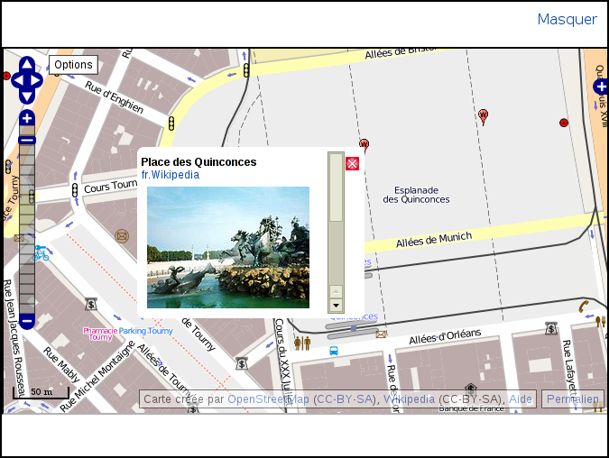
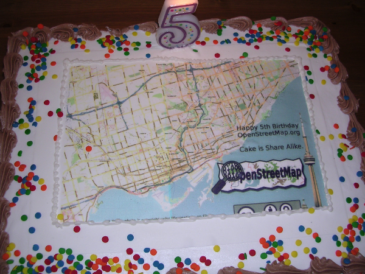

Part0 - Éclosion d'un monde ouvert

Un écosystème en mutation
=========================

Géomatique 1.0
--------------

de la cartographie à la géomatique

La cartographie est pratiquée depuis l'antiquité mais l'avènement de
l'informatique à permis de faire rentrer cette science dans une nouvelle
ère. La géomatique regroupe les disciplines de collecte, de traitement
et de diffusion de l'information géographique, le tout assisté par des
ordinateurs. Il ne s'agit plus uniquement de dessiner des cartes mais de
produire de l'information géolocalisée. Pouvant servir à créer des
cartes mais aussi être utilisées pour faire des recherches, des calculs
d'itinéraires, des optimisations...

carte produite par des experts ; consultable par tous ; outil
d'information et de communication

Historiquement les cartes sont produites par des spécialistes : les
cartographes. Elles peuvent être des outils d'information et de
communication, elles sont alors consultable par tous.

logique up-botton

Cette logique met en œuvre des experts diffusant et mettant en forme
leur connaissances pour le plus grand nombre.

haÿ 2007

### []{#anchor}Origine des données géomatiques

correction en cycle long

Les fournisseurs de données géomatiques classiques sont de deux grands
types. D'une part les agences nationales de cartographie et d'autres
part les compagnies privées. Leurs objectifs sont de décrire le
territoire selon des critères d'exhaustives et de homogénéités. Leurs
méthodes de collecte et de traitements impliquent des mises à jour en
cycle long de six mois à plusieurs années.

L'objectif de la collecte de ces informations est les rediffuser. Elles
peuvent servir notamment à produire des cartes papier, des jeux de
données professionnelles pour système d'information géographiques, des
cartes pour GPS... Mais que ces produits soient mise à disposition
gratuitement ou vendu ils le sont avec des restrictions en limitant
leurs usages.

Redistribution

Des conditions d'utilisation et des licences restrictives leurs sont
conjointement diffusées. Ce qui limite souvent la redistribution, la
création de données dérivées ou l'extraction d'information.

travaux dérivés ou composites

Dans la majorité des cas il n'est pas possible de créer et de diffuser
de nouveaux produits réalisés depuis des données sous licences. Si l'on
désire le faire, il faudra s'acquitter d'une licence le permettant. Par
exemple l'on ne peut pas utiliser des photographies aériennes
orthorectifiées pour géolocaliser des points d’intérêts et les revendre.
La licence va encadrer les œuvres pouvant être dérivées des
photographies et quels usages en sont permis.

les cartes existantes sont rarement libre

Il est même rare que les données initiales ou dérivées puissent être
librement rediffusées.

Accès aux données géomatiques ; Non gratuite

Les conditions d'utilisations font l'objet de différents types de
contrats, à différents tarifs. Avoir accès à ces jeux de données et
pouvoir les réutiliser suivant ces propres besoins n'est pas à la porté
de tous. Les taris en viveur dans le domaine sont prohibitifs, bien que
liée aux coups de production.

rôle

L'organisme national chargé de l'information géographique en France est
l'[]{#anchor-1}Institut géographique national (IGN). Il est financé par
l'état pour effectuer des missions dites régaliennes. Elles comprennent
l'entretien des réseaux géodésiques et de nivellement, la photographie
aérienne... Tout cela est mise à disposition par l'IGN et facilement
accessible. L'institut à aussi une mission commerciale pour laquelle il
développe des produits : BD ALTI® (modèle de terrain), BD CARTO®
(routes, hydrographie, limites administratives), BD TOPO® (base vecteur
détaillé).

Prix

Au prix catalogue 2010, l'accès à la licence monoposte pour la BD TOPO®
sur la France entière revenait à près de 1,8 million d'euro par an.

Au Royaume-Uni on trouve un organisme similaire :
l'[]{#anchor-2}Ordnance Survey. Il effectue aussi des missions
commerciales, parmi ces produits l'on trouve : Meridian™ 2 (rues,
hydrographie, limites administratives), OS Street View® (base vecteur
détaillé). Ces deux jeux de données sont distribués librement depuis
2010.

- 73 M€

agences nationales qui gardent des droits sur le produit

À l’exception des États-Unis, où les données produites par le
gouvernement sont dans le domaine public, et le Royaume-Uni, les agences
nationales de beaucoup de pays diffusent leurs données sous des licences
privatives restreignant fortement les usages.

Compagnies

Le secteur privé international est occupé par deux sociétés : Tele Atlas
et Navteq. Toutes deux créées au milieu des années 1980. Aujourd'hui
elles fournissent principalement des données géographiques pour les
systèmes de navigation par satellites et des cartes pour sites internet.
Elles parcourent les pays de planète qu'elles couvrent à l'aide de
véhicules qui enregistrent toutes sortes de données routières.

Tele Atlas

Tele Atlas est une société néerlandaise créée en 1984 qui équipe, entres
autres, TomTom, Mio, Navman, ViaMichelin, Mappy ou les Pages Jaunes. En
2008 TomTom rachetée l'entreprise pour près de 3 milliards d'euros.

Navteq

Navteq est une société américaine créée en 1985 qui équipe, entres
autres, Garmin, Magellan, Yahoo!, Bing ou MapQuest. Elle fut rachetée
par Nokia en 2008 pour plus de 8 milliards de dollars.

[]{#anchor-3}Néogéographie
--------------------------

« Neogeography is about people using and creating their own maps, on
their own terms and by combining elements of an existing toolset.[^1] »

« La néogéographie regroupe des personnes utilisant et créant leurs
propres cartes, selon leurs propres règles en combinant des outils déjà
disponibles. »

### []{#anchor-4}Évolution vers la géomatique 2.0

nouvelle approche

La néogéographie est une nouvelle approche de la géographie. Elle est
une nouvelle voie qui permet au profanes et non experts de toucher à
cette discipline.

approche intuitive et itérative non guidé par des standards et du
passif ; nouveaux besoins

L'approche intuitive, itérative, non guidé par les standards et les
façons de faire usuelles permet de combler des besoins émanant des
nouvelles possibilités offertes par le web.

GéoWeb ; interactivité ; collaboration et confrontation des points de
vues

Ce GéoWeb offre l'accès à des cartes interactivités et collaboratives où
l'on peut confronter des points de vue.

motivé par la frustration d'un maque ou d'un manque d'accès

Cela en répondant à des besoins réels et une frustration émanant de la
diffusion de la géomatique traditionnelle. Ici les utilisateurs ne
« subissent » plus les cartes réalisées par des experts. Frustration
aussi motivée par un maque de données et des difficultés d'accès qui
poussent à ne plus rester passif et à participer à cette néogéographie.

Web 2.0

la géomatique par le web 2.0 devient accessible et compréhensible par le
grand public

Cette évolution s'inscrit pleinement dans le Web 2.0, la géomatique
devient compréhensible mais aussi accessible par tous.

"D'un Internet de consultation a un Internet de contribution";
Read/Write Web

Elle se traduit par le passage « d'un internet de consultation à un
internet de contribution[^2] » dont l'exemple le plus connu est
Wikipédia : c'est le Read/Write Web.

être acteur ; personnalisation de la carte et cartographie personnelle ;
interface plus simple ; appropriation par l'"utilisateur"

Tous le monde peut y être acteur en personnalisant ou en construisant
des cartes. Mais il ouvre aussi la voie à la cartographie personnelle.
C'est-à-dire assembler ces propres cartes pour les faire coller avec ces
besoins. Les interfaces y sont aussi plus simples et plus intelligibles,
permettant à l'utilisateur de se les approprier.

ne pas se limiter a une dimension récréative ; à envisager au delà de
l'amateurisme

La somme des contributions des utilisateurs ne se limite pas a une
dimension récréative. Une fois assemblées elles valorisent une œuvre
qu'il faut envisager au-delà de l'amateurisme. Les efforts portés sur
Wikipédia nous l'ont déjà montré.

- Web mapping <http://en.wikipedia.org/wiki/Web_mapping>

information géographique implicite, flikr

L'information géographique sur le web 2.0 est omniprésente. Que cela
soit de façon implicite ou explicite. Des sites web tel que Flikr en
font usage de manière indirecte, permettant aux photographes de
géolocaliser leurs clichés. On la retrouve aussi du coté de la publicité
géocontextuelle, fonction de votre position, mais par exemple aussi de
votre vitesse de déplacement. Les annonces publicitaires peuvent être
locale, mais nul besoin d'afficher les promotions du supermarché du bout
de la rue si vous traverser la ville à 300km/h en TGV.

information géographique explicite

De l'autre côté, l'information géographique explicite est aussi mise en
avant avec des services de plus en plus novateur. Partant de
l'orthophotographie aérienne détaillé pour aller vers Google StreetView,
la réalité augmentée ou encore pour diriger des piétons vers des points
d'intérêts locaux.

API, partie serveur

Les fournisseurs de ces informations et services les diffusent aux
travers d'interfaces de programmation (API). Elles servent à la fois de
portes d'entrées standardisés et documentés, mais aussi de points de
passages obligés. Offrant ainsi des accès à leurs serveurs pour des
terminaux minimalistes (dit clients légers). Des clients tels que les
navigateurs web se connectent aux serveurs centraux effectuant les
calculs et conservant les informations, ne donnant accès que aux
résultats des requêtes.

lib javascript

Tous les grands acteurs de la cartographie en ligne offres de tels
services aux travers d'API et de bibliothèques clients
[]{#anchor-5}JavaScript : Bing, CloudMade , Google Map, MapQuest...

Mashup

On retrouve à la fois des services et des outils mis à disposition du
public. Ce même public à aussi de plus en plus accès à des silos de
données, tels que ceux mis à disposition de tout le monde par les
administrations. Cela ajoute aux contributions volontaires des
utilisateurs et de leur inventivité permet l'émergence d'applications
composites : les mashups. Elles remixent les informations de différentes
sources de façon à apporter un nouvel angle de vue; ou tout simplement
permettre la visualisation de données qui restaient abstraites
jusque-là.

Exemple de mashups : vue des articles de Wikipédia géoréfréncés sur un
fond de carte OpenStreetMap avec la vue sur un article ouvert.

[]{#anchor-6}deux modèles de géomatiques actuelles

La géomatique classique et la néogéographie ne sont pas des modèles qui
s'opposent, ni même un passé un futur.

en complément et en suivant la géomatique pro

Elles sont complémentaires, la dernière démocratisant la première.

professionnelle et classique ; uniforme

Le modèle classique représenté d'une part le côté professionnel dans le
quel les démarches sont normées pour assurer la qualité et l'uniformité.

personnelle et communautaire ; bazar ; non organisé en apparence

De l'autre côté l'on trouve une géomatique personnelle et communautaire.
Tout le monde peut y participer. Un bazar qui en y regardant de plus
prêt est un ordre spontané et pas si désordonné que ça. Laissant la
place libre à la création et aux échanges[^3]. L'organisation n'y est
plus descendante.

[]{#anchor-7}

modèle non cloisonnées

Ces deux modèles ne sont pas isolés l'un de l'autre. Il existe des
échanges dans les deux sens. L'un offrant des données de références,
l'autre créant des ressources pour répondre à ces propres besoin et
explorer de nouvelles voies (logiciels libres, formats ouverts,
crodwsourcing)[^4].

MapTogether dans leur guide SIG à but non lucratif[^5] résume bien la
situation en schématisant ainsi les géomatiques :

  ---------------------------------------- ------------------------
  Géomatique classique                     Néogéomatique

  Formel                                   Moins formel
                                           
  Professionnel, éducation, gouvernement   Personnel, communauté
                                           
  Statistique, quantitatif                 Interactif, qualitatif
                                           
  Orienté données                          Humaniste
                                           
  Cher et complexe                         Abordable
  ---------------------------------------- ------------------------

### Wikification

principe du wiki ; formaliser et mobiliser les connaissances

À l'instar de Wikipédia les wikis sont des sites web modifiables
rapidement. Dans la majorité des cas l'on retrouve une communauté
gravitant aux alentours. Le travail collaboratif est un aspect
indissociable de ce concept. Les wiki sont des espaces permettant de
mobiliser et formaliser des connaissances.

Wikisig; =&gt; carto en ligne participative; information produite par
tous

La wikification des SIG, les wikisig, sont des espaces ou les
contributeurs participent tous ensemble à la construction de données
cartographiques. Les informations saisies peuvent être retouchées par
tout le monde. Ces cartographies collaboratives sont la succession de
contributions par amélioration et correction de l'existant. Ce travail
itératif permet de consolider l'ensemble pour finalement donner quelque
chose de pertinent.

logique botton-up ; grass-roots

La structuration de l'information pertinente émerge presque toute seule.
En cela, ce modèle s'oppose au modèle classique. Ce ne sont plus les
experts qui diffusent leurs savoirs mais un co-produit qui émane de la
masse : concept de grass-roots en anglais.

crowdsourcing

Ce phénomène est aujourd'hui connu sous le nom de crowdsourcing.
Littéralement extraction d'information depuis la foule.

co-producteur et co-consommateur par des pairs ; peer production model

Les contributeurs à ces projets y participent dans un modèle d'égal à
égal. Les co-producteurs y sont aussi des co-consommateurs.

contribution individuelle à un but commun ; définition des niveaux de
participation sur le web ; engagement

Ils y participent en œuvrant à la réalisation d'un but commun. Les
niveaux de participation sur le web peuvent se définir ainsi[^6] :

-   information,
-   consultation.

À partir de ce point il y a engagement dans le projet :

-   concertation,
-   contribution,
-   collaboration.

mode d'expression citoyenne

De par leur nature les wikisig sont des modes d'expression citoyenne.
Les savoirs décrit vont exprimer quelque chose de différent d'une
approche descendante. Ils expriment un autre rapport à la
territorialité.

outil d'interaction ; outil de participation

Ces outils permettent d'interagir, de participer et de s'exprimer. Tel
le site web dismoioù où l'on peut retrouver, géolocaliser et donner son
avis sur des lieux.

### Crowdsourcing

Le crowdsourcing consiste à réaliser un objectif par l'accumulation de
participations. Ces créativités, idées et savoir-faire unitaires donnent
naissance à forme d'intelligence collective.

les participants ne sont pas des experts

Les participants ne sont pas des experts. Ils contribuent, à leur niveau
et selon leurs envies, à créer ou à améliorer l'édifice.

TomTom

Cette source d'information est aussi utilisé dans l'économie ou les
clients participent à l'amélioration des produits. C'est par exemple ce
que fait TomTom® avec Map Share™, permettant de remonter des anomalies
et des corrections qui seront ensuite validées, intégrées et rediffusées
à tous les utilisateurs.

OpenCrodsourcing

Il faudrait alors parler de « OpenCrodsourcing[^7] » pour qualifier les
initiatives citoyennes qui éclosent, définissant leurs propres objectifs
(autant d'objectifs que de contributeurs) vers un but commun.

non dirigeable ; You cannot direct the crowd

Ces initiatives établissent leurs propres régles et réalisent leurs
propres choix, toujours selon une émanation de la foule. En fait il
n'est pas possible de donner une direction ou de contraindre le crowd,
chaque élément étant libre de participer suivant ça propre voie.

dimension sociale de l'information géographique

Une dimension sociale émerge de ces populations de participants.
Différentes préoccupations ou besoins se retrouvent. Il y a ainsi des
groupes de personnes géolocalisant les aires pour camping-cars, les
radars automatiques, les ventes de légumes à la ferme ou encore les
caméras de vidéo-surveillances.

nouvelle forme d'intelligence ; collective ; spatiale ; territoriale

Cette forme d'intelligence spatiale apporte une nouvelle approche du
territoire.

- projet de thèse de Mericskay Boris, hiver 2009, p9
- http://ulaval.academia.edu/MericskayBoris/Papers

[]{#anchor-8}Carthotèques
-------------------------

Il s'agit de voir dans cette section quels sont les nouveaux usages
géomatiques des deux plus grands acteurs du domaines.

### []{#anchor-9}TomTom

### []{#anchor-10}Google Maps

orienté voiture ; Agrégateur de sources

Google Map, que l'on ne présente plus, est en très grande partie orienté
vers les déplacements en voitures. Il n'est originellement qu'un
agrégateur de sources, puisant chez différents fournisseurs en fonction
des zones et des pays.

USA tout seul ; quel est la source ? ; google streetview ; tigger

Mais grâce à ces initiatives et ça taille, Google fournit aussi de
manière autonome une carte des État-Unis depuis 2009[^8]. Elle est
construite depuis des données des autorités locales dont TIGER du bureau
de recensement (ce type d'information étant dans le domaine public aux
État-Unis). Cette carte est surement complété à l'aide du travail
effectué dans le cadre de Google StreetView.

dégradation de la qualité

Toutes fois les utilisateurs ont constaté une baisse de qualité lors de
cette migration[^9]. Google Maps permettant alors de faire remonter les
problèmes rencontrés directement depuis l'interface de consultation.
Autorisant même à déplacer et modifier la description des points
d'intérêt.

Google Map Maker

Mais l'élément essentiel orienté crowdsourcing est l'application Google
Maps Maker[^10], librement inspiré d'OpenStreetMap. Où les contributeurs
peuvent dessiner et enrichir la carte depuis le fond d'imagerie aérienne
dont dispose Google Maps. Cette application est disponible dans des pays
ou Google Maps n'a pas d'autres cartes.

Orienté service API

L'accès aux APIs de Google Maps, comme celles des autres grands
fournisseurs de cartographie en ligne, est publique et gratuit. En
contre partie des possibilités qu'elles offrent elles sont des cages de
verre. Les données qu'elles manipulent, géographiques ou utilisateurs
sont stockées sur des serveurs centralisés[^11]. Les données y sont
déposées de fait, mais aussi enfermées par les licences et les
conditions d'utilisation.

verrouillage des données entrée ; Impossible de les réutiliser hors de
ggm

Le premier paragraphe des conditions d'utilisation du service Google
Maps dit ceci :

« Dans le cas des utilisateurs particuliers, Google Maps (y compris ses
résultats de recherches locales, ses cartes et photographies) est
destiné à un usage personnel et non-commercial uniquement. Dans le cas
des utilisateurs professionnels, Google Maps est destiné à un usage
interne uniquement et ne peut être redistribué à des fins commerciales,
à l'exception des données cartographiques qui peuvent être diffusées et
affichées au moyen de l'API Google Maps, conformément aux conditions qui
régissent l'API.[^12] »

En d'autres termes, et particulièrement dans la dernière phrase, ce qui
est dans Google Maps y reste. Liant ainsi vos données à leur service,
vous n’êtes pas libre de disposer de « vos » données comme bon vous
semble.

Image ; pas d'export retouchable

Ce type d'accès canalisé à la donnée entraine d'autres limitations. Vous
avez ainsi accès aux cartes uniquement en version image (bitmap) et non
pas en vectorielles empêchant ainsi de les retravailler, même pour un
usage interne.

pas de données

Il est impossible d'effectuer des opérations qui n'ont pas été
initialement prévu par l'API, car il n'y a aucune possibilité d'accès
direct à la donnée (techniquement et légalement).[]{#anchor-11}

### Corrélations

Les jeux de données géomatiques peuvent être évalués suivant plusieurs
critères : la qualité, la couverture, le prix... La qualité restant une
notion à définir[^13].

fonction du besoin

Toutes fois, la qualité n'est pas une valeur quantifiable dans l'absolu.
Elle est fonction du besoin. Ainsi une carte ne pourra pas être
qualifiée d'utile suivant les mêmes critères selon que vous devez
creuser un tunnel ou indiquer à un ami comme se rendre chez vous.

prix

Si l'on augmente la précision d'un carte son prix risque aussi d'évoluer
en conséquence. Ce nouveau prix ne conviendra pas forcément aux
consommateurs. Ils n'en ont pas forcément l'utilité, en tout cas
vis-à-vis du prix. Des produits différents avec des qualités,
couvertures et tarifs différents se justifiant pleinement.

Couverture; comparaison; Chypre

L'aspect quantitatif de la couverture est aussi en prendre en compte. Le
jeu de données est-il disponible pour le monde entier ou se limite-t-il
à l'étendu d'une ville ? Les fournisseurs tel que Navteq ou Tele Atlas
ne couvrent pas tous les pays. Il est évidant que certains pays sont
plus rentables que d'autres. La géomatique à aussi ces zones
déshéritées. Il suffit par exemple de comparer les données disponibles
sur les zones périphériques de l'Europe, par exemple à Chypre.

relation prix/qualité

Les solutions collaboratives sont disponible pour un coup apparent très
faible. Elles impactent donc le marché dès que la qualité s'y prête.
Cette qualité est une notion contextuelle, son rapport au prix arrive
toujours à satisfaire des besoins.

évolution

Des solutions comme les logiciels Libres, Wikipédia, Waze[^14] ou
OpenStreetMap sont en amélioration constante pour un prix toujours aussi
faible. Lors que la qualité arrive à un certain niveau, l'écosystème en
est totalement bouleversé. L'exemple le plus frappant est celui de
Wikipédia qui a chamboulé le marché des encyclopédies. Certaines on du
même être abandonné, comme Encarta® de Microsoft®.

La cartographie est toutes fois un secteur différent du marché de
l'encyclopédie. Wikipédia à imposé un modèle de gratuité dans le quel il
n'y avait pas la place pour une forme de service monétisable. La
géomatique est en cela différente, la donnée doit être exploité pour
être utile.

Les solutions fermées propriétaires doivent alors envisager plusieurs
évolutions. Les plus évidentes sont de baisser les prix et d'augmenter
la qualité.

prix min de revient pour des données proprio

Mais la baisse de rentabilité peut aller jusqu'à pousser le prix de
revient à dépasser le prix de vente. C'est alors le modèle économique en
entier qu'il faut revoir.

libération

Une autre voie a été emprunté par AND[^15] qui à fait le pari d'ouvrir
ces données. Offrant des cartes à OpenStreetMap, permettant un retour
depuis le terrain grace au crowdsourcing.

Données publiques et OpenData
-----------------------------

[]{#anchor-12}[]{#anchor-13}définition

L'OpenData ou « Données Libres » désigne les jeux de données que l'on
peut utiliser, modifier et diffuser librement avec un minimum de
restrictions. Dans la grande majorité des cas elles viennent du secteur
public.

cake test

Une façon possible de déterminer si des données sont libres est de leur
faire passer le « cake test[^16] » (le test du gâteau). Un jeu de
données géographique ou une carte est libre seulement si quelqu'un peut
offrir un gâteau avec une carte issue des données dessiné dessus. Lors
que des données sont diffusées gratuitement elles ne sont pas pour
autant libre. Pour pouvoir offrir le gâteau, il faut que l'on puisse y
copier la carte dessus, la redistribuer. Il faut que le pâtissier puisse
en faire une utilisation commerciale. Comment offrir un gâteau s'il faut
faire signer quelque chose avant ou envoyer une notification ?

Toronto, cinquième anniversaire d'OpenStreetMap. Photo par Richard Weait
CCBY.

<http://www.opendefinition.org/okd/>; accès aux données; libre

Plus formellement on retrouve la définition d'une connaissance libre sur
OpenDefinition.org[^17]. Qui pour résumer définit une œuvre libre comme
satisfaisant aux conditions suivantes :

-   accès effectif intégral à l'œuvre et sans limitation,
-   redistribution non conditionné financièrement,
-   réutilisation, modification et création d'œuvres dérivées possibles,
-   pas de restrictions techniques d'accès, comme des formats non
    ouverts ou soumis à redevance,
-   la redistribution peut être conditionnée à l'attribution (mention
    des auteurs),
-   le respect de l'intégrité de l'œuvre peut être demandé,
-   pas de discrimination, tout le monde doit pouvoir profiter de
    l'œuvre,
-   pas de discrimination d'usage, en particulier commerciale,
-   tout le monde doit pouvoir bénéficier de la licence associé à
    l'œuvre,
-   la licence doit porter sur tout ou partie de l'œuvre,
-   la licence ne doit pas apporter de restrictions à d'autres œuvres.

<http://www.village-justice.com/articles/diffuser-donnees-publiques,7658.html> ;
en accord avec la loi française

La légalité de telles conditions de diffusion en France à déjà été
étudié[^18]. Cela ne semble pas poser de problème vis-à-vis du droit
français.

[]{#anchor-14}jurisprudences en France ; logiciel

Des jurisprudences en France concernant les licences sur les logiciels
Libres existent déjà, ainsi que sur les creatives commons en Europe et
aux État-Unis[^19].

licences;
http://www.regardscitoyens.org/open-data-des-licences-libres-pour-concilier-innovation-sociale-et-economique/

En pratique deux voies pour diffuser sous licence libre sont possibles.

réutilisation directe

Une première, où l'intention est la réutilisation la plus large
possible ; licences de type domaine public (PDDL, CC-0), CC-By ou
Licence Ouverte.

partage des contributions

Une seconde, qui impose la conservation de la licence lors des
modifications ou des créations de travaux dérivés. C'est le partage des
conditions à l'identique ; licences virales du type CC-By-SA ou ODbL,
utilisé par Wikipédia et OpenStreetMap.

### []{#anchor-15}Problématique

« Data is a platform not a commodity: you build on it rather than sell
it. And that’s why it should be open.[^20] »

« Les données sont une plate-forme, non une marchandise : elles sont des
fondations plus qu'un bien marchant. C'est pourquoi elles doivent être
ouverte. »

la donnée devient un élément stratégique plus que patrimonial; il faut
faire vivre la donnée

Aujourd'hui la donnée devient un élément stratégique plus que
patrimonial, ce qui nécessite de la faire vivre. La valeur d'une donnée
se mesure à son utilisation.

problème du modèle classique

limites d'accès; limites d'accès aux données entres collectivités elles
mêmes

Au niveau des organismes publics il existe des difficultés
organisationnelles d'accès aux données.

les agences publiques doivent s'acheter les données entres elles; frais

Les collaborations et les échanges sont soumis à des restrictions et des
contrats onéreux.

200 millions de livres par an, en frais de licences et de justice en UK;
frais d'avocat, amande pour la gestion des données

Toutes ces lourdeurs coutent cher, établir des licences, les gérer, les
défendre en justice...

Cap Gemini a estimé que la mauvaise qualité des échanges d’information
entre les entreprises et les institutions coûtaient 46 milliards d’euros
par an

Une étude réalisé par Capgemini UK en 2008 révélait qu'une mauvaise
approche de la culture de la diffusion de l'information au Royaume-Unis
pénalisait l'économie du pays de 67 milliards de livres pas an[^21].

les collectivités n'arrivent pas vendre leur données ; on ne parle même
pas rentabilité ; rentabilité pas le but des collectiviées ; mail de
dinot du 32/01/2012

Les contraintes de gestion font que dans la pratique les collectivités
ne vendent que très peut leur données. Il n'y a même pas lieu de parler
de rentabilité. L'aspect financier n'est pas un argument valable pour ne
pas ouvrir les données dans la majorité des cas.

IGN

Une autre problématique spécifique aux données géographiques en France
est le mode actuel de fonctionnement de l'IGN.

tarif inadapté pour les collectivités; qui produisent elles même des
données

Il fournit des données aux collectivités à des conditions et taris
inadaptés. Ces collectivités, en tant qu'acteurs locaux, contribuent à
enrichissement des jeux de données de l'IGN. Jeux qu'elles doivent
ensuite négocier.

conflit entre l'aspect service public, commercial et INSPIRE

Il y a conflit entre la mission commerciale et celle de service public.

boucle de "privatisation" par l'IGN

On constate une boucle de « privatisation » des données publiques par un
établissement public !

créer un cercle vertueux plus ouvert

Il conviendrait de créer un cercle d'ouverture plus vertueux. Toutes
fois l'IGN et l'État sont conscient des problèmes du modèle actuel. Le
nouveau contrat d'objectifs de l'IGN pour 2010-2013 réoriente certains
aspects.

### []{#anchor-16}Mouvement

L'OpenData est une philosophie qui est apparue vers 2005, mais il faudra
attendre 2009 pour que cela prenne vraiment consistance et se traduise
par des actes concrets et significatifs.

UK

Au niveau de l'état

L'histoire d'ouverture la plus emblématique est s'en nul doute celle du
Royaume-Uni. Lors des élections de XX pour XXX le débat tournait à qui
en ferait le plus pour l'OpenData.

Campagne UK "Free our data"

Cette problématique a été porté aux yeux du public par le journal le
« Guardian » qui avait lancé en 2006 la campagne « Free our data[^22] ».

progrès lent

Les progrès ont été lent mais les résultats sont aujourd'hui là.

Ordnance Survey

Suite à une consultation publique et à la participation de Sir Tim
Berners-Lee[^23] au gouvernement, une quantité conséquente de données
ont été publiées sous licence libre[^24], y compris des données de
l'agence de cartographie Ordnance Survey.

- liste des dataset
-   postcode
-   données déjà payé par des taxes
-   bénéfice gratuit

http://www.edparsons.com/2010/03/os-consultation-a-fairy-tale/

Un portail pour ces d'informations a été ouvert : http://data.gov.uk.

- Londres

USA ; Au niveau de l'état

Aux État-Unis l'on retrouve ce mouvement à plusieurs niveaux de
l'administration. Tout d'abord au niveau fédéral avec le site data.gov
lancé en 2009 regroupant des données de plusieurs départements.

San Francisco; Washington DC; New York

[]{#anchor-17}[]{#anchor-18}Des états et des villes du pays ont aussi
lancé leurs propres initiatives : Massachusetts, Michigan, San
Francisco, New York, Washington D.C...

vient des pays anglo-saxons

Il est vrais que le phénomène vient essentiellement des pays
anglo-saxons. On retrouve parmi les primo-adoptants l'Australie, des
villes anglophones du Canada, la Nouvell-Zelande...

Piemonte; []{#anchor-19}Helsinki

Toutes fois il y a des initiatives en Europe continentale : Région du
Piémont, la ville[]{#anchor-20} d'Helsinki, des régions autonomes
espagnoles...

France

Rennes; Keolis; Mars 2010; initiative privé

Consternant la France, la première tête de pont a été la communauté
d'agglomération de Rennes Métropole. Initialement une initiative privé
de la part de l'exploitant Keolis-Rennes du réseau de vélopartage[^25]
qui à diffusé librement des données et mis en place une API.

création d'appli

Cette ouverture à rapidement permis la création ou le portage
d'applications, notamment mobile.

reprise par le politique; effet boule de neige

Devant ce premier succès une reprise par le politique à eu lieu.

création d'un dépôt;
[www.data.rennes-metropole.fr](http://www.data.rennes-metropole.fr/);
données SIG

Grace à l'implication de personnes convaincues, la ville à ensuite crée
un dépôt et ouvert un portail d'accès à ces données[^26],
essentiellement issue du SIG en février 2010. Ce dépôt a été
progressivement enrichit.

[http://owni.fr/2010/06/14/liberation-des-donnees-on-ne-reviendra-](http://owni.fr/2010/06/14/liberation-des-donnees-on-ne-reviendra-pas-en-arriere/)[pas-en-arriere/](http://owni.fr/2010/06/14/liberation-des-donnees-on-ne-reviendra-pas-en-arriere/)

Pays de Brest; mouvement de fond

Parallèlement un mouvement de fond avait lieu en Bretagne grâce à
l'implication d'élus.

Communauté urbaine de Brest; filaire; orthophoto

Tout a commencé par la communauté urbaine de Brest qui en mars 2010 à
libéré son orthophotographie et ces données filaires (voies et bâtit),
rendant ainsi officiel une ouverture effective datant de quelques mois.

filaire du pays de Brest; 1/3 finistaire

Ces données ont pu être importées dans OpenStreetMap, ainsi que celles
des 89 communes du Pays de Brest qui ont à leur tour ouvert leurs
données.

Région Bretagne

Suite à ces orientations la région Bretagne a aussi libéré une partie de
son SIG en novembre de la même année.

- []{#anchor-21}+ []{#anchor-22}- Paris

            -   []{#anchor-23}http://captaindash.com/2010/04/03/paris-the-city-of-love-and-datavisualization/

                problème sur la définition et le but

                ODbL

                http://www.regardsurlenumerique.fr/blog/2010/9/28/opendata-a-paris\_nous-publierons-une-vingtaine-de-jeux-de-donnees-avant-la-fin-2010\_/

        -   []{#anchor-24}+ []{#anchor-25}- En cours

            -   []{#anchor-26}Auvergne
            -   Alpes Maritimes
            -   Marseille

                -   projet pour la capitale eu de la culture 2013

            -   Montpellier
            -   cf FING
            -   Bordeaux

        -   Grace

            -   organisation de cartopartie
            -   ouverture de l'orthophoto
            -   ouverture de POI

        -   France

            -   http://www.epsiplatform.eu/topic\_reports/topic\_report\_no\_10\_psi\_re\_use\_in\_france\_overview\_and\_recent\_developments

                Agence du patrimoine immatériel de l’État

                -   APIE

                ordnance June 6th 2005 and decree December 30th 2005
                which modify the law of July 17th 1978 concerning the
                improvement of the relationship between administration
                and citizens.

                cada.fr

                France Numérique 2012

                -   http://www.prospective-numerique.gouv.fr

                In September 2009, during the seminar on the Digital
                society: "Investing today for growth tomorrow", the
                Prime Minister François Fillon defined the economic
                purpose of re-use: "The state, beyond its duty to
                transparency through the Internet, must (…) allow the
                creation of services and therefore value from public
                data gathered and made available to the citizens and
                companies".

                -   p2

                Un petit pas pour l’OpenData, un grand pas pour la
                France !

                -   http://www.regardscitoyens.org/licence-%C2%AB-information-publique-%C2%BB-un-grand-pas-pour-la-france/

                GFII

                http://www.dila.premier-ministre.gouv.fr/qui-sommes-nous/reutilisation-informations-publiques.html

                -   reconnaissance d’un droit à réutilisation des
                    informations publiques pour toute personne qui en
                    fait la demande.

                un data.gouv.fr pour la fin de l'année

                -   avec quelle licence ?
                -   https://www.apiefrance.com/sections/actualites/vers\_un\_portail\_uniq/

                    -   http://berjon.com/blog/2010/07/apie-opendata-payant-effet-pervers.html

    -   http://www.google.com/publicdata/home

### Volontarisme

#### Politique

« Les initiatives officielles d’OpenData ont toujours nécessité des
prises de position politiques fortes présentant la libération des
données comme vecteur d’innovation sociale et économique[^27] »

Définir une politique volontariste

Le mouvement de l'OpenData doit passer par un volontarisme politique et
des orientations claires.

Transparence; Justifier le travail pour le public

La mise à disposition publique des données et la transparence que cela
induit offrent l'occasion de montrer aux citoyens le travail effectué
par les acteurs publics.

juste retours des produits vers les citoyens

Elle est aussi un juste retour des travaux financés sur fond public.

action politique

Convention d'Aarhus

Au niveau mondial, la convention d'Aarhus[^28] de 1998 et la directive
européenne INSPIRE de 2007 posent les bases de la diffusion des données
environnementales et géographiques.

Directive INSPIRE; concerne les données environnementales; obligation de
diffuser gratuitement le cataloguer des méta-données

INSPIRE demande notamment à ce que les données géographiques soient
cataloguées et décrient avec des méta-données. Ce catalogue devant alors
être gracieusement mis à disposition.

Faciliter l'accès aux données

Le but étant de faciliter l'accès, la diffusion et la réutilisation.

fourniture uniformisé; interopérabilité; service offrant l'accès

Elle demande en outre que les données soient publiées de façon uniforme,
interopérable et accessible via des services.

l'openData peut être une solution !

Cette directive, comme toute les directives européennes, doit être
transposé et appliqué en droit des états membres. Ce fut le cas en
France en octobre 2010. À ce titre, les formats ouverts et les licences
libres répondent pleinement à ces attentes.

- guide de diffusion osgeo

European PSI Directive 2003/98/EC1

Il existe aussi la directive PSI (Public Sector Information) sur la
réutilisation des informations du secteur public. Elle demande à ce que
les tarifs pour la diffusion soient limités au coup de revient et à la
participation à la qualité du service public. Elle prône, elle aussi,
une réutilisation aussi large que possible.

nouvelle directive pour 2012 en EU pour les PSI

Une nouvelle directive sur les informations publiques est envisagé pour
2012.

#### []{#anchor-27}Citoyen

rapprocher le gouvernement et les citoyens; lien fort entre les
institutions et les citoyens, en leur permettant de s’approprier un bien
commun.; bien commun

La mise à disposition des biens communs que sont les données publiques
permettent aux citoyens de se les approprier. Les rapprochant ainsi des
institutions qui les produisent.

appropriation du territoire par les citoyens

La diffusion de la connaissance du territoire permet à ces habitants de
mieux l'appréhender.

gestion territoriale participative

Cette approche bipartie ouvre alors la voie à la discutions et la
gestion participative du territoire.

démocratie participative; implication

Permettre aux citoyens d'accéder aux informations publiques c'est leur
donner une possibilité de plus de s'impliquer dans une forme de
démocratie participative locale. Cet accès rend possible l'analyse mais
aussi la critique. Quoi qu'il en soit cela ouvre la voie aux
discussions, permettant les argumentaires.

#### []{#anchor-28}Qualitatif

démarche qualité

L'OpenData peut aussi faire partie d'une démarche de qualité.

si l'on ouvre l'on fait plus attention à ce que l'ont fait

Il est évidant que si l'on laisse tout le monde regarder, analyser,
retravailler et construire avec ce que l'on produit, on va y porter plus
d'attention.

qualité des données; qualités des méta-données

Avec pour effet de bord une influence sur la qualité même des données,
mais aussi de porter sont attention sur les méta-données et le
recensement au niveau des catalogues.

retour, remonte; l'ouverture permet aux autres de faire des retours

Si l'ouverture se fait sur un modèle d'échange et de collaboration elle
va permettre aux usagers de faire des retours. Il sont de plusieurs
types.

détection d'anomalies lors de conversions

Tout d'abord la détection d'anomalies ou d'incohérences révélé par les
conversions ou croisements avec d'autres sources des données.

appliquer des outils qualités autres

Mais aussi par l'utilisation d'outils de vérifications ou de qualité
tiers.

remonté de crowdsourcing vers les collectivités

L'autre type de remonté est la correction et l'amélioration des données.
Les utilisateurs vont confronter les données à la réalité et auront
éventuellement besoin de les ajuster ou de les enrichir. C'est notamment
le cas sur les plateformes de crowdsourcing.

permet d'illustrer/documenter; légalement

D'autre part, la diffusion des données permet pour les utilisateurs de
mieux documenter et illustrer des publications tout en étant sûr de la
possibilité de rediffusion.

adéquation besoin/coup classique; plus données diffusées; données plus
justes

Autorisant ainsi une foule de petites usages et donc une diffusion plus
large. Utilisation permise par l'abaissement du ratio entre le besoin et
cout, tout en ayant une qualité accrue.

amélioration des services; nouveau; existant

Que ce soit du coté des organismes publics ou des réutilisateurs, les
données librement diffusables apportent un gain de qualité et une
amélioration des services, pour des applications nouvelles comme
existantes.

Il faut collaborer !; co-production; ouverture, collaboration de
pair-à-pair vs. hiérarchie

Le volontarisme est nécessaire. S'ouvrir et collaborer c'est avant tout
vouloir collaborer. Il faut entrer dans une logique de co-production de
pair-à-pair et non se positionner dans une situation de producteur de
données diffusant à sens unique vers ces utilisateurs.

-   appropriation et diffusion des données en prévision de crise

    -   plus la connaissance est diffusé plus on peut réagir mieux
        rapidement et facilement

### []{#anchor-29}[]{#anchor-30}Valorisation

Libérer de la données c'est créer de la richesse. L'OpenData est une
matière première à disposition de tous.

source de valeur potentielle, et dont il convient de faire bénéficier
l’ensemble du pays. ; conséquence vaste et difficile à mesurer

Les données sont une source de valeurs potentielles à différent point de
vue et dont il convient de faire bénéficier le plus grand monde. De par
leur nature même et la place qu'elles ont dans la société la conséquence
de l'ouverture des données est difficile à mesurer.

#### Valorisation économique

« Freeing up public data will create major new opportunities for
businesses. By allowing industry to use data creatively they can develop
new services and generate economic value from it.[^29] »

« Libérer des données publiques va créer de nouvelles opportunités
majeures pour l'économie. Permettant ainsi à l'industrie d'utiliser les
données de manière créative pour développer de nouveaux services et en
retirer une valeur économique. »

optimiser les ressources; mutualisation des couts

Le libre accès à la donnée permet de capitaliser dessus et de mutualiser
les coups de production et de mise à jour, point essentiel pour les
informations géographiques.

diminuer le gaspillage

L'accès à moindre cout permet aussi de diminuer le gaspillage en temps
et en argent. Même un jeux de données surdimensionné pour un besoin peut
être utilisé dans toute sa précision et son détail pour quelque chose
qui ne le nécessiterait pas. Économisant ainsi la création parallèle
d'un autre jeu de donnée répondant à des besoins proches, mais plus
simple, alors que le premier jeux de données n'aurait pas été
financièrement accessible.

rentre utile des données qui pourraient être sous exploité; révéler leur
potentiel; geoSPI spécification fonctionnelles sauvant supérieures aux
besoins

Le marché peut aussi trouver des moyens de valoriser des informations
géographiques sous exploitées ou pour les quelles les spécifications
fonctionnelles sont supérieures à l'utilisation réelle ; révélant ainsi
tout leur potentiel.

la mise en forme des données coute cher

D'autre part la mise en forme de données est un processus couteux.

pas forcement le rôle des acteurs publics; diffuser pour reexploitation

Ce n'est pas forcement le rôle des acteurs publics que de formater ces
données pour les rendre diffusable, exploitable et présentable pour tout
le monde.

libérer les données brutes

L'idée qu'il y a derrière cela est de laisser au secteur privé et à la
société civile le soin de le faire. C'est à dire de fournir du service
ajouté à ces données. D'où l'idée du « Raw data now » de Sir Tim
Berners-Lee du TED2009[^30] : « libérer les données brutes, maintenant
! ». Les personnes capables, intéressées ou en ayant l'utilité vont
elles mêmes prendre en charge ces données. Rendant ainsi leurs
diffusions plus simple et rapide.

création de richesse

La création de richesse peut aussi se faire par le regroupement et la
constitution de collections. L'accès libre à un nombre accrut
d'informations permet de les combiner pour accroitre leurs champs
d'action spatialement ou même descriptivement.

meilleure couverture

Par exemple, les données des collectivités qui gèrent chacune le nommage
de la voirie et les adresses peuvent être consolidées au niveau
national.

croiser les données pour faire apparaître de nouvelles informations

Un autre aspect est le recoupement et le croisement de données qui font
émerger de nouvelles informations, et qui crée donc de la valeur.

création d'opportunités entrepreneuriales

L'ouverture c'est aussi la création d'opportunités entrepreneuriales.

support décisionnel ; abaisser le coup du support ; choix plus juste

Une plus grande quantité de données analysables permet un support
décisionnel plus large ; []{#anchor-31}donc plus efficace pour un coup
moindre.

en fait utile aux petites structures

De par une plus grande diffusion, l'OpenData profite essentiellement à
une meilleure orientation des petites structures. C'est à dire celles
qui ne pouvaient pas se le permettre auparavant.

foison d'application à rennes pour les transports publics

L'accès facilité à l'information ouvre aussi de nouvelles perspectives
et de nouveaux champs d'applications. Chaque fois que des silos de
données sont correctement mis à disposition du public des applications
apparaissent. Parfois ces applications tentent d'exister avant, guidé
par le besoin, telle les applications tierces de géolocalisation de
disponibilité des stations bordelaises de vélopartage. Mais la mise à
disposition libre et la création d'API en est un accélérateur.

opportunité de croissance économique ; créer des emplois

Si le besoin et les possibilités d'exploitations sont là, la
valorisation latente est une opportunité de croissance économique et de
création d'emplois.

création de nouveaux business modelés

Toutes fois des business modèles pérennes restent à inventer si l'on
veut aller au delà d'application web ou mobile financé par la publicité.

- augmente la compétitivité : des arguments pour ça ?

PSI une par importante de la nouvelle économie

Le rapport à la commission européenne sur l'exploitation commerciale des
données du secteur public[^31] montre qu'elles sont appelées à prendre
une part importante de la nouvelle économie.

apparition d'une réelle valeur ajoute avec internet

Le développement d'internet a permis l'apparition d'une réelle valeur
ajoutée pour ces données.

USA ; loi forte sur la liberté des informations

Même aux État-Unis où une loi forte sur la liberté des informations
gouvernementales les met dans le domaine public.

- pas de copyright dans ce cas : prix limite au cout de distribution

en 2000 ; cout des données public géographique ; plus de 50% sont des
données géographiques

Selon ce même rapport, en 2000, environ 50% des 10 milliards d'euros par
an du financement des données publiques des états européens étaient
consacrés aux données géographiques.

la réutilisation de donnée public représenterait 1% du PIB du l'UE ;
Potentiel estimé à 68MM€/an de valeur du PSI

Les données publiques dans leur ensemble représenteraient 68 milliards
d'euros par an, soit 1% du PIB de l'EU.

- 37% France, 41% Suède, 57% UK, répartition cout en france, p29

retour sur l'ouverture de la base adresse danoise

La base d'adresses danoise est en accès gratuit depuis 2002[^32].

bénéfice social de 14M€

Pour l'année 2010 les bénéfices de cette diffusion étaient estimés à 14
millions d'euros pour un cout de 0,2 million d'euro.

2/3 dans le privé

Le bénéfice profite à 70% au secteur privé.

- les mises a jour jusqu'à l'utilisateur sont assez lentes

EU IPS ; ext ; 40 MM€/an ; croissance

Sur le territoire Européen, le potentiel économique liée à la diffusion
des informations publiques a été estime 40 milliards d'euros par ans. De
ce fait, l'OpenData peut être vu comme un moteur potentiel de
croissance.

#### Valorisation sociale

la donnée a plus de valeur ouverte que fermé ; empowerrement ;
capacitation

La donnée a plus de valeur ouverte que fermé. Elle renforce la
capacitation (empowerment en anglais) des citoyens. C'est-à-dire qu'elle
rend les individus plus autonomes et amène de faire des choix mieux
justifiées.

Ressource ; diffusion large de la connaissance du territoire

Les ressources mise à disposition, notamment géographique, sont le
vecteur de diffusion plus large de la connaissance et du territoire.

- ressource pour l’innovation

opportunités ; développement local ; éducation ;susciter des services et
des usages

Elles sont des opportunités pour le développement local et l'éducation
en suscitant des services et des usages. Même si les données des
institues nationaux sont souvent accessible à l'éducation, des données
mondiales et créées suivant une approche différente permettent d'autres
types d'études et d'usages.

Innovation ;

Pour conclure sur la valorisation sous tous ces aspects. L'ouverture à
la société civile et au secteur privé permet des innovations qui
n'entrent souvent pas dans les attributions des institutions publiques.

le secteur privée a plus la capacité d'entreprendre, d'essayer, de
publier et de mettre en valeur ; prise de risque ; donne l'image d'un
territoire innovant

Ces premières peuvent se permettre d'essayer, de publier et prendre des
risques, donnant du relief à ces données et mettant ainsi en emphase
l'image d'un territoire innovant.

ouvrir c'est permettre les collaborations ;amélioration de la qualité ;
amélioration de l'actualisation ; mise a jour citoyenne rapide

D'autre part l'ouverture c'est aussi permettre les collaborations et un
enrichissement mutuel : amélioration de la qualité et de l'actualisation
par un retour citoyen.

l'ouverture permet de gagner la confiance des utilisateurs

Mais c'est aussi gagner la confiance de ces partenaires notamment par la
transparence, la coopération et la philosophie associé au (logiciel)
libre.

- http://queue.acm.org/detail.cfm?id=1868432

long tail usage ; ne pas présuposer des usages ; laisser la porte
ouverte

Pour finir, ouvrir c'est ouvrir à tout le monde, à la fois aux gros
consommateurs de données prêt à souscrire à des licences, mais aussi à
de petits usagers tels que de simples citoyens, associations ou petites
entreprises. C'est ce que l'on appelle en français la règle des 80%-20%.
Peut d'acteur réalisent beaucoup d'usage et beaucoup d'acteur réalisent
peu d'usage. Il ne faut présupposer des usages possibles et laisser la
porte ouverte.

### Acteurs

« It has to start at the top, it has to start in the middle and it has
to start at the bottom.[^33] »

« Cela doit partir du haut, cela doit partir du milieu et cela doit
partir du bas. »

#### []{#anchor-32}Collectivités et politiques

démarches volontaristes

Comme nous l'avons déjà vu, les acteurs de cette dynamique doivent y
venir avec une démarche volontariste.

vision de l'avenir ; courage politique

Les politiques s'y engageant doivent porter une vision de l'avenir et
faire preuve d'un courage politique

Les hautes sphères du pouvoir, guidées soit par une pression extérieure,
soit par le climat réformateur d’une toute nouvelle administration

Se sont au final des décideurs sous pression de l'opinion publique.

Des fonctionnaires gouvernementaux de peu d’influence, mais compétents
et engagés

Mais ils doivent être encadrés de fonctionnaires et d'administratifs, de
peu d'influence de par leurs fonctions, mais compétant et engagés.

#### Hackers et activistes

civil hackers ; développeur d'application ; enthousiastes ; acteurs du
web sémantique

De l'autre coté, l'on retrouve un milieu de data hackers[^34], de
journalistes, de développeurs d'applications, de lobbyistes, de férus du
web sémantique et d'enthousiastes. Capables d'extraire de l'information
depuis des données brutes. Comme les hackers de RegardsCitoyens l'on
fait pour quantifié l'activité des députés français depuis les comptes
rendu de séances et le Journal Officiel sur le site NosDéputés.fr.

auto-organisation

Les lobbyistes français engagés dans cette évolution sont principalement
des associations ou des collectifs dans lesquels il est parfois
difficile d'identifier des interlocuteurs, tant leurs fonctionnements
sont collaboratifs.

appuis pour transition

Cette société civile qui s'organise, qui fait pression mais aussi qui
collabore avec les acteurs publics est un appui obligatoire pour la
transition.

Partir tout seul dans cette initiative, et s'égarer, c'est risquer une
« volé de bois verts » de la part de cette société civile, comme dans le
projet d'OpenData de la ville de Paris avant de rectifier le cap[^35].

- collaboration collective, coélaboration, crowdsourcing, création de meta-data

lobbying

LUG

Au niveau local l'on retrouve souvent des groupes de promoteur du Libre
(LUG, initialement Linux User Group, mais qui sont aujourd'hui des
relais locaux du mouvement Libriste).

Regards Citoyens ; Fing ; LiberTic

En France on trouve aussi sur le plan national le collectif Regards
Citoyens, la *Fondation Internet Nouvelle Génération (Fing, dont le but
est de valoriser et stimuler l'usage du numérique), LiberTic (promotion
de l'OpenData)...*

- travailler avec parties d'oppositions, Creative Commons France

CADA

Un autre acteur non lobbyiste est la CADA (Commission d'Accès aux
Documents Administratifs) qui sert à réguler, de façon consultative,
l'accès aux documents détenus par les administrations. Elle se base sur
la loi française du 17 juillet 1978 qui pose un cadre juridique à la
réutilisation des informations publiques. Cette dernière autorise toutes
formes de réutilisations sous conditions de principes généraux, tel que
le respect des données à caractères personnels. Elle permet à tous de
demander des documents à l'administration.

#### Public

### Mode opératoire

#### Catalogue

La première étape avant d'ouvrir ces données est de déterminer ce que
l'on possède.

cataloguer et méta-tagger est indispensable

Il est pour cela indispensable de cataloguer et de décrire par des
méta-informations ce qui se trouve le système d'information (SI).

connaitre le potentiel des PSI;

Permettant ainsi d'en connaître le potentiel et de choisir de façon
cohérente des jeux de données.

choix des données; consistance des données; Ouvrir les informations pour
proposer une offre complète et visible ; avoir des chances d'être
réutilisé

La sélection des données à diffuser doit viser la consistance et
proposer une offre complète et visible pour augmenter ces chances d'être
réutilisé.

non sensible

Il faut bien sûr faire attention aux données qui pourraient être
sensibles ou relever de la vie privée.

avoir les droits

Un autre point d'achoppement est les droits liées aux données. Qui peut
les exploiter ? de quelle façon ? Il faut par exemple se poser la
question d'où proviennent des points d'intérêts :

-   Depuis le terrain par relevé GPS. Qui les a fait ? une société
    externe ? sous quel contrat ?
-   Depuis une photo aérienne. À qui est cette photo ? A-t-on le droit
    de produire des données dérivées de celle-ci ? peut-on les
    rediffuser ?

[]{#anchor-33}retravailler les données

Ensuite il faut éventuellement retraiter les données pour les convertir
dans un format diffusable et si possible dans un format de fichier
ouvert ou du moins répandu.

respect de la vie privée; anonymat

Mais il convient également de les retravailler pour les anonymiser. Ces
étapes peuvent avoir un coup ou prendre du temps. Lors que les
informations s'y prêtent il est toujours possible de les redistribuer de
façon brute.

créer des api

Si les données sont temps réel il faut passer par la mise en place d'une
API. Des données ou des structures de données similaires peuvent déjà
être disponible et servir d'exemple.

#### Les licences

L'autre choix majeur est celui des conditions de diffusion et donc du
choix de la licence. Mettre en place une bonne licence est essentiel
pour permettre la réutilisation. Plus il aura de restrictions moins les
possibilités d'usage seront au rendez-vous.

besoin d'une licence

Au sens de la loi Française une licence n'est pas obligatoire pour la
diffusion gratuite de données publiques. Néanmoins poser un cadre de
diffusion est rassurant pour le diffuseur et le réutilisateur.

##### []{#anchor-34}Partage à l'identique : le « Share-Alike » (SA)

viralité

Les clauses de type « partage à l'identique » imposent à ce que les
données soient repartagées en conservant les conditions d'origines.
Cette clause peut s'appliquer différemment lors d'usages dérivés.

Un partage à l'identique limite l'usage pour garantir la pérennité de la
liberté quand aux améliorations qui sont faite sur la données.

éviter une captation du secteur public par un partage à l'identitique

Cette clause évite une captation par le secteur privé. Les systèmes
d'exploitation de type « BSD » sont distribué avec des licences dite
« BSD » qui sont sans close de partage à l'identique. Tout le monde peut
donc prendre ce système le faire évoluer et le revendre, sans fournir
les sources originale ni les améliorations à qui que ce soit. C'est ce
que a en partie réalisé Apple avec OSX. À contrario le système
d'exploitation « Linux » distribué sous licence « GPL » à une close de
partage à l'identique. Donc toutes modifications apportées à ce système
doit être repartagées. On est par exemple ici dans le cas du système
Android de Google.

problème des bases annexes juridiques a opposer à un coup financier de
diffusion ; pour racheter les données ;
<http://www.bibliobsession.net/2011/06/07/bibliotheques-publiques-et-donnees-ouvertes/?doing_wp_cron=1349275627.7844851016998291015625> ;§Question
de fond, question politique

Cette opposition ne se limite pas au domaine des nouvelles technologies.
On la retrouve ailleurs comme dans les bases de données juridiques. Ou
les informations sont à l'origine diffusées gratuitement mais enrichies
par des entreprises qui monnayent ce travail et le revendent à des
organismes publics.

##### []{#anchor-35}Usage non commercial (NC)

ne pas vouloir restreindre les usages

Pour rester dans le cadre des licences libres, il ne faut pas interdire
l'usage commercial.

[]{#anchor-36}une close non commerciale est souvent plus limitative que
prévu

Une clause non-commerciale est souvent plus limitative que initialement
envisagé[^36].

cake test

Pour en revenir à l'exemple du cake test : le pâtissier fait-il un usage
commercial de la carte en la redessinant sur son gâteau ? un site
internet, à but non lucratif, peut-t-il financer son hébergement avec de
la publicité et afficher en même temps les données ?

##### Droit sur les bases de données

La protection par le droit d'auteur ne s'applique pas au contenu d'une
base de données ne relevant d'aucune originalité.

Directive 96/9/EC of the European Parliament and of the Council of 11
March 1996 on the legal protection of databases ; loi du 1er juillet
1998 transposant

Sous l'impulsion d'une directive européenne des années 1990 des droits
spécifique s'appliquent et sont donc protégé :

droit d'auteur sur la structure ; droit d'auteur sui generis du
producteur avec investissement ; le droit d'auteur sur les éléments
constitutifs

-   la structure de la base,
-   le droit d'auteur sui generis du producteur réalisant
    l'investissement de production,
-   le contenu au titre du droit d'auteur s'il y a lieu.

##### Domaine public

Le domaine public est l'état dans le quel l'usage n'est pas restreint.
Dans les pays où le droit d'auteur est utilisé certain droits sont
inaliénables, comme le droit moral. Dans les pays d'usage du copyright
tous les droits peuvent être relâché. Pour lisser ces disparités il
existe un licence la Creative Commons Zéro (CC0) qui vise a attendre le
domaine public autant que possible quelque soit la législation.

##### Creative Commons

Les Creative Commons sont un ensemble de licences à clauses modulables.
On peut ainsi choisir de prendre ou non les options déjà vu plus haut :

-   citation de l'auteur (By),
-   usage non commercial (NC),
-   partage à l'identique (SA),
-   pas de modification ou d'œuvres dérivées (=).

evolution en cours des CC (CC4) pour les base de données

##### La saga des licences en France 

-   http://libertic.wordpress.com/2011/07/05/pourquoi-ny-a-t-il-pas-de-consensus-sur-une-licence-open-data-en-france/

    vers une clarification avec la LO

    APIE n'est pas une licence

    Licence IP

    -   Information publique librement réutilisable
    -   dérivation obligatoire
    -   notion d'œuvre dérivée
    -   http://www.rip.justice.fr/information\_publique\_librement\_reutilisable
    -   commercial ou non

Licence IP ; Information publique librement réutilisable

La licence IP[^37] (Information Publique librement réutilisable) est
spécifique à la France. Elle a été crée par le ministère de la justice
pour mettre la diffusion d'information des institutions publiques
françaises. Ce n'est pas une licence libre à proprement parler. Elle a
la particularité d'obliger la création d'une œuvre dériver avant de
permettre la redistribution d'information. Il est aussi demandé que la
source et la date de mise à jour des données soient citées et que leurs
sens n'en soit pas dénaturé.

- dérivation obligatoire
- notion d'œuvre dérivée
- commercial ou non

Dans le spectre des licences libres plusieurs options sont possibles.

  ---------------- ------------------------------------- ---------- -------------- ------------- ---------------- ---------------------- -------------------------------
                   Minimum pour être qualifié de libre                             
                   Copier                                Modifier   Redistribuer   Dériver
  Domaine public   X                                     X          X              X
  CC-0 1.0         X                                     X          X              X
  CC-By 3.0        X                                     X          X              X
  LO               X                                     X          X              X
  CC-By-SA 3.0     X                                     X          X              X
  OdbL 1.0         X                                     X          X              X
  IP                                                                               Obligatoire
  ---------------- ------------------------------------- ---------- -------------- ------------- ---------------- ---------------------- -------------------------------

1.  Une licence est virale si elle demande que cette même licence
    continue d'être appliqué à des œuvres modifiées ou dérivées.
2.  Elle est avec attribution si elle demande de citer les auteurs.

Le type de protection nécessaire, et par conséquence la licence, dépend
de la nature des données. Mais aussi des législations sur les notions de
bases de données ou de copyright qui sont différentes suivant les pays.

Il est fortement préférable de réutiliser une licence préexistante et
éprouvée. Les creatives commons ont été adaptées à différentes
législations. Lors que des licences spécifiques sont créées cela
comporte un risque et implique des freins supplémentaires.

une licence éprouvé

Tout d'abord, avant de pouvoir faire usage de données sous une nouvelle
licence, il faut l'étudier et en analyser les impacts. Étape pouvant
engendrer des frais de juristes et des risques. Cette nouvelle licence
n'est pas forcément aussi « blindée » qu'une déjà éprouvée et largement
rependue. De plus lors de l'écriture du texte il faut faire attention à
tout. Le diable est dans les détails et pourrait avoir de lourdes
conséquences sur les possibilités de réutilisations.

Problème de Washington

Un exemple de ce qu'il ne faut pas faire se retrouve dans les conditions
d'utilisation du silo du District de Columbia (Washington, D.C.)[^38].
Où il est demandé de notifier par e-mail l'utilisation des données,
clause apriori anodine ; mais qui empêche de les qualifier de libres.
Vous pouvez être amené à ne pas pouvoir effectuer cette notification et
donc ne pas réutiliser ces données !

- licences multiples

#### []{#anchor-37}[]{#anchor-38}Accompagnement

les données doivent être accompagné de garanti pour permettre la
réutilisation ; juridique

La licence et le contexte de diffusion doivent aussi apporter des
garantis : notamment de pérennité et juridique. La fiabilité et la
stabilité de la fourniture et de la mise à jour peuvent être des
éléments capitaux pour le réutilisateur.

commerciale

En particulier dans le cas de données temps-réel et d'API ou les
services créés en seront entièrement dépendants.

Garantir les moyens des organismes pour assurer la qualité des
informations ; entretenir les données ;mise a jour; diffusion; service
fiable

Il est donc important de garantir et provisionner dans le temps la mise
à disposition et l'entretien des données.

suivre

La diffusion n'est pas la fin du processus d'ouverture.

la diffusion ; Initier une dynamique de la diffusion

Pour en améliorer l'adoption les institutions essayent en même temps
d'initier une dynamique.

Développer le dialogue entre producteurs et réutilisateurs ;
Sensibiliser les réutilisateurs sur les conditions de réutilisation.

Les échanges avec les réutilisateurs est aussi un des éléments de
succès. Il faut à la fois les sensibiliser sur les conditions d'usages
et aussi développer un dialogue avec eux.

interlocuteur identifiable

Pour cela il est important d'avoir un interlocuteur identifiable coté
collectivité.

faire les choses progressivement

Pour finir toutes ces étapes demandent des moyens temporels, techniques
et financiers. Il convient de faire les choses progressivement et en
dialogue avec les lobbyistes.

#### A[]{#anchor-39}nimation

Différents publics peuvent être visés, avec des objectifs et des
capacités à participer propres.

sensibilisation du public et analyse critique ; collecte de données sur
le terrain

Tout d'abord le grand public doit être informé de la démarche. Cela fait
souvent partie du processus d'ouverture des données : le faire et le
faire savoir. Le public peut être invité à participer à la découverte
des données mais aussi à de la collecte d'informations complémentaires
pour mieux les appréhender et en saisir l'ampleur. Rapprochant ainsi le
public du territoire, l'impliquant et lui permettant de voir les données
en état de cause et d'aiguiser son esprit critique.

hackathon ; très ponctuel ; brassage d'idées et de compétences

Secondement, un public plus ciblé et créatif peut être invité à
participer à un « hackathon ». Il s'agit d'un événement créatif et
collaboratif dans le but de faire découvrir les données disponibles et
d'initier une réutilisation sur un weekend par exemple. L'évènement
permet de brasser des idées et des compétences, d'exprimer des besoins
ou des critiques et de faire naître des usages potentiels.

[]{#anchor-40}concours ; []{#anchor-41}redondance des réponses ; manque
de []{#anchor-42}pérennité ; appli abandonné ;
[]{#anchor-43}accompagnement a prévoir en plus du concours

Les concours sont des animations de plus grandes envergures, à la fois
doté financièrement, mais aussi dans le temps. Il convient de faire
attention, car les applications ainsi créées, ou suite à l'euphorie de
l'ouverture, peuvent se retrouver rapidement abandonnées. Un
accompagnement est à prévoir pour pérenniser l'action.

appel à projet

Pour finir, l'appel à projet donnera de meilleurs résultats mais
nécessite un plus gros investissement. Il permettre d'éviter le biais
des concours, offrant à profusion des applications toujours sur les
mêmes thématiques et en délassant d'autres.

la population capable de valoriser les données est faible ; l'animmer
l'ouverture ; essayer d'aller au dela des données les plus réutilisées

D'un autre coté, ne pas stimuler et ne pas communiquer sur l'ouverture
c'est se rapprocher de l'échec. Les personnes s'intéressant à ces
données, étant capables de les utiliser et les utilisant effectivement
est d'autant plus faible que l'emprise géographique va être petite. Il
ne faut pas compter sur la création spontanée d'une communauté, mais
tenter réellement de lui donner vie.

#### Portail

##### Du dépôt au portail

L'OpenData c'est tout d'abord de la diffusion volontaire de données. À
cet effet un dépôt de fichiers peut tout simplement répondre à ce
besoin. C'est le « Row Data Now » de Tim Berners-Lee.

Méta-données

À cela s'adjoint la diffusion d'informations complémentaires : les
méta-informations. Ces informations doivent être également mise à
disposition pour permettre un usage raisonné des données : date de
création, contexte, limites, dans quel but, à qu'elle échelle...

API ; Temps réel

La mise à disposition de services d'accès à des sous jeux de données sur
requêtes ou la diffusion de données temps réels nécessite la définition
et la mise en place d'API. On s'élève alors au dessus du simple dépôt
pour obtenir un portail regroupant des services.

Visialisateur ; forum

Le portail peut également intégrer des visualiseurs de données, un
catalogue, des forums... pour permettre la collaboration et la remonté
d'informations.

##### Les plateformes

Le média de diffusion des données peut prendre diverse forme.

Externe ; public ; plateforme mutualisé publique ; Etalab ;
http://datalocale.fr/

Des plateformes mutualisés de diffusion existent. La plus connu étant
celle de l'État : data.gouv.fr. Il en existe d'autres plus locales comme
en Bretagne ou en Aquitaine.

Mutualisation ; mutualisation vs communication ; pas forcement en
opposition

La mutualisation ne va pas forcement à l'encontre du portail par
collectivité. La plateforme pouvant être partagé et la présentation
propre à chacun pour des besoins de communication.

Privé ; plateforme privé d'hebergement ; http://www.data-publica.com/ ;
http://www.nosdonnees.fr

Des portails non institutionnel existent aussi. Il reprennent souvent
des données déjà diffusées par d'autre acteurs. On retrouve par exemple
dans ce secteur Data-Publica.com ou NosDonnees.fr.

Interne ; plateforme ; utiliser des outils existant

La plateforme de diffusion peut être une extension de l'infrastructure
déjà existante par des développements spécifiques. Mais des logiciels de
plateforme sont disponibles, il permettent de respecter plus facilement
les bonnes pratiques du secteur et de mutualiser les couts de
développement.

ckan

Parmi ces solutions on trouve le logiciel libre ckan de l'Open Knowledge
Foundation.

- exemples

#### Qualité

respecter les standards ; format ; meta données ; données documentées ;
format ; date de création ; format de méta données ; RDF ; API

La philosophie de l'OpenData passe par la diffusion des données sous
format libre ou tout du moins suffisamment rependu pour être
techniquement utilisable sans contraintes. Les format des fichier
doivent respecter les standards, être documenté, accompagné de
méta-informations...

Bonne pratique opendata ; http://checklists.opquast.com/fr/opendata

Une liste de bonne pratiques OpenData à était développé par Opquast,
elle classe par thématique et niveau d'importance des règles qu'il faut
essayer de respecter dans la démarche OpenData[^39].

étoile de l'opendata et linked data ; linked data

Tim Berners-Lee propose de données des étoiles aux portails
OpenData[^40] pour aller au delà du partage de données vers le web des
données (linked data). Le web des données est la capacité de lier des
données entres elles quelque soit leur dépôt : passer d'un web pour les
humains à un web des données pour les machines :

  ------- ------------------------------------------------------------------------------------------------------------
  x       Rendre les données disponible sur le web (peut importe le format).
  xx      Rendre les données disponible de manière structuré (par exemple un tableau à la place d'une image scanné).
  xxx     Pas de format propriétaires (par exemple CSV à la place de Excel).
  xxxx    Utiliser des URL pour identifier les choses, comme ça les gens peuvent ponter sur vos données.
     Lier vos données à celles des autres pour définir un contexte.
  ------- ------------------------------------------------------------------------------------------------------------

Sur cette échelle la plupart des portails ne dépassent pas deux étoiles.
Mais des logiciels comme ckan sont là dans le but d'aller vers le web
des données.

### Problèmes

« Les données publiques doivent pouvoir être réutilisées aussi de
manière commerciale, même par des entreprises que nous n'aimons pas, et
pour des buts que nous n'approuvons pas.[^41] »

#### Culturel

tradition

La première des barrières à lever est avant tout traditionnelle.

culturel a faire évoluer ; De façon générale, il s’agit de sortir d’une
culture considérant que toute information doit, par défaut, être tenue
secrète.

Il s'agit de faire évoluer une culture considérant que toute
information, doit par défaut, être tenu secrète.

« Information collected by or for the public sector is a national
resource which should be managed for public purposes. That means that we
should reverse the current presumption that it is secret unless there
are good reasons for release and presume instead that it should be
freely available for anyone to use and transform unless there are
compelling privacy, confidentially or security considerations which
require otherwise.[^42] »

« Les informations colletées par ou pour le secteur public sont une
ressource nationale qui doit être géré à des fins publiques. Cela
signifie que nous devons inverser la présomption actuelle de secret à
moins qu'il y ait de bonnes raisons de rendre cela disponible à tout le
monde pour l'utiliser et le transformer. Sauf s'il y a des informations
portant sur la vie privée, confidentielles ou attrayantes à la
sécurité. »

réticences internes ; dans quel état sont les données, sont-t-elle
montrable ?

Il peut aussi s'agir de réticences internes. Les données sont-elles de
qualité suffisante pour être montré au public ? Les agents des services
pourraient se sentir dépossédé ou vouloir éviter que d'autres personnes
ne regardent et ne jugent leur travail.

surexposent mécaniquement les défaillances et les limites de l’action
publique

Diffuser librement des informations publiques c'est ouvrir une porte sur
l'exposition des défaillances internes.

pas de dispositif participatif effectif

La culture « d'entreprise » des administrations les poses dans une
situation de producteur de données face à des consommateurs : échange
univoque qui n'en est pas un. Dans la pratique les portail s'accompagne
rarement de dispositif de remonté d'information : c'est le mirage
participatif de l'OpenData.

#### Politique

Les craintes peuvent aussi être au niveau politique.

d'autres priorités; dénigrement de l'intérêt économique

Une introduction à l'OpenData peut laisser dubitatif et se voir
rétorquer : « Qu'est que cela va nous apporter ? », ou encore « Nous
avons mieux à faire pour le moment », on peut aussi se trouver face à un
dénigrement de l'intérêt économique.

crainte de laisser des armes aux contestataires. ; plus c'est libre plus
ça circule

De plus, faire circuler de l'information induit de donner des armes aux
contestataires.

les données politiquement sensible ne sont pas publié ;
[]{#anchor-44}transparence non effective en France

La tiédeur politique contribue en pratique à ne pas se risquer à publier
certaines informations rendant la transparence loué par l'OpenData peu
effective en France.

support politique limité; niveau de liberté

Mais le plus gros risque est que les décideurs ne s'engagent que à
demi-mots sans dicter de ligne politique claire pour établir les niveaux
de libertés à accorder.

#### Clarté de l'action

Si des règles claires à l'ouverture ne sont pas posées, l'on retrouvera
ces indécisions dans les conditions de réutilisations, freinant ainsi
l'adoption et créant un flou et des risques.

ne pas confondre données libres et données participatives

D'autre part il est important de distinguer différentes notions. Il ne
faut pas confondre données et information.

ne pas confondre données et informations; l'information est dérivé de la
donnée brute; L'information, ce sont des données transformées

L'information est la substance issue des données brutes. L'information
est un produit transformé depuis la matière première que sont les
données.

la donnée brute sans valeur ajouté n'a pas de droit d'auteur

La donnée brute est sans valeur ajoutée, il convient donc de la diffuser
en premier lieu. Elle n'est pas susceptible d'appropriation et est
dépourvue d'originalité au sens du droit d'auteur. Elle n'est donc pas
protégeable en tant que telle. Par contre sa structure et son
regroupement en base de données l'est.

Mr TouLeMonde n'as une vision de OD que au travers de visu, appli ou
journalisme ; occulte l'OD

D'autre part le mouvement de l'OpenData peut apparaître flou au grand
public. Complexité mais aussi finalité mal comprise car indirecte. Les
conséquences sont visibles du grand public au travers d'application ou
de site web, mais ce sont bien eux qui sont visibles du public et non le
portail ou l'initiative OpenData elle même.

#### Économique

l'échange des informations est un business

Au niveau économique, le passage à l'OpenData peut poser deux problèmes.
D'une part l'échange d'information peut être un commerce qui deviendra
caduque ; mais cela est rarement effectif.

cout

À contrario cela peut avoir un coût.

création d'API; entretien d'un écosystème

Il faut éventuellement créer des silos, des APIs et aussi amorcer et
faire naître un écosystème.

plateforme et tehcno deja en place

Les solutions logicielles et plateformes commencent a être rependu, ce
sont les primo-ouvrants qui on payé ce coût.

peut être nul; Simple copie de fichiers

Il est possible de faire cela en limitant les frais et choisissant
l'option « Row Data Now ». La mise à disposition de données brutes peut
se faire de façon simple sur un serveur web, ou par copie de fichiers
directement dans les locaux de l'institution concerné.

P2p; données financiere UK

Le dépôt de données britanniques utilise même les réseaux peer-to-peer
pour diffuser de grosse quantité de données financières et ainsi
économiser sur l'infrastructure.

[]{#anchor-45}budget raisonnable ; de 20k à 100k

Aujourd'hui un projet de portail OpenData pour être obtenu avec un
budget raisonnable pour une collective de l'ordre de vingt mille à cent
mille euros.

- discourt de Gordon Brown

- http://libertic.wordpress.com/2010/08/24/chaine-de-valeur-de-louverture-de-donnees-publiques/

### Références

#### Vidéo

-   « Tim Berners-Lee on the next Web », Tim Berners-Lee, TED, 2009,
    <http://www.ted.com/talks/tim_berners_lee_on_the_next_web.html>
-   « The year open data went worldwide », Tim Berners-Lee, TED, 2010,
    <http://www.ted.com/talks/tim_berners_lee_the_year_open_data_went_worldwide.html>
-   « L'Open Data à la Loupe » :
    <http://libertic.wordpress.com/2011/12/12/le-film-de-lopen-data>

#### Livre

-   « Open Data », Simon Chignard
-   « Le Manuel de l’opendata » - Open Knowledge Foundation project :
    <http://opendatahandbook.org/fr>

#### Web

-   « Comment impliquerles habitants d'un territoiredans le processus
    d'ouverturedes données publiques ? », Lacroix Léa, 2012 :
    <http://fr.scribd.com/doc/96964660/Memoire-Universitaire-Open-Data-Comment-impliquer-les-habitants-d-un-territoire-dans-le-processus-d-ouverture-des-donnees-publiques>
-   « Guide pratique de l'ouverture des données publiques
    territoriales », FING, 2012:
    [h](http://www.reseaufing.org/pg/blog/openid_82/read/52200/guide-pratique-de-louverture-des-donnes-publiques-territoriales)[ttp://www.reseaufing.org/pg/blog/openid\_82/read/52200/guide-pratique-de-louverture-des-donnes-publiques-territoriales](http://www.reseaufing.org/pg/blog/openid_82/read/52200/guide-pratique-de-louverture-des-donnes-publiques-territoriales)
-   « Guide Citoyen d’Ouverture des Données Publiques » :
    <https://docs.google.com/document/d/1Mlci0xQOW4oDKR0AKFcEKoiPP7_wcas68VApi1eFXOo/edit?pli=1>\#
-   []{#anchor-46}« Open Data : des licences libres pour concilier
    innovation sociale et économique », RegardsCitoyens, 2010,
    http://www.regardscitoyens.org/open-data-des-licences-libres-pour-concilier-innovation-sociale-et-economique
-   « Données publiques ouvertes : comment faire ? », Hubert Guillaud,
    2010,
    http://www.internetactu.net/2010/07/13/donnees-publiques-ouvertes-comment-faire
-   http://www.soros.org/initiatives/information/focus/communication/articles\_publications/publications/open-data-study-20100519

    -   []{#anchor-47}http://owni.fr/2010/05/31/opendata-12-data-gov-ou-data-gov-uk
    -   http://owni.fr/2010/05/31/opendata-22-linternationale-de-lopendata

-   « Government as a platform », Tim O’Reilly, 2010,
    http://opengovernment.labs.oreilly.com
-   « L'ouverture des données publiques : un facteur d’innovation et de
    développement de l’économie numérique - Les 7 facteurs clés de
    succès », Groupe inter associations « Données publiques »,
    http://www.gfii.asso.fr/article.php3?id\_article=3278

Cartographies collaboratives
============================

vers un nouveau modèle plus "ouvert" et/ou orienté collaboratif et/ou
crowsourcing

Les technologies disponibles pour tous, les échanges permis par internet
et les philosophies d'ouvertures sont à la base de nouvelles
possibilités collaboratives. Ce chapitre les explore et introduit
OpenStreetMap dans cet univers.

Une nouvelle voie possible
--------------------------

bon/seuil

### Un bon technologique et culturel

// avec le téléphone; tentative; []{#anchor-48}inventions parallèles

L'histoire de l'invention du téléphone passe par toute une série de
rebondissements, pré-inventions, inventions, découvertes, dépôts de
brevets à 2h d'intervalle (dont le second uniquement sera retenu) et de
procès. Mais derrière tout cela réside un seuil technologique qu'il a
fallu franchir. C'est-à-dire arriver à doser les savoirs existants pour
créer une nouvelle solution viable.

[]{#anchor-49}La technologie et la société sont prêtes a accueillir

La cartographie a atteint dans la première moitié des années 2000 un
seuil technologique et socio-culturel ouvrant la voie à la
néogéographie.

// UPCT

L'année 2004 à vue naître deux projets des cartographies initialement
basées sur des concepts similaires. À savoir, contribution en ligne à
une carte libre depuis des enregistrements de traces GPS. Ces projets
étaient « Un Point C'est Tout[^43] » (UPCT) et OpenStreetMap.

Technologie

Le premier grand déclencheur de la cartographie collaborative est
technologique.

gps; déblocage; osm rendu possible par le déblocage le 1er mai 2000 des
gps par Clinton

Rendu possible par la disponibilité grand public des récepteurs GPS.
Initialement l'usage du réseau de satellites était destiné aux
militaires des État-Unis. Il a été ouvert en version dégradée pour tous
après que l'armée soviétique en 1983 eut abattu un avion civil coréen
ayant dévié de sa trajectoire. Mais il faudra attendre 2000 pour que la
dégradation volontaire du signal pour tous prenne fin sous l'impulsion
du président des État-Unis Bill Clinton.

Selective Availability (SA); passe la prés de 100m à 10m

La désactivation de la « disponibilité sélective » (Selective
Availability) a fait passer la précision de 100m à 10m.

récepteur gps a moins de 100\$€ en 2001; abordable

Se faisant, une démocratisation des récepteurs eut lieu. Les prix sont
devenus abordables. On pouvait alors trouver des récepteurs pour à peine
plus de 100€.

création du standard gpx en 2002

Un autre facteur technique fut la création d'un standard pour l'échange
de coordonnées GPS en 2002 : le GPX, une extension du standard XML.

difficile d'échanger des données avant

Auparavent chaque fabriquant utilisait son propre format, les échanges
n'en étaient que plus complexe.

Internet; augmentation de la bande passante

Parallèlement, ces mêmes années ont vue la démocratisation d'internet.
Le nombre d'internautes et les vitesses de connexion ont augmenté.

émergence des outils collaboratifs

Le nombre croissant d'accès internet et la non limitation des durées de
connexion ont permis l'émergence d'outils collaboratifs en ligne. Pour
ne citer que le plus grand : Wikipédia en 2001.

culturel

Le second grand catalyseur est culturel.

collaboratif

Pour oser cartographier le monde à la petite semaine il faut un grand
nombre de contributeurs.

Internet; (émergence crows, communauté)

Ils vont pouvoir se rencontrer grâce à la révolution d'internet puis se
raccrocher et participer au projet. Mais ils vont le faire que s'ils y
trouvent leur compte. C'est là que l'aspect social intervient ; les
participants deviennent alors acteurs dans la communauté.

aspect émotionnel et affectif; de qq chose que l'on fabrique soit même

Mais ils sont aussi auteurs, et en cela sont attachés à ce qu'ils
produisent eux-mêmes tant qu'ils peuvent y avoir accès. Le Libre étant
alors un des facteurs clé avec l'aspect social.

### Une autre approche de la cartographie

les cartes sont fausses; c'est un fait

Les cartes sont fausses, c'est un fait !

non volontairement

Il peut s'agir d'erreurs non volontaires sur les noms des rues ou dans
la topologie. Il peut aussi s'agir de cartes qui ne sont pas à jour,
apparition d'un nouveau rond-point, d'un nouveau quartier résidentiel ou
une rue renommée...

volontairement

D'un autre coté, il peut aussi s'agir d'anomalies intentionnelles.

Watermark; []{#anchor-50}œufs de pâques

On les apèlle des « œufs de pâques[^44] » quand ce sont des informations
ajoutées par rapport à la réalité, telles que des rues ou des églises.
Ce type d'ajout est aussi pratiqué par exemple dans les dictionnaires où
des termes et des personnalités inexistantes sont insérés. Tout cela
dans le but de prouver ultérieurement une copie illégale du document.
Ainsi si l'on retrouve les mêmes œufs de pâques dans une autre carte, il
s'agit forcément d'information copiées de celle d'origine.

Connaissez-vous des pays sans cartes ? Ou des cartes fausses,
instrumentalisées à des fins de propagande ?

Mais les cartes sont aussi des éléments stratégiques et démagogiques.
Elles peuvent être volontairement dégradées ou instrumentalisées.

la carte présente le territoire, mais peut aussi être outil politique
pour en orienter ça vision

On s'attend à ce qu'elles représentent le territoire, mais elles sont
alors un outil politique pour en orienter la vision.

-    Chine
-    algorithme de []{#anchor-51}décalage
-    google
-    map
-    ditu
-    <http://www.thinkdifferent.to/googlemap/googlemapchina_c.pdf>

-    <http://irevolution.wordpress.com/2009/06/16/how-to-lie-with-maps/>
    []{#anchor-52}How to Lie with Maps

Les cartes peuvent être un moyen de libération, de connaissance

Le crowdsourcing et la néogéographie permettent l'émanation de
l'information depuis la base. Ils sont en cela des vecteurs
d'indépendance et des moyens de libération, mais pas uniquement de la
connaissance.

accepter

Fabriquer de manière collaborative des cartes c'est aussi accepter un
nouveau paradigme pour la cartographie.

[]{#anchor-53}hétérogénéité des lieux

Contrairement aux grandes firmes et surtout aux institues nationaux pour
qui ce n'est politiquement pas envisageable, il faut admettre
l'[]{#anchor-54}hétérogénéité des lieux.

VGI en ville et zone privilégié

Les villes, les lieux de villégiatures et socio-économiquement favorisés
seront mieux couvert que les autres.

-    Acteur public autres zones
-    /!\\ c'est vision politique à expliquer; cf Poste
-    http://www.josis.org/index.php/josis/article/download/35/35
-    p16§2

Ouvrir la production de données géographiques à tous c'est accepté que
des non experts avec du matériel commun travaillent à cette œuvre.

que les instruments disponibles pour le grand public sont suffisant

Les moyens disponibles pour le grand public vont être des récepteurs de
positionnements par satellites banals, des photographies aériennes au
niveau de détails et de calages géographiques variables, des relevés sur
le terrain au jugé...

que des non pro peuvent construire quelque chose

Il faut alors admettre que ces amateurs, ces amateurs éclairés et ces
professionnels tous ensemble ne vont pas produire un résultat
correspondant aux critères actuels du marché et des milieux géomatiques
professionnels. Mais il faut considérer le résultat dans son ensemble et
le prendre pour ce qu'il est : une voie différente de la géomatique.

-    OSM User generatedstreetmap
-    Haklay
-    Weber
-    eprints.ucl.ac.uk/13849/1/13849.pdf

de n'être que l'un des participants; -&gt; l'effet fourmi

Participer à la co-élaboration d'une carte c'est accepter d'être une
fourmi parcourant son territoire et collectant petit à petit avec ces
congénères tout ce qu'elle trouve.

accepter l'incertitude de la réalité

Chaque personne va avoir une expérience différente de la réalité. Cela
va se traduire dans son écriture de la carte. Mais il faut aussi
admettre que cette cartographie subjective : la réalité est tangible,
mais de son abstraction découle une incertitude faisant varier ça
retranscription.

[]{#anchor-55}Projets de mise en œuvre
--------------------------------------

#### Collecter

POI

Les projets communautaires de collecte de points d'intérêts sont les
plus anciens.

liée à une pratique; pour l'enrichissement de de gps

Ils sont guidés par des pratiques spécifiques (camping-car, commerciaux
itinérants, randonneurs...) et le besoin d'avoir plus d'informations à
leurs disposition sur les terminaux GPS. L'on va ainsi retrouver des
listes de stations service mise à disposition par les distributeurs mais
aussi collectionnées au fil de la route, des d'aires de stationnement,
des barrières de péages, des golfs, des marchants de glaces...

gpspassion; poifriend

Parmi ces sites l'on retrouve gpspassion.com, poifriend.com ou
poi-factory.com, ils sont issue de collectifs soit de petites
entreprises.

-    groupe local

photographie des iles britanniques;; geograph.org.uk

Une autre pratique de la collecte plus inhabituelle est le patchwork de
photographies des îles britanniques :
[http://www.geograph.org.uk](http://www.geograph.org.uk/).

photo par km2

L'idée est d'avoir une photographie représentative de chaque kilomètre
carré.

stats

En 2010 le projet compté plus de dix milles contributeur et 75% des
kilomètres carrés photographiés.

GreenMap

Un autre est GreenMap[^45]. Il a pour but de créer des cartes comme un
des vecteurs de développement local ; orientées social, environnemental
et culturel. Ces cartes sont ouvertes à la collaboration et portent sur
les ressources locales à travers le monde.

#### []{#anchor-56}Décrire

Wikimapia; site commercial; depuis 2006; dérivé depuis googlemap

Wikimapia est un site web commercial permettant depuis 2006 aux
contributeurs d'annoter et de décrire le monde, principalement depuis
une vue aérienne Google Maps.

niveau d'utilisateur; vote pour confirmer les données

On y retrouve des principes collaboratifs comme dans les systèmes
ouverts. Il y a en plus des niveaux d'utilisateurs avec des droits
différents et des votes pour permettre la validation croisée des
données. Les principes collaboratifs se trouvent là.

Licence ? ;finalité et légalité du projet peu claire

Par contre le but du projet est peu clair et il n'y a pas de conditions
d'utilisation du service.

All content uploaded by users becomes the intellectual property of
WikiMapia

Toutes les contributions deviennent la propriété de Wikimapia. De plus,
dériver des informations et copier d'autres cartes ou données en tout
illégalité ne semble pas poser de problèmes aux fondateurs du projet
comme aux contributeurs.

#### []{#anchor-57}Améliorer

##### Google Map Maker

« If there are still people out there than believe that community
generated geodata is just a joke, its time to wake up![^46] »

« S'il y a encore des personnes qui pensent que les données
géographiques produites par des communautés ne sont qu'une blague, il
est temps de se réveiller ! »

Ouvertement copie d'OSM; inspiré d'osm

Google Map Maker est un outil de cartographie en ligne lancé en 2008 par
Google, sur un principe ouvertement inspiré d'OpenStreetMap.

-    mise en place anticipé suit au Myanmar disaster (?)

Il vise à améliorer les cartes et services de Google Maps.

ouvert dans les pays ou il y peut de données disponible ; pays du sud

L'outil est disponible sur les zones où la quantité de données est la
plus faible, principalement dans les pays en voie de développements.

licence; cède les droit à google

En contribuant les utilisateurs cèdent tous leurs droits à Google. On
peut lire ceci dans les conditions d'usage du service Map Maker[^47] :

« By submitting User Submissions to the Service, you give Google a
perpetual, irrevocable, worldwide, royalty-free, and non-exclusive
license to reproduce, adapt, modify, translate, publish, publicly
perform, publicly display, distribute, and create derivative works of
the User Submission. »

« En soumettant la Contribution au Service, vous donnez à Google une
licence perpétuelle, irrévocable, mondiale, libre de droit et
non-exclusive de reproduire, adapter, modifier, traduire, publier,
distribuer et de créer des travaux dérivées de la Contribution. »

téléchargement

Les données produitent par les contributeurs peuvent être
téléchargées[^48], mais leur réutilisation est compromise. La
disponibilité est variable suivant la localisation et les mises à jour
restent aussi au bon vouloir de Google. Dans les conditions
d'utilisation on retrouve ceci :

« Please don't use the Map Maker Source Data if: (a) you are a
for-profit entity; or (b) you want to use the map data for any
commercial purpose; or (c) you want to create a mapping service (such as
driving directions); or (d) you want to create any other service that is
similar to a service already provided by Google \[...\] »

« N'utilisez pas, s'il vous plait, les données de Map Maker si : (a)
c'est pour une société à but lucratif ; ou (b) vous voulez utiliser les
données pour un quelconque usage commercial ; ou (c) vous voulez créer
un service à base de carte (comme de l'assistance à la conduite) ; ou
(d) vous voulez créer n'importe quel service similaire à ceux déjà
fourni par Google \[...\] »

non concurrence

En résumé, vous ne pouvez pas vous servir de ces données pour un usage
commercial ni pour un usage cartographie...

pas possible de réutiliser librement les données

Il va de soit que telles conditions ne sont pas Libres.

impact sur osm

Le risque que représente une telle solution parallèle à OpenStreetMap
est de diviser les contributeurs éventuels en deux communautés.

comparaison

-    Nairobi
-    emploie à plein temps ?
-    <http://brainoff.com/weblog/2009/04/01/1391>
-   <http://brainoff.com/weblog/2009/12/18/1499>

haiti

L'exemple portant le plus à conséquence de cette division est celui de
Haïti. Suite au tremblement de terre de janvier 2010 une course à la
création de cartes à jour pour améliorer l'aide humanitaire a eu lieu.
Mais ces données ont été recréées sur les deux plateformes à la fois :
Map Maker et OpenStreetMap.

Une étude[^49], menée par Muki Haklay, sur la complétude met en avant
les différences. Conformément à la disponibilité des photographies
aériennes alors utilisées, le nord est mieux cartographie dans Map Maker
et le sud dans OpenStreetMap. Pour ces raisons certaines voix se sont
élevées pour demander le passage des données dans le domaine public à
fin de pouvoir les consolider et les rendre au maximum profitable.

-    pas de communauté (?)
-   
    http://www.shirky.com/herecomeseverybody/2008/04/looking-for-the-mouse.html
-    bof, bof

et le wikipedia à la google

Ce n'est pas la première fois que Google tente de reprendre un concept
émanent du libre. Knol[^50] est une encyclopédie collaborative ou les
contributeurs écrivent des articles de manière individuelle sur un
thème, les articles sont alors en concurrence.

##### Waze

Waze (waze.com) est une solution de navigation collaborative par GPS. La
participation consiste à la fois à construire les cartes mais aussi à
diffuser des informations sur le trafic. Les utilisateurs peuvent
participer de manière automatique ou manuelle. Ils peuvent aussi
compléter les cartes depuis le site web. Mais comme pour Map Maker, Waze
se réserve les droits sur les contributions.

##### TomTom

TomTom® a été précurseur dans l'utilisation commerciale de ces clients
pour faire remonter des problèmes de cartographie.

TomTom MapShare ; 5M de contributions

Dès 2007 TomTom ouvre son service Map Share™[^51]. Permettant à
l'automobiliste de signaler directement depuis l'appareil GPS des
modifications simples à apporter à la carte : sens de circulation, nom
de rue, modifier des points d'intérêt... TomTom annonçait 5 millions de
signalement fin 2008.

besoin d'avoir une carte a jour ; licence ; abonnement !

Pour pouvoir recevoir les mises à jour, mais aussi contribuer, il faut
avoir effectué la mise à jour annuelle payante de la carte.

Il semblerait toute fois que le nombre de contributeurs représente un
pourcentage fixe des appareils en circulation, pas de croissance
exponentielle, pas de communauté grandissante, il manque l'aspect
social.

Map Share n'est pas le seul usage du crowsourcing que fait TomTom. Leur
application de synchronisation dispose d'une option de remonté de
statistiques d'utilisation. À savoir l'enregistrement anonyme des
déplacements. Permettant ainsi de détecter de nouvelles voies ou
rond-points, mais aussi de calculer la vitesse moyenne réelle de
circulation sur un axe.

#### Impact sur le marché

Les solutions collaboratives et de crowdsouring ont un impact sur le
marché des applications et des données géographiques.

Même si les plus grands acteurs se contentent d'un crowdsourcing tout à
leur bénéfice, les moins grands tentent de jouer le jeu de la
collaboration. Ainsi on a vue MapQuest[^52] (AOL) et Bing[^53]
(Microsoft) utiliser et même investir dans OpenStreetMap.

Voilà ce que répondaient les portes paroles des deux plus grands acteurs
au « Dow Jones Deutschlan »[^54] :

« For TomTom, high quality accurate maps are essential for all our types
of customers, from consumer to automotive, so they \[OpenStreetMap\] are
not impacting our business.[^55] »

« Pour TomTom, des cartes de bonnes qualités sont essentielles pour nos
clients de tous types, des consommateurs à l'automobile, c'est pour quoi
\[OpenStreetMap\] n'a aucun effet sur notre business. »

« When it comes to how to leverage crowd sourcing or community elements
for map making, Nokia and Navteq are already using GPS probes for
building better traffic service.[^56] »

« ?????????????????????????????, Nokia et Navteq utilisent déjà les
traces GPS pour offrir de meilleurs services sur le trafic. »

Ces compagnies ignorent actuellement les initiatives collaboratives et
campent sur la qualité de leur service et données.

<http://www.pcpro.co.uk/news/356008/tomtom-shrugs-off-free-apps-threat-with-new-iphone-app>
; blog.cloudmade.com/2009/10/30/putting-the-developer-in-charge

Pendant ce temps les solutions gratuites ou collaboratives sont en
fortes croissances. Forçant les fournisseurs historiques à revoir leurs
tarifications.

http://www.christeck.de/wp/2008/12/08/does-openstreetmaporg-attack-the-business-of-companies-like-garmin/

D'autre part les politiques de distribution, de mise à jour onéreuses,
l'impossibilité de changer les cartes dument achetées d'un appareil à un
autre... poussent les utilisateurs à chercher des solutions
alternatives. Il est par exemple possible de convertir les données
OpenStreetMap pour les utiliser dans des GPS Garmin.

rentre en concurence avec les modèle économiques classiques

Les acteurs de la géomatique alternative impactent le marché.

comme le logiciel libre ; wikipédia ; wikipedia a brisé la corrélation
classique entre prix et qualité

Comme l'ont déjà montré les logiciels Libres ou Wikipédia, la relation
entre la qualité et le prix est brisé.

osm abaisse le prix d'entre sur le marché des applications utilisant des
données géographiques

Les coûts d'entrées sur le marché ne sont donc plus directement liées
aux coûts des données et de leur production. Même si elles doivent être
produites et que cela n'est jamais gratuit. Mais ce coût est mutualisé.

vente de service

La production de valeur ajoutée se retrouve alors sur la vente de
services.

-    /!\\ aux données privées
-    /!\\ à la source qui permet de créer de nouvelles données :
    licences

[]{#anchor-58}L'initiative OpenStreetMap
----------------------------------------

### Un travail de fourmi

travail qui ébahi lors que l'on en parle; osm carte construite from
scratch; le monde

La plupart des personnes sont ébahies lors qu'elles découvrent
l'objectif d'OpenStreetMap : créer une carte détaillée du monde à
partant de rien ! Partir de rien est un moyen de reconstruire suivant
ces propres termes : un monde libre.

-    Allons cartographier le monde

Le monde, rue après rue; de fourmi

Parcourir le monde, rue après rue, voilà ce qui est promis aux myriades
de contributeurs.

comment on en vient à participer et à ce dire que c'est possible à faire

Plus la cartographie avance, plus on en vient à croire que c'est
possible.

-    Il était une fois rien, puis les hommes créèrent une carte libre du
    monde et []{#anchor-59}l'appelleraient OSM

temps passé à regarder les pub à la tv vs temps pour écrire wikipedia

Même Wikipédia qui est un projet encore plus imposant que OpenStreetMap
n'est pas si grand que ça. En 2008, il était estimé qu'il avait fallu
100 millions d'heure de travail pour créer l'ensemble des Wikipédia dans
toutes les langues. 100 millions d'heures c'est le temps que passent
chaque weekend l'ensemble des habitants des État-Unis à regarder la
publicité à la télévision[^57].

évaluation du temps pour cartographie une zone; région; pays;
http://www.mapkibera.org/blog/2010/04/28/what-would-it-take-to-map-an-entire-country/

La question qui vient ensuite est de savoir combien de temps cela va
prendre pour faire la cartographie d'une ville ? d'un pays ? du monde ?
Difficile à dire.

travail colossal

Même si le travail semble colossal, le nombre de participants est
toujours plus nombreux à penser que c'est possible. Pour tenter de
répondre à cette question le point clé est la croissance de la
communauté. On entant parler du projet, ça nous plait, on cartographie
son quartier, son village. On en parle autours de soit et ça plait à
d'autres personnes... La croissance n'est pas linéaire mais
exponentielle. Il est difficile de dire jusqu'où peut aller cette
croissance, mais elle est un facteur clé de la réussite.

en 5ans en Angleterre; 65% de la topologie couverte; 25% en tenant
compte des attributs

En Angleterre, cinq ans après que tout a débuté, l'avancement était
estimé à 65% pour la topologie des voies et 25% en tenant compte de la
descriptions des éléments.

soit 45% de la population couverte

Ce qui représentait une couverture de 45% de la population[^58].

### Inception

« The project was started because most maps you think of as free
actually have legal or technical restrictions on their use, holding back
people from using them in creative, productive or unexpected ways. »

« Le projet a été crée car la plupart des cartes que vous pensiez
légalement ou techniquement libres sont en fait soumises à des
restrictions, empêchant de les utiliser de façon créative, productive ou
même de façon inattendue. »

réponse à un manque de données accessibles

À l'origine d'OpenStreetMap il y a la frustration d'un manque de données
accessibles. Les limitations qui ont poussé Steve Coast à lancer ce
projet sont les restrictions de réutilisations et l'aspect financier
prohibitif.

libre

« OpenStreetMap is a project aimed squarely at creating and providing
free geographic data such as street maps to anyone who wants them. »

« OpenStreetMap est un projet qui vise à produire et fournir librement
des données géographiques, comme des cartes de rues, à toutes personnes
le désirant. »

diffusable; accessible a tout le monde

Couvrir le monde : oui, mais rendre c'est données accessibles à tout le
monde. Voilà le but d'OpenStreetMap.

consolidable

Les données collectées doivent être accessibles et utilisables pour
tous. Permettant à chacun de participer et de consolider cet édifice
commun, mais aussi de l'utiliser.

### Contribuer

on se prend rapidement au jeux

#### On peut facilement se prendre au jeu en participant

sur un zone

Les contributeurs sont volontaires, ils mettent donc du cœur à
l'ouvrage. Généralement ils connaissent ou habitent sur la zone à la
quelle ils participent.

savoir que d'autres vont l'utiliser

Savoir que l'œuvre que l'on accompli est utile est source de motivation.
Elle va servir à d'autres personnes pour se laisser guider par un GPS,
rechercher une adresse ou tout simplement ne pas se perdre lors qu'ils
sont sur le terrain.

pousse à la complétude et à la qualité.

Le fait de connaître le secteur et le sentiment de participer à une
œuvre utile pour tous pousse à la complétude et à la qualité.

contribution frénétique

La complétude quantifiable permet aux contributeurs de se fixer des buts
objectivement atteignables. Cela ajouté au lien affectif avec le
territoire provoque une addiction à la contribution. On dit même que
OpenStreetMap « volerait » des participants à Wikipédia !

explorateur d'un nouveau monde

#### Explorer un nouveau monde

Exploration et appropriation du territoire

Cartographier le monde tangible du terrain c'est partir à la découverte
des arcanes du quotidien. Aller découvrir une impasse à deux pas de chez
soi, où l'on n'avait aucune raison d'aller jusque-là. Visiter ça
régions, les lieux « glamours » mais aussi des lieux plus banals.
Explorer son monde, sa ville, c'est redécouvrir un monde que l'on
croyait déjà connaître. L'on se rend alors compte que l'on ne connait
que les grands axes et ces propres destinations habituelles et que même
cela l'on ne le connait que superficiellement.

Explorer le monde et le digitaliser, retranscrire la réalité, c'est se
poser des questions.

écrire la carte

Comment écrire la carte pour rester fidèle à la réalité ? Il faut
généralisé, faire abstraction des menus détails, mais pas trop.
Finalement il faut se rendre à l'évidence. Devant une réalité de détails
infinis l'on ne peut pas tout retranscrire. Il faut se fixer des
limites. On est alors libre de retranscrire ce que l'on veut.

décrire le territoire

En décrivant le territoire l'on va donc imposer aux autres son
expérience de la réalité. Chacun ne va pas observer le monde de la même
façon, se fixant des limites différentes. Ainsi l'on peut choisir de
cartographie les voies cyclables et feux tricolores mais pas les bancs
publics et les cabines de téléphones. Mais l'on va aussi imposer son
approche d'OpenStreetMap. La façon de modéliser le réel n'est pas la
même pour tout le monde. Une avenue avec un petit terre plein central
peut être représenté comme une seule voie ou deux parallèles à sens
uniques. Il y a aussi l'interprétation de l'immatériel, il faut juger
l'importance de cette avenue dans le schéma global de la ville. On doit
alors décider si c'est une artère principale ou non.

Digital Pioneers

Cartographier en zone vierge est une expérience dans la quelle on à
l'impression d'être un pionner.

digital terra incognita

Mais même sur zone déjà fournie, explorer c'est s'approprier le
territoire. À la fois en créant une relation particulière avec les lieux
visités avec attention, mais aussi en les digitalisant et faisant
reculer la « digital terra incognita ».

-    numérique
-    ouvert

connaitre un lieu avant d'y aller

La démarche inverse est aussi possible. Partir des données et les
travailler jusqu'à connaître un lieu sans y être allé.

impression que l'on a en arrivant la première fois sur le terrain

Dans ce cas, lors que l'on arrive enfin sur le terrain pour la première
fois l'on ressent une forme complicité avec le lieu et de satisfaction
du travail accompli.

J'ai déjà renseigné quelqu'un qui cherchait ça direction juste après
être descendu de voiture pour la première dans une ville

J'avais décidé de cartographier un village ou je n'étais encore jamais
allé. Le lendemain je me rendais sur place à l'occasion d'une fête. En
arrivant, j'ai tout de suite su par où passer et trouver de la place
pour me garer. Tout juste descendu de voiture un inconnu me demande une
direction, naturellement je lui indique son chemin ! Mais la réalité est
bien plus complexe que ce que l'on peut en percevoir à distance. Elle
apporte toujours ces surprises : une statue sur la place, un lavoir,
l'architecture des bâtiments... D'où l'adage : rien ne vaut le terrain.

volontaire

#### Les contributions sont volontaires

faire par envie, travail non compromis par un chèque

Chacun participe selon son temps et ces envies. OpenStreetMap n'est pas
un travail compromis par un chèque à la fin du mois. Pourquoi un
contributeur volontaire bâclerait ce qu'il fait ? Il le fait uniquement
parce qu'il a envie de le faire. Le regard des autres sur ces propres
contributions incite aussi à faire les choses comme il faut.

sur et proche du terrain

Les participants habitent ou connaissent la plupart du temps le terrain,
ils l'affectionnent donc. Ils vont avoir tendance à le décrire aussi
soigneusement que possible : c'est leur territoire, c'est leur œuvre.

regarder par la fenêtre ;marcher dans le voisinage

Sur Wikipédia pour créer un article il faut connaître un domaine, avoir
des connaissances pointues ou de faire des recherches
documentaires[^59]. Pour contribuer à OpenStreetMap il suffit de
regarder par la fenêtre, de faire le tour du quartier, d'aller se
balader, de faire un tour en forêt...

-&gt; plus confiance en la donnée

De fait les cartographes connaissent bien leur territoire et ont une
relation particulière avec celui-ci. La conséquence est simple : ils
vont produire du travail pas forcément en quantité mais de qualité.
Cette qualité ne s'entend pas au sens précision géométrique mais plutôt
descriptive.

-   http://wherewithal1.wordpress.com/2010/08/03/why-i-love-openstreetmap-and-you-should-too/

#### Étique

De l'investissement des participants et la recherche de la qualité nait
une étique.

respect

La co-élaboration implique un respect du travail des autres. Respecter
le travail des autres ne veux pas dire ne pas y toucher. On peut
l'améliorer ou le corriger, mais l'on se doit d'essayer de le
comprendre. Il faut se demander pourquoi la réalité est modélisée de la
sorte. Dans le cas ou l'on ne serrait pas d'accord, il est possible de
contacter l'auteur et d'en discuter.

dialogue

Le dialogue est possible entres contributeurs directement sur le site du
projet. D'autres canaux comme les listes de diffusion ou le Wiki sont
utilisables, notamment pour confronter des points de vue ou examiner des
problèmes avec l'aide de la communauté.

humilité

Devant une telle quantité de données, de travail et de temps passé l'on
ne peut être que humble. Il est impensable d'essayer de forcer un
changement. Une telle attitude va vite soulever un tollé dans la
communauté. Avant de procéder différemment, de modéliser la réalité, de
la décrire il faut en discuter. Une élaboration collective implique
d'échanger et de trouver un consensus avant d'agir. Ce qui ne veux pas
dire que les pratiques ne peuvent pas évoluer sans de longues
discutions. Ce sont les pratiquants qui font les pratiques.

Licence

Un autre aspect sur le quel il faut rester intraitable et vigilant est
le respect de la licence. Les contributeurs doivent veiller à ne pas
copier de données sans autorisation et ne pas enfreindre de droit
d'auteur. De tels agissements mettraient en danger le projet. Il ne
serait alors plus possible de faire confiance à la licence sous la
qu'elles sont diffusée les données. Le projet et les utilisateurs du
projet pourraient être attaqué par des ayants droits, rendant le projet
caduc.

### Ce qui fait le succès d'OpenStreetMap

pk osm marche

adict

Lors que l'on commence à participer l'on remarque tout de suite
l'addiction qu'il procure ! Contribuer est un jeu que l'on a du mal à
lâcher. Au début le plus difficile n'est pas de trouver quelle
contribution apporter, le monde est tellement vaste, mais de comprendre
comment le faire. En zone vierge tout est à créer, mais même si un fond
de carte existe déjà, l'on trouve toujours des choses à corriger et à
améliorer. On peut facilement y passer sans s'en rendre compte des
heures et des journées.

aspect social

Vient ensuite le facteur social. Les nouveaux arrivant sur le projet ont
l'impression d'être seul face à la carte. Mais il suffit de pousser la
porte et rentrer dans la communauté des contributeurs. Il y a du monde
partout sur le territoire. Des personnes avec les qu'elles ont peut
collaborer sur le terrain comme dans le domaine digital.

communauté

Cette communauté cartographie mais aussi échange et structure le projet.

contributeur s'y retourve ; reconnaissance

Si les contributeurs continuent à participer c'est que bien sûr cela les
intéresse, mais aussi qu'ils s'y retrouvent. Participer à une œuvre
massivement collective c'est faire preuve d'altruisme, mais cela ne veut
pas dire qu'il n'y a pas d'attente de reconnaissance. Cette carte c'est
moi qui l'ai faite !

-    implication de l'individu dans un groupe

MP

Tous ces échanges restent souvent virtuels. Mais les participants se
rencontrent aussi dans la vie réelle lors de carto-praties ou pour
discuter cartographie locale autour d'un verre. Ces différentes
rencontres permettent de confronter les façons de faire. Elles offrent
aussi l'occasion d'initier les nouveaux arrivants. Les carto-parties
sont un moyen d'améliorer la carte. Mais globalement elles ne
représentent pas une part importante d'ajouts de données. Elles sont
essentiellement un élément social apportant de la cohésion et des liens
entres les cartographes.

idéologie préexistante ; logiciels libres

Le troisième point est l'ouverture. Tout d'abord la licence libre et la
philosophie issue des logiciels libres encourage à contribuer.

que le début ; a début au primo-internet -&gt; logiciel

Elles viennent initialement des logiciels car elles se sont tout d'abord
exprimé par internet et ces primo-utilisateurs que sont les
informaticiens. Elles s'étendent désormais à bien d'autres domaines. On
trouve aujourd'hui de la musique libre, des œuvres d'art, des plans de
construction et même plusieurs projets de voitures libres.

des données libres encouragent a contribuer pour corriger des erreurs

Remonter des anomalies et participer à leur correction est plus naturel
sur une plateforme libre que sur une solution propriétaire.

vs proprio et travail eqv qui est payé

Dans ce dernier cas on sait pertinemment que le produit est vendu et que
des personnes sont payées pour améliorer la qualité, ce qui ne motive
pas à participer.

-    voir même qu'il faut payer pour le faire !

L'ouverture se retrouve aussi dans les possibilités de contributions. Le
projet est par essence un espace ouvert qu'il est possible d'orienter
suivant ces besoins.

tag non limité

L'approche pour décrire la réalité est libre. Permettant en cela des
usages divers et non initialement prévus. Comme son nom l'indique,
OpenStreetMap, avait au début pour objectif de cartographier les rues.

usage d'osm ouverts

Mais grâce à cette liberté, on y trouve aujourd'hui des rivières, des
pistes de ski, des bouées marines... Le projet est-ce que les
contributeurs en font.

résultat facilement et rapidement visible sur une carte

Le principe de contributions en cycle court est aussi un facteur de
succès. À peine une contribution est-elle soumise que tout le monde peut
en profiter. Pas de cycle long qui passe une remonté d'information, des
traitements, de la validation et de la rediffusion dont le résultat
n'est que de rompre le lien entre le contributeur et sa contribution.
Dans OpenStreetMap une contribution est tout de suite disponible à tout
le monde et la mise à jour de la carte principale est quasi instantané.
Il s'agit là d'un point d'accroche important pour les nouveaux
arrivants, permettant d'avoir un retour immédiat.

Les autres principaux facteurs de succès se trouvent du coté de la
réutilisation, en plus des libertés accordées par la licence.

abaissement des couts d'entré à la donnée cartographique

La large diffusion et la réutilisation commerciale possible
d'OpenStreetMap abaisse le cout d'entrée sur le marché pour différentes
applications. Devenant en cela un point de passage et d'encrage, pour
beaucoup d'innovation basées sur la géomatique, que ce soit dans le
milieu scientifique ou pour des solutions commerciales.

"prime à l’intelligence"

OpenStreetMap représente aussi une prime à l'intelligence et à
l'innovation. Il débride les usages. On a ainsi pu voir la réalisation
de cartes papiers ou de panneaux détaillées et de qualité, par des
acteurs qui n'auraient pas pu le faire avant. Mais aussi la réalisation
de jeux en ligne par de grandes enseignes comme Nike ou Monnopoly
nécessitant des données mondiales.

### Pourquoi cela va continuer

pk ca va durer

La popularité d'OpenStreetMap est toujours plus croissante.
L'amélioration permanente des données donne une visibilité croissante au
projet. Bien sûr cela à pour conséquence d'attirer de nouveaux
contributeurs et donc d'augmenter la quantité de données. Néanmoins il
s'agit d'un cercle vertueux qui ne peut pas durer éternellement. Il sera
soit limité par le nombre de volontaires arrivant sur le projet, soit
par la taille de la planète, qui bien que grand, n'est pas infini. L'on
a déjà vue cette forme de croissance exponentielle s'éroder sur le
projet Wikipédia.

Les importations de données venant d'autres systèmes géomatiques (avec
compatibilité de licence ou accords) sont une source de donnée qui
n'était pas disponible à l'origine.

masse critique; Ces imports ayant fortement augmenté le volume de
données, le projet a gagné en crédibilité, en popularité, et donc en
nombre d'utilisateurs.

Cet apport participe à créer la masse critique dans beaucoup de pays.
Rendant ainsi OpenStreetMap de plus en plus utilisable et donc crédible
et populaire. Le but du projet n'est pas d'envoyer des contributeurs se
promener sur le terrain, bien que cela face partie de ces charmes, mais
de créer une base géographique libre. Le travail effectué
« manuellement » par les contributeurs participe à la notoriété du
projet. Rendant ainsi légalement possible des importations et des mises
à disposition d'autres sources, comme les orthophotographies. Ce sont
l'ensemble de ces moyens qui permettent d'aller de l'avant.

-   
    <http://www.cete-mediterranee.fr/tt13/www/imgarea/rapport-OSM-CETE.pdf>

Le dernier indice tendant à prouver qu'une masse de personnes est
capable de créer des données géographiques de qualité est l'intérêt de
plus en plus important de sociétés privées vis à vis du modèle
communautaire.

De plus en plus de compagnies s'intéressent à OpenStreetMap ce qui tend
à prouver que son modèle est capable de créer des données utiles. Au
début il s'agissait de petites entreprises européennes spécialement
crées pour les exploiter. Mais ensuite de grands groupes des État-Unis
se sont orientés sur cette voie. Ils en font la promotion et apportent
des moyens financiers.

-   
    <http://www.cete-mediterranee.fr/tt13/www/imgarea/rapport-OSM-CETE.pdf>

Les contributions et réutilisations futures d'OpenStreetMap s'inscrivent
dans un mouvement de simplification.

abaissement du niveau seuil technique à l'entrée

L'accessibilité des outils permet d'abaissement du seuil technique
d'entrée.

logiciel plus accessible

Ils sont plus facile de prise en main par les utilisateurs que en
géomatique classique. Mais aussi financièrement car ce sont des
logiciels libres. Il y a bien sur tout une gamme de logiciels, de
l'éditeur en ligne aux moteurs de rendus de cartes. Mais les logiciels
destinés aux contributeurs sont de plus en plus simples, éditeurs en
lignes intuitifs, sites web de génération de cartes à la demande...

technique plus simple; fond de carte pré-existant

L'époque des pionniers étant passée, les techniques de contribution et
d'amélioration des données sont plus simples et rationnelles. Les
contributions sont facilitées par le fond de carte d'OpenStreetMap
lui-même enrichi par de nombreuses sources dérivées orthophotographies
et d'imports.

walking paper

L'utilisation des walking-papers permet de contribuer de façon
convenable sur le terrain sans même avoir de GPS. Abaissant encore plus
les prérequis d'entrée sur le projet.

### Défis

Se lancer dans la cartographie du monde était déjà un défit, mais il a
été relevé ! Une fois ce grand chantier entrepris plusieurs autres
problèmes émergents.

volume de données

Le volume des données devient de plus en plus consentant. Créer des
services sur l'ensemble du globe requièrent de plus en plus de moyen
techniques.

Évolution de la taille compressée de l'extraction de la base de données
pour le monde entier sans l'historique :

  ---------------- --------
  2006 (aout)      230 Mo
  2007 (janvier)   135 Mo
  2008 (janvier)   2,9 Go
  2009 (mars)      5,3 Go
  2010 (janvier)   7,7 Go
  2011 (janvier)   
  ---------------- --------

arriver a entretenir et maintenir les données a jour

Mais cette quantité de données pose aussi un autre problème. Il faut
être capable de la maintenir à jour.

besoin d'une masse significative de contributeurs de proximité

On peut pour cela compter sur les contributeurs locaux. Mais même eux
peuvent se retrouver submerger sous la quantité de données locales
importées et crées.

mapper et tagger ce qui peut être maintenu

Il faut alors se poser la question de savoir ce qui à ça place dans
OpenStreetMap, mais aussi de ce qui va pouvoir y être maintenu. Quel est
le niveau de détail à entrer dans OpenStreetMap ? Plus il va y en avoir,
géographiques ou descriptifs, plus dure en seront les mises à jour.
Supposons que l'on parcoure une ville pour enregistrer tous les
commerces avec leurs numéros de téléphone et leurs horaires
d'ouvertures.

fournir des données fiables

Il faudrait être ensuite capable de détecter les changements si l'on
veut pouvoir fournir des données fiables. De cela découle deux façons de
procéder.

oui

D'un coté il y a ceux qui n'entrent dans OpenStreetMap que des données
qu'ils vont être capable de suivre et de maintenir.

tout et on voit après

De l'autre on trouve ceux qui ajoutent tout ce qu'ils peuvent. Ne se
privant pas des détails qu'ils sont en mesure d'avoir et laissant à plus
tard les problématiques de mise à jour.

besoin que plusieurs mappeurs repassent au même endroit; fiabilité;
qualité

Pour assurer la qualité et la fiabilité ce sont les contributeurs de
terrain qui comptent. Une étude a montré que la qualité d'une zone
commence à être stable lors qu'il y a au moins 13 contributeurs qui y
participent[^60]. De plus il en faut au moins 6 avant que cela ait une
influence. Le nombre de participants locaux nécessaires pour produite
une carte de qualité est vraiment important. Il s'agit donc réellement
d'un défit que de couvrir qualitativement tout le territoire. Néanmoins
cela ne veut pas dire que s'il n'y a qu'un seul contributeur les données
ne vont pas être de qualité. Les personnes produisant des données de
bonne qualité sont celles ayant de l'expérience et donc par là même
celles en produisant le plus.

-    http://www.josis.org/index.php/josis/article/download/35/35
-    p16§3

couvrir les zones "reculées"

Le défi suivant est spatial. De par ça nature volontariste et non
systématique, la couverture du terrain est hétérogène. Les zones
blanches sont un problème. Toutes fois ce problème doit être mis en
perspective avec le contenu de ces zones. On peut avancer l'argument que
si elles ne sont pas cartographiées c'est parce qu'elles sont moins
intéressantes. On se retrouve alors avec des zones bien couvertes et des
zones « périphériques » qui le sont moins. Bien sûr l'on est en droit de
se poser des questions sur l'utilité d'une carte à la qualité variable
(particulièrement si l'on cherche son chemin à l'intérieur d'une zone
blanche).

couvrir les zone ou la liberté ou la sécurité sont être restreinte

Le défit spatial est aussi très variable suivant les pays :
cartographier librement dans des lieux en guerres, instables ou fermés
sur l'extérieur n'est pas forcément possible. La connaissance et la
diffusion de l'information représentant même un enjeu politique.

Jordanie

On peut retenir l'histoire de Mikel Maron expulsé de Jordanie après
avoir été trouvé entrain de cartographier[^61].

Gaza

Il faut alors se poser la question de savoir si rendre publique des
cartes détaillées de ces zones va aller dans le sens des populations
locales, comme cela a été le cas à Gaza.

-    Chine ?
-    Corée du Nord

### Enjeux

Des données en libres accès est un enjeu primordial pour contribuer au
développent et à l'innovation. Des données cartographiques pour tous !

écosystème commercial

OpenStreetMap est désormais en quantité et qualité utilisable
commercialement suivant les pays. Le projet devient un élément
stratégique dans le milieu des solutions cartographiques. Par exemple
MapQuest base son développement en Europe la dessus.

humanitaire

On a aussi pu constater l'enjeu que représentait les données
collaboratives en situation de crise, et le cas particulier
d'OpenStreetMap. La capacité de mobiliser et permettre la collaboration
au travers du monde pour répondre à une situation exceptionnelle est un
nouveau atout pour les organisations engagés sur le terrain. Le projet
dispose d'une infrastructure et d'une organisation permettant de
répondre très rapidement.

collaboration avec les administrations et collectivités

OpenStreetMap représente aussi une chance à saisir pour les
collectivités locales et les administrations. Elles ont la possibilité
d'impliquer et d'accroitre par ce biais les échanges avec le public. La
diffusion et la remonté d'information au travers d'OpenStreetMap doit
permettre de mieux comprendre et échanger sur le territoire.

### Environnement d'OpenStreetMap

création d'outil sig sous un nouvel angle d'approche

L'approche particulière d'OpenStreetMap sur la géomatique à pour
conséquence le développement d'application spécifiques. Ainsi les outils
d'édition de données OSM sont spécifiques au projet. Mais les outils de
SIG classiques peuvent aussi avoir accès aux données, soit à l'aide de
transformations avec pertes. Le format de données OSM est souvent trop
riche pour pouvoir être injecté dans des schémas plus classiques, à
l'aide de plug-in dédiés, le plus souvent ne permettant que la
visualisation.

sert de base à de nombreux usages et projets

Le projet sert de bases à de nombreux autres initiatives. Soit
directement en son sein, comme pour les données de navigation maritimes
ou les informations de calcul d'itinéraires pour personnes handicapées.

OpenAddresses.org

Soit en périphérie, comme OpenAddresses.org, visant à créer une base
adresse mondiale.

Spot Image; youmapps.org

Mais la plus grande majorité des projets sont externes : mashups, calcul
d'itinéraires, expérimentation de crowdsourcing de Spot Image avec
youmapps.org, JumpStart promouvant la cartographie comme vecteur du
développement...

[^1]: Introduction to Neogeography, Andrew J. Turner, 2006

[^2]: Étude du processus de démocratisation de la géomatique en lien
    avec le Web 2.0, Boris Mericskay, 2008

[^3]: The Cathedral and the Bazaar, Eric S. Raymond, 1998

[^4]: [Cartographie numérique en ligne nouvelle génération: impacts de
    la néogéographie et de l'information géographique volontaire sur la
    gestion urbaine participative, Boris Mericskay,
    ](http://s3.amazonaws.com/academia.edu.documents/370017/Mericskay_et_Roche_Hyperurbain2_Final_2009.pdf)[p6,
    ](http://s3.amazonaws.com/academia.edu.documents/370017/Mericskay_et_Roche_Hyperurbain2_Final_2009.pdf)[Stéphane
    Roche,
    2009](http://s3.amazonaws.com/academia.edu.documents/370017/Mericskay_et_Roche_Hyperurbain2_Final_2009.pdf)

[^5]: [The Illustrated Guide to Nonprofit GIS and Online Mapping, p17,
    Maptogether,
    2010](http://maptogether.org/sites/default/files/images/MapTogether-NPGIS-v.0.99.pdf%20)

[^6]: Analyse du processus de démocratisation de la géomatique. Le
    développement du Géoweb 2.0 et ses impacts sur la gestion
    territoriale participative. Boris Mericskay, p7, 2009

[^7]: <http://spanring.eu/blog/2009/12/07/what-can-towns-learn-from-openstreetmap/>

[^8]: http://google-latlong.blogspot.com/2009/10/your-world-your-map.html

[^9]: http://www.thefloatingfrog.co.uk/news-reviews/google-takes-another-bite/

[^10]: Cette application est détail dans la section XXX

[^11]: Concept du Minitel 2.0

[^12]: http://www.google.com/intl/fr\_ALL/help/terms\_maps.html

[^13]: Voir le XXX pour le détail de l'évaluation de la qualité.

[^14]: Waze.com une solution collaborative d'aide à la navigation par
    géolocalisation satellite

[^15]: http://www.and.com

[^16]: <http://old.opengeodata.org/2009/11/11/921/index.html>, Ivan
    Sanchez, 2009

[^17]: http://www.opendefinition.org/okd/francais/

[^18]: http://www.village-justice.com/articles/diffuser-donnees-publiques,7658.html

[^19]: http://wiki.creativecommons.org/Case\_Law

[^20]: Rufus Pollock, fondateur de l'Open Knowledge Foundation

[^21]: http://www.uk.capgemini.com/news-centre/news/pr1605/

[^22]: http://freeourdata.org.uk

[^23]: Aussi connu pour avoir créé le World Wide Web et être à la tête
    du W3C

[^24]: http://www.ordnancesurvey.co.uk/oswebsite/media/news/2010/April/OpenData.html

[^25]: http://data.keolis-rennes.com

[^26]: http://www.data.rennes-metropole.fr

[^27]: http://www.regardscitoyens.org/lopendata-cest-bien-plus-que-de-la-communication-politique/

[^28]: http://www.unece.org/env/pp/treatytext.htm

[^29]: Stephen Timms, Ministre Britannique au numérique

[^30]: http://www.ted.com/talks/tim\_berners\_lee\_on\_the\_next\_web.html

[^31]: Commercial exploitation of europe's public sector information,
    2000

[^32]: http://www.adresse-info.dk/Portals/2/Benefit/Value\_Assessment\_Danish\_Address\_Data\_UK\_2010-07-07b.pdf

[^33]: Tim Berners Lee, Open Data Study, Transparency and Accountability
    Initiative, 2010

[^34]: Selon Wikipédia « Hacker est à l'origine un mot anglais
    signifiant bricoleur, bidouilleur... »

[^35]: http://www.rslnmag.fr/blog/2010/9/28/opendata-a-paris\_nous-publierons-une-vingtaine-de-jeux-de-donnees-avant-la-fin-2010\_/

[^36]: http://www.regardscitoyens.org/open-data-des-licences-libres-pour-concilier-innovation-sociale-et-economique/

[^37]: http://www.rip.justice.fr/information\_publique\_librement\_reutilisable

[^38]: http://weait.com/content/better-approach-municipal-open-data

[^39]: <http://checklists.opquast.com/fr/opendata>

[^40]: <http://lab.linkeddata.deri.ie/2010/star-scheme-by-example>

[^41]: Michael Cross, journaliste au Guardian, dans un chat au journal
    Le Monde.

[^42]: <http://www.finance.gov.au/publications/gov20taskforcereport/index.html>
    Engage: Getting on with Government 2.0, p.12, Bureau de la gestion
    de l'information du gouvernement australien

[^43]: [http://www.upct.org](http://www.upct.org/), le projet n'est plus
    actif depuis 2006

[^44]: Easter Eggs ou watermark en anglais

[^45]: http://www.greenmap.org

[^46]: <http://www.edparsons.com/2009/07/openstreetmap-all-grown-up-and-serious/>
    Ed Parsons, Mr. Map chez Google

[^47]: http://www.google.com/mapmaker/mapfiles/s/terms\_mapmaker.html

[^48]: https://services.google.com/fb/forms/mapmakerdatadownload/

[^49]: http://povesham.wordpress.com/2010/01/18/haiti-how-can-vgi-help-comparison-of-openstreetmap-and-google-map-maker/

[^50]: http://knol.google.com

[^51]: http://www.tomtom.com/page/mapshare

[^52]: http://blog.mapquest.com/2010/07/09/mapquest-opens-up/

[^53]: http://www.bing.com/community/site\_blogs/b/maps/archive/2010/08/02/bing-maps-adds-open-street-maps-layer.aspx

[^54]: http://www.dowjones.de/site/2010/10/interview-open-source-mapping-poses-threat-for-tomtom-nokia.html

[^55]: Kristine Nillsson, porte parole de TomTom

[^56]: Kristina Bohlmann, porte parole de Nokia

[^57]: http://www.shirky.com/herecomeseverybody/2008/04/looking-for-the-mouse.html

[^58]: http://www.josis.org/index.php/josis/article/download/35/35
    Completeness in volunteered geographical information the evolution
    of OpenStreetMap coverage in England (2008-2009) , Muki Haklay,
    Claire Ellul, 2010

[^59]: C'est de bonne guerre les gas !

[^60]: http://povesham.wordpress.com/2010/10/21/linus%E2%80%99-law-and-openstreetmap-%E2%80%93-evidence-from-large-scale-analysis/

[^61]: http://brainoff.com/weblog/2010/02/26/1532
