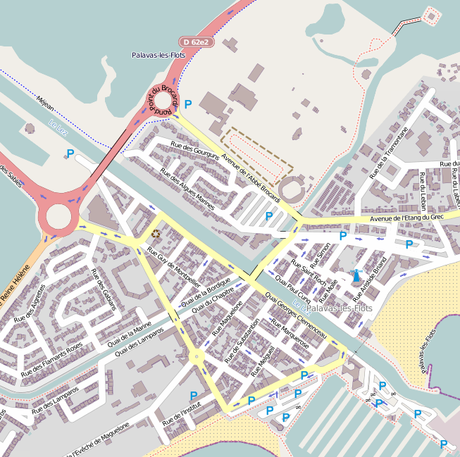
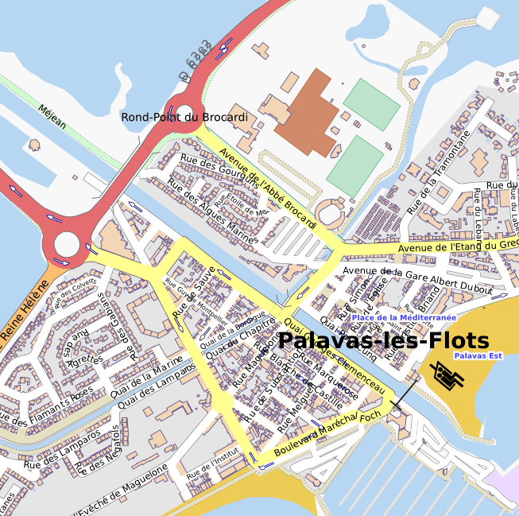
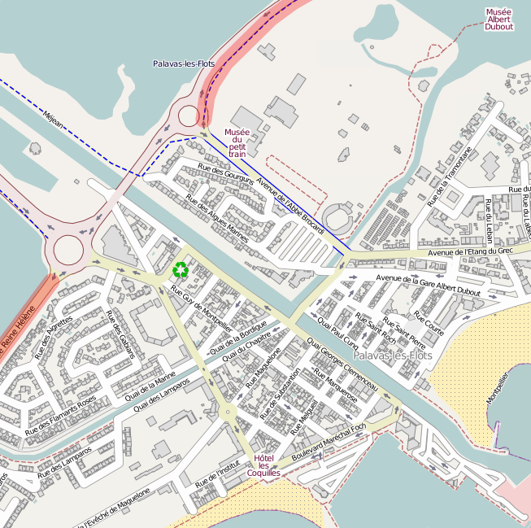
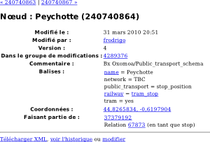
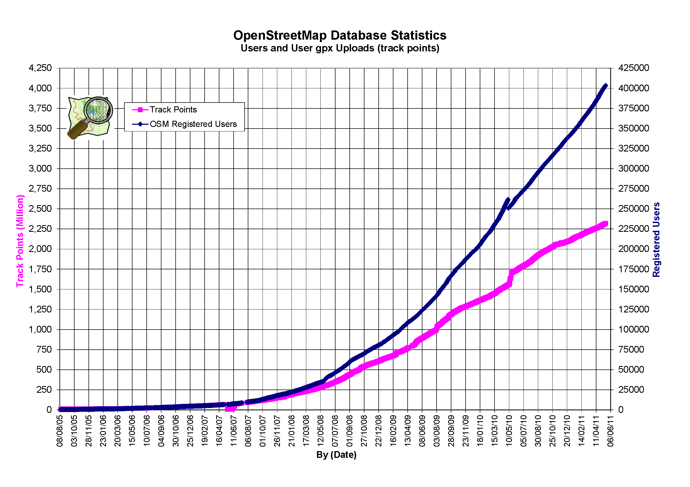
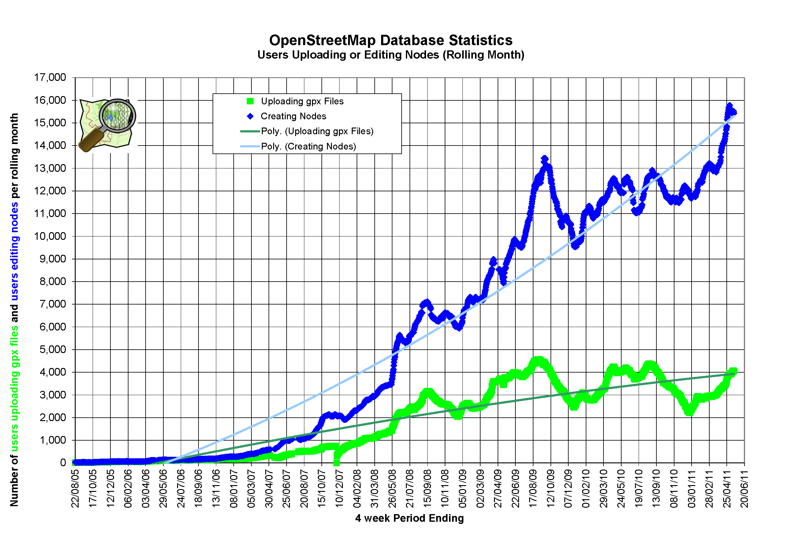
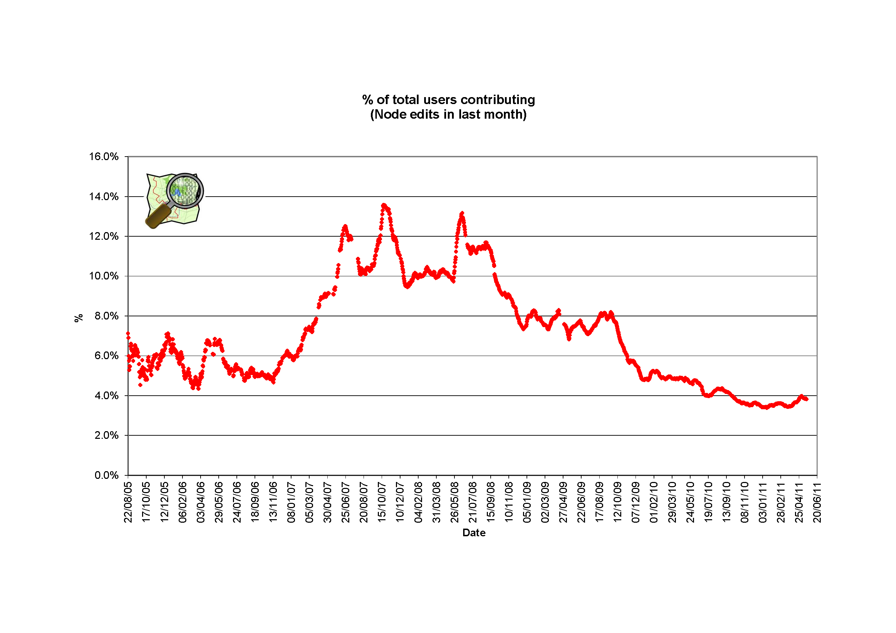
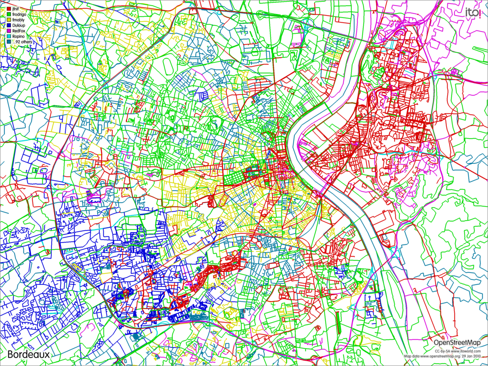

Part1 – Monde - Écosystème OSM

Le site : OpenStreetMap.org
===========================

Le site principal du projet est disponible à l'adresse
[http://www.openstreetmap.org](http://www.openstreetmap.org/), il est
également accessible sous ça forme abrégé
[http://osm.org](http://osm.org/).

objectif

Avec le wiki abordé plus bas, il est à la fois une vitrine et un point
d'entrée sur le projet. C'est par lui et ces APIs que passent les
contributions.

Consultation
------------

### Carte

La carte glissante (1) est l'élément central de la page d'accueil du
site.

Pan; souris; flèches

Il est possible de la déplacer à l'aide de la souris par un
cliqué-déplacé ou par des flèches directionnelles en haut à gauche (2).

zoom; curseur

Le niveau de zoom est contrôlé par la barre de gauche (3). Il peut être
modifié à l'aide des boutons « + » et « - » ainsi que en déplacent le
curseur sur l'échelle.

Double clic

Une autre façon de zommer est d'effectuer un double clic directement sur
la carte. Le point sous le curseur passera alors au centre au niveau de
détails supérieur.

Molette; position du pointeur

Il est également possible d'utiliser la molette de la souris. Le
changement de zoom se fera alors en fonction de la position du pointeur
sur la carte. Le point ainsi désigné restera au même endroit.

sélection rectangulaire

La solution la plus rapide d'atteindre un lieu est sans doute la
sélection directe de la zone. En maintenant la touche « Ctrl » enfoncée
puis en effectuant un cliqué-déplacé on dessine un rectangle (4). Une
fois le bouton de la souris relâché, cette sélection sera directement
affichée au bon niveau de détails.

Échelle

L'échelle de la carte est visible en bas à gauche (5). Elle est fonction
du niveau de zoom mais aussi de la position sur le globe terrestre du
fait de la projection utilisée. Cette échelle est indicative et ne se
révèle pertinente que à des niveaux de zooms importants.

Rendu

Le « + » en haut à droite (6) ouvre un menu. On y trouve une liste de
rendu de cartes; chacun avec ces avantages et ces défauts. Mapnik et
Osmarender sont des rendus génériques. Les autres sont des usages
thématiques. La carte cyclable (OpenCycleMap), comme son nom l'indique,
est à l'usage des cyclistes. À un niveau de zoom élevé elle va afficher
les voies, pistes cyclables et autres informations utiles. Tandis qu'à
faible zoom elle va mettre en avant les véloroutes. La base de données
OpenStreetMap n'est pas orienté sur une seule thématique. Un nombre
important de données peuvent être positionnées au même endroit. Parfois
en telle quantité qu'il n'est pas possible de les afficher toutes à la
fois. Il convient alors de réaliser des rendus pour différents usages.

### Menu gauche

Wiki ; Licence ; Légende

Ce menu contient le logo du projet et un bref descriptif. Il est suivi
de points d'entrées pour aller plus loin : lien vers la documentation
sur le wiki, l'outil d'aide, des détails sur la licence, la légende
(7)...

### Recherche

Le menu de gauche possède aussi une zone pour effectuer des recherches
(8). Les résultats vont provenir de deux sources différentes.

Nominatim

La première est Nominatim. Il s'agit d'un outil travaillant avec les
données d'OpenStreetMap. Il va être capable de retrouver des adresses et
des entités par mots clés.

geoname

La seconde est GeoNames, un service externe.

ajouter outil de recherche firefox

Avec certains navigateurs web il est possible d'ajouter
OpenStreetMap.org comme site de recherche. Sous Firefox il faut utiliser
l'option « ajouter » depuis la zone d'accès à la recherche rapide.

### Liens

permalink

En bas à droite se trouve des liens vers la carte en cours de
visualisation (9). Ce sont des liens permanents sur la vue active. Si on
les suis on arrive sur la même page, dans le même état qu'actuellement
visualisé. Ils permettent de désigner le lieu, le zoom et le calque
actuellement affiché. Le lien permanent et le lien court désignent la
même page, mais de façon plus ou mois concise et interprétable par
l'homme. L'objectif est de pouvoir diffuser un lien permanent sur une
vue de la carte. Pour une même vue l'on va donc avoir ces deux liens :

-   <http://www.openstreetmap.org/?lat=-46.43155&lon=51.86108&zoom=16&layers=M>
-   <http://osm.org/go/jXH9FlBj>

Réutilisation
-------------

### Exporter

onglet

L'onglet exporter sur le site permet d'extraire des données et de créer
des cartes.

Zone

Par défaut la zone utilisée correspond à la vue courante, mais il est
possible d'en spécifier manuellement une. Plusieurs options sont ensuite
disponibles.

#### Format natif

 .osm

Le premier des formats disponibles est celui natif à OpenStreetMap.
C'est-à-dire des données brutes au format XML. Elles sont destinées a
être retravaillé ou exploité à l'aide de logiciels. Mais ce n'est pas la
façon la plus courante pour les obtenir.

#### Image bitmap

Image

Les formats Mapnik et Osmarender permettent d'obtenir de grandes images
en PNG ou JPEG (formats bitmap). Leurs tailles et le leurs poids vont
dépendre du niveau de zoom et de l'échelle choisie.

#### Image vectorielle

Pdf

L'export Mapnik à aussi l'avantage de pouvoir être fait sous forme
vectorielle[^1] (SVG, PDF ou Postscript). Ce type d'image à l'avantage
de pouvoir être affiché et imprimé avec une qualité constante
indépendante des redimensionnements. Il s'agit d'un format décrivant
l'image finale à l'aide de traits d'aplats, de textes, etc, à l'inverse
d'une matrice de points de couleurs (bitmap). C'est donc vers ce type
d'export qu'il faut se tourner par défaut pour rediffuser une carte. Ces
formats (particulièrement le SVG) autorisent aussi une modification tout
en conservant la qualité du rendu , mais il existe des outils mieux
adaptés à ce besoin.

échelle pour changer le niveau de détails

Afin d'obtenir plus ou moins de détails sur la carte il est possible
d'ajuster l'échelle.

#### Code HTML

iframe

Le dernier type d'export permet de générer du code HTML à inclure dans
un site web. La carte glissante OpenStreetMap ainsi obtenue permettra
aussi l'exploration : .déplacement, zoom...

marquer

Une option est disponible pour ajouter un pointeur.

&lt;iframe width="425" height="350" frameborder="0" scrolling="no"
marginheight="0" marginwidth="0"
src="http://www.openstreetmap.org/export/embed.html?bbox=-1.513412,48.63456,-1.509502,48.637411&amp;layer=mapnik"
style="border: 1px solid black"&gt;&lt;/iframe&gt;

&lt;br /&gt;

&lt;small&gt;

&lt;a
href="http://www.openstreetmap.org/?lat=48.6359855&amp;lon=-1.511457&amp;zoom=17&amp;layers=M"&gt;Voir
une carte plus grande&lt;/a&gt;

&lt;/small&gt;

### Usages avancés et astuces

marqueur sans iframe

#### Ajouter un marqueur sur un lien permanent

Dans un lien permanent il est possible de remplacer « lat » et « lon »
par « mlat » et « mlon ». On obtient alors le même pointeur au centre de
la carte que dans l'export de type code HTML. Pour choisir l'élément à
centrer on peut y faire un double-clic dessus au paravent. L'ajout d'un
marqueur sur la version courte du lien se fait en le suffixant de «?m ».

lien sur un éléments

#### Lien sur un objet

Désigner directement un élément de la base par un lien est également
possible. Il faut pour cela en connaître son identifiant.

Contribution
------------

avant tout il faut un compte; pas de contributions anonymes

La contribution est le maître mot d'un projet participatif comme
OpenStreetMap. Les contributeurs peuvent dessiner des pans entier de la
carte ou tout simplement ajouter un bureau de poste ou corriger le nom
d'une rue. Avant de pouvoir effectuer une quelconque contribution il
faut avoir un compte utilisateur. Les soumissions anonymes ne sont pas
possible.

Pour ce faire il suffit de s'inscrire à l'aide du lien tout en haut à
droite sur le site (10).

### Espace utilisateur

#### Information publique

À chaque utilisateur est associé un lien unique donnant des
d'informations le concernant. De là il est possible de lui écrire, de
consulter ces journaux, la visualiser la liste de ces contributions,
lister ces traces GPS... Ces URL sont de la forme :
http://www.openstreetmap.org/user/\[utilisateur\]

#### Partie privé

messagerie

La partie privé d'un utilisateur contient notamment un système de
messagerie permettant de contactéer les autres contributeurs.

options

On y trouve aussi une section option. Pour un affichage du site en
français il faut entrer « fr » dans la zone de sélection de la langue.
Il est possible d'y choisir son éditeur par défaut. La carte tout en bas
de page permet de se géolocaliser. Cela permet notamment de retrouver
les contributeurs à proximité et de pouvoir ainsi les contacter.

Pour finir, la section dédiée aux paramètres OAuth liste les
autorisations accordées aux applications tierces pour contribuer en
votre nom ou liéer un outil externe à votre compte. Il s'agit de
logiciels ou d'autres sites internet, essentiellement des outils
d'éditions.

### Dépôts de traces GPS

Les enregistrements de déplacement avec des GPS donne des traces. Elles
servent à enregistrer la position des voies et par la suite à les
positionner dans OpenStreetMap.

#### Onglet Traces GPS (11)

Cette vue liste toutes les traces GPS soumisent par les contributeurs.

But

Bien que OpenStreetMap ne soit pas un dépôt de traces, elles sont
stockées pour aider à la cartographie. Ces traces sont historiquement la
première source de données. Un tramage de traces permet dessiner la
carte.

#### Envoie de traces

Dans l'onglet « Traces GPS », comme dans la partie privée de
l'utilisateur on trouve un lien pour envoyer ses propres traces. Elles
doivent être au format GPX pour pouvoir être déposées. Tous les GPS ne
produisent pas des GPX, mais elles peuvent être converties dans le bon
format notamment avec le couteau suisse du GPS qu'est le logiciel
GPSBabel. Lors de l'envoi il faut saisir une description et des balises.
Ces balises correspondent à des tags pour la décrire de façon
synthétique, permettant de la retrouver facilement. On utilisera par
exemple : « Vieux Port, Marseille, France ». Les traces peuvent alors
être listées par balises :

-   <http://www.openstreetmap.org/traces/tag/Marseille>

niveau de privatisation

Le dernier champ à saisir lors du dépôt est plus complexe à appréhender.
Il détermine la façon de protèger votre vie privée en diffusant ces
informations. Il y a trois axes de protections :

-   listé : elles apparaissent ou non dans la liste publique des traces,
    on peut les retrouver à l'aide des balises,
-   anonyme : il est possible ou non de remonter à l'auteur de la trace
    lors de son usage comme source de donné,
-   ordonné, daté : les éléments constituant la trace seront horodatés
    ou non lors de leurs usages.

  -------------- ------- ------ ---------
                 Listé   Daté   Anonyme
  Privé                         x
  Public         x              x
  Pistable               x      x
  Identifiable   x       x      
  -------------- ------- ------ ---------

### Onglet Modifier (12)

Au survol de l'onglet « modifier » apparaît un menu avec les différents
éditeurs disponibles à partir d'ici (il en existe d'autres). L'éditeur
par défaut est configurable dans les options personnelles. Le meilleur
choix pour débuter est sûrement Potlatch 2.

### Onglet Historique (13)

L'onglet « Historique » donne la liste des modifications récentes
apportées à la zone en cours de visualisation. On trouve dans l'ordre :

-   un lien vers les détails du « groupe de modifications »,
-   la date,
-   un lien vers l'utilisateur ayant contribué,
-   la description de la modification laissée par l'utilisateur,
-   les coordonnées de la zone concernée, les lignes suffixées par
    « (grand) » désignent des zones plus large que celle concernée.

### Calque données (14)

Ce calque permet de visualiser directement sur le site les données
présentes dans la base. Les cartes, qu'elles soient thématiques ou
génériques, ne permettent pas de visualiser toutes les données à la
fois. Ce calque offre donc la possibilité de les explorer en détail. On
peut alors sélectionner un élément sur la carte ou dans la liste pour en
avoir les détails.

### Données

Chaque élément contenu dans la base d'OpensStreetMap est détaillé sur
une page. Ainsi on peu suivre le lien « détail » sur le calque de
données ou depuis le contenu d'une groupe de modifications. Ces pages
décrivent entièrement les objets et les liens entre eux. Sont également
accessible l'historique de l'objet et le téléchargement en format natif.
Ces éléments sont adressables par leur identifiant :

-   http://www.openstreetmap.org/browse/node/\[identifiant\]
-   http://www.openstreetmap.org/browse/way/\[identifiant\]
-   http://www.openstreetmap.org/browse/relation/\[identifiant\]
-   http://www.openstreetmap.org/browse/changeset/\[identifiant\]

Onglet journaux (15)
--------------------

Les journaux sont ce que les utilisateurs en font. Ils sont lisibles
depuis l'onglet « Journaux ». Tous les utilisateurs sont libres de
poster. Mais ce n'est pas un forum ou un lieu de discussions. Il existe
pour cela d'autres canaux. Les journaux sont, comme leur nom l'indique,
des rapports d'activités des contributeurs et des notes d'informations.

-   <http://www.openstreetmap.org/diary>, toutes langues confondues,
-   <http://www.openstreetmap.org/diary/fr>, uniquement en français.

Ce que le site OpenStreetMap.org est et ce qu'il devrait être
-------------------------------------------------------------

On fini toujours par trouver qu'il manque quelque chose, où qu'il y a du
superflu sur le site OpenStreetMap.org.

Portail

Il est le point d'entrée du projet. OpenStreetMap est aujourd'hui un
projet de base de données géographique libre et une communauté.

avoir ou pas un carte

Partant de ce fait on peut se poser la question de la pertinence
d'afficher ne serait-ce qu'une carte ! Il constitue cependant une belle
vitrine. Des voix qui s'élèvent pour en demandent toujours plus (plutôt
que moins)[^2].

outil de routage; monter plus de types de rendu; affichage
OpenStreetBug; afficher facilement les information des poi ; multilangue

On retrouve notamment des demandes pour avoir un outil de calcul
d'itinéraire, la possibilité d'obtenir directement des informations sur
les points d'intérêts (POI), plus de rendus de cartes thématiques ou
linguistiques pour montrer la diversité des données, un outil pour
reporter facilement des anomalies...

Toute fois il faut se demander quel est l'objectif du site : un portail
d'entrée sur le projet, un outil pour les contributeurs, un outil pour
les utilisateurs ; un site présentant...

Historique
==========

 debut

 ete 2004

 fort essor en UK

 2006, 2007 pour se repandre

 fondateur

 Steve Coast

 http://www.stevecoast.com/

 NB

 Aout 2004

 Ordnance Survey

 1ere mp

Définition actuelle du projet
=============================

OSM n'est plus une carte des rues mais est devenu un base d'information
geographique

À l'origine le projet avait pour but de créer une carte libre de la
voirie. Mais cet objectif a évolué. Il est devenu une base de données
géographiques contenant tous types de thématiques.

Approche
--------

L'approche d'OpenStreetMap est différente de la cartographie et de la
géomatique classique. Le simple fait que les données soient éditable par
tout le monde rompt avec les contraintes et les normes imposées des
milieux professionnels.

l'approche la plus simple est la meilleure

L'esprit du projet est qu'une approche simple et ouverte serra
meilleure.

pas d'utilisation des std tel OGC

Ainsi il définit ces propres « normes » loin des standards, comme ceux
de l'OGC.

complique a mettre en plus; maintenir; pas adapte à un processus wiki

Le respect de ces standards entraverait la facilité à contribuer. Cela
n'empêche pas les données de rester convertibles et d'être utilisées
dans d'autres systèmes d'information plus normés.

pas de wms

Par exemple les données ne vont pas être servies via le standard WFS
mais pas une API spécifique, permettant le travail collaboratif. L'API
laisse libre la description des données, ouvrant le champ des usages
possibles.

Périmètre
---------

La question du périmètre se pose selon plusieurs axes. Quels contenus
doivent entrer dans OpenStreetMap. Les sources d'information sont
diverses, la réalité est multi-échelle, tout ce que l'on trouve sur une
carte ne provient pas directement du terrain (limites administratives,
toponymie, interprétation du terrain...).

techniquement on peut tout mettre dans la base ; la communauté n'est pas
prête à accepter n'importe quoi

Techniquement il est possible d'ajouter beaucoup de concepts et
d'objets, mais la communauté est-elle prête à accepter n'importe quoi.
Par exemple des éléments éphémères peuvent-il intégrer OpenStreetMap ?

non temporel ; controverse du tag historic=event

Doit-on signaler des voies en travaux ou encore localiser des événements
historiques (historic=event ou historic=battlefield)... La dangerosité
des voies (notion sujette à appréciation) ou encore les lignes ou les
horaires de bus sont-il des informations aptes à être ajoutées à la
base.

profitable a tous

De plus OpenStreetMap est un projet collaboratif, construit par tous
mais aussi pour tous. Il doit contenir de l'information potentiellement
utile à tout le monde. Ce n'est pas un système d'information
géographique simplifié sur internet. Ce n'est pas le lieu pour noter la
date de plantation des arbres de son jardin ou stocker des liens
géolocalisés vers ses photos personnelles.

Ce sont les contributeurs eux-mêmes et surtout l'ensemble des
contributeurs qui définissent le périmètre de ce qui est acceptable.

### Réalité tangible

cartographie la réalité du terrain

La philosophie originale du projet est de cartographier la réalité du
terrain. Face aux variantes issue de différentes sources d'informations
et aux interprétations possibles, c'est la réalité du terrain qui doit
prévaloir.

vérifiable

Elle à ceci de particulier qu'elle est à l'origine de la carte et
surtout qu'elle est vérifiable.

<http://wiki.openstreetmap.org/wiki/Verifiability>

Est vérifiable ce que l'on peut démontrer être vrais, ce qui est
observable à plusieurs reprises de manière objective. Malheureusement
tout ne l'est pas, la façon même de percevoir et de décrire cette
réalité brise l'objectivité. Il va être possible de montrer qu'une rue
existe (position, highway=\*), qu'elle est pavé (surface=cobblestone),
qu'elle porte un tel nom (name=\*). Mais déterminer son importance dans
la ville va relever d'une certaine subjectivité
(highway=residential/tertiary/secondary...).

L'interprétation du monde peut se faire à plusieurs échelles. En
fonction du niveau de détail, de la précision dont on dispose et de son
approche. La traduction de la réalité en artefacts cartographiques ne va
donc pas aboutir au même résultat.

### Niveau de détails

Vue de loin, de très loin, où de manière simplifiée, une ville n'est
qu'un point, c'est en s’approchant que l'on va y distinguer un réseau de
rues. Il en est ainsi à tous les niveaux d'échelles. En approchant
encore les rues vont se muter en surfaces et ne plus être uniquement des
axes. encore plus près une rue est composée de trottoirs
(sidewalk=both), de caniveaux, d'asphalte, de terrains pleins et autres
éléments, le tout décoré de passages piétons (highway=crossing), de
candélabres (highway=street\_lamp), de bancs (amenity=bench), de
panneaux (traffic\_sign=\*) et de tant d'autres artefacts.

école un point ; école une surface

Pour commencer une école peut être annoté comme un point d’intérêts.
Ensuite il est possible de le remplacer par une zone. Pour continuer
l'on peut entreprendre de représenter chaque bâtiment et surfaces de
jeux...

la qualité vient en raffinant

Les détails et la qualité viennent en raffinant, en retravaillant les
données itérativement, en repassant dessus, en revisitant le terrain.

### Immatériel

Relever des données afin d'établir des cartes ce n'est pas uniquement
collecter des données palpables in-situ.

limite administrative

Les frontières sont des éléments artificiellement posées sur le
territoire. Même si elles se basent souvent sur des démarcations
géographiques leurs assemblages n'en demeurent pas moins arbitraire.

Ref ; code postal ; insee

D'autres marqueurs existent pour référencer les territoires, cette fois
de façon totalement artificielles. Les codes postaux ou INSEE sont
utilisés pour faire le lien entres les zones géographiques et d'autres
jeux de données. L'utilisation de ces références pour adresser les
éléments est essentiel dans le but d'enlever toute l'ambiguïté des
nommages et les désigner par la même de façon unique.

route

Les routes au sens du cheminement sont aussi une abstraction de la
réalité. Une route est la mise bout à bout de segments.

départementale

Un exemple simple est celui de la route nationale. Elle constitue une
entité mais n'est pas cartographiable sur le terrain de façon immédiate.

ligne de bus

Cette notion peut être complexifiée, une route départementale peut ne
pas être d'un seul tenant, on peut vouloir cartographie la route
effectuée par un bus de ville, une route des vins...

opérateur ;num de téléphone

Il est possible d'aller encore plus loin dans cette immatérialité. On
peut décrire, en plus du trajet du bus, l'opérateur qui l'exploite, le
numéro de la ligne, les arrêts qu'il dessert. Il est également
envisageable de relever les numéros de téléphone et les horaires
d'ouverture de magasins.

osm base topologique ou base sémantique ou pas

OpenStreetMap n'est pas qu'une base de données topologique elle
introduit aussi de la sémantique entre les éléments, permettant de les
associer et de les décrire.

Ce que le projet n'est pas
--------------------------

une simple carte

Le projet n'est pas une simple carte sur un site internet. C'est à la
fois une base de données, une communauté, et tout ce que celle-ci crée.
OpenStreetMap est un projet.

un clone de google map ; image aérienne ; API ; pas d'image aérienne

Ce n'est pas non plus une solution de cartographie web intégrée. Il ne
met pas à disposition à la fois une carte, une API pour la manipuler et
gérer des données annexes ainsi que afficher une photographie aérienne.
OpenStreetMap à lui tout seul n'est pas un concurrent de l'API Google
Maps, ViaMichelin, MapQuest...

Les logiciels nécessairee à l'exploitation des données d'OpenStreetMap
lui sont souvent spécifiques. Dans la majorité des cas ils sont
uniquement dédiée au projet. Il existe un grand nombre d'applications
permettant de traiter des données géographiques. Certaines travaillent
avec des modèles proches du format natif d'OpenStreetMap, tandis que
d'autres nécessiteront des conversions préalables.

juste une base de données ; un fournisseur de services

L'objectif premier d'OpenstreetMap est bien de fournir une base de
données géographique libre. En se sens on ne trouve donc pas de
solutions annexes fournis directement par le projet. Toute fois, si
elles existent et elles existent souvent, elles vont l'être par des
tiers et parfois même intégrées au site OpenStreetMap.org comme pour
fonctionnalité de recherche. Ces offrent de services et de logiciels
sont disponibles librement ou gratuitement, mais aussi commercialement.

tiles

Les serveurs du projet ne sont pas mis en place pour offrir des services
tiers. Surtout pas pour être utilisé comme fournisseur de tuiles
(morceaux de carte sous forme d'images) en quantité importante à des
consommateurs. Les réutilisateurs qui auraient besoin d'un tel service
ou d'autres doivent se tourner vers des solutions externes : utiliser
des fournisseurs dont c'est le métier ou mettre même en place eux-mêmes
une infrastructure.

un dépôt de GPX

OpenStreetMap n'est pas non plus un dépôt de GPX. Les traces GPS
collectées doivent être utile pour créer la carte. Ce n'est un site
destiné à conserver des déplacements à travers champs, des
enregistrements de séances de vol à voiles... Les données doivent être
utiles à tous et ne pas être source d'erreurs ou de doutes.

http://help.openstreetmap.org/questions/1194/what-osm-is-not

Comparaison à Wikipédia
-----------------------

OpenStreetMap est par nature proche de Wikipédia en bien des points :
libre, esprit collaboratif, construction itérative, organisation...

utilisation dans wikipedia cf \[reutilisation\]

Wikipédia affiche des cartes OpenStreetMap sur les contenus
géolocalisés. La passerelle dans l'autre sens, d'OpenStreetMap vers
Wikipédia se fait à l'aide de références à des articles depuis des
objets.

Chemin : La Croix Blanche (31289191)

landuse = commercial

name = La Croix Blanche

wikipedia = fr:La Croix-Blanche (Sainte-Geneviève-des-Bois)

Par contre le géoréférencement des articles de Wikipédia ne peut pas
être utilisé comme source pour OpenStreetMap. Ils proviennent de source
qui ne sont pas utilisables ou ne le serait pas une fois reconsolidées
dans OpenStreetMap.

### Multilinguisme

L’approche pour la gestion des langues et par extension des spécificités
par pays est faite de façon différente à Wikipédia.

corpus unique

Wikipédia a principalement un contenu textuel, son corpus est dont
décliné par langue. Quand au contenu multimédia il est centralisé sur
Wikimedia Commons. À l'opposé OpenStreetMap n'a qu'un seul exemplaire
des données de la planète pour l'ensemble des langues et des pays, sa
matière de base est topologique. Les valeurs des attributs peuvent y
être déclinés par langues ou spécificités locales.

nommage multilingue

Un attribut à valeur littérale destiné à l'utilisateur a par principe
une valeur dans une seule langue, la version par défaut est celle de la
langue locale. Une version de l'attribut par traduction est ajouté.
Toute fois certaines zones, comme la Belgique ont plus d'une langue
officielle. À Bruxelles le nommage « local » est par défaut à la fois
français et néerlandais en plus des dénominations par langues.

Nœud : Saint-Gilles (26032499)

name = Saint-Gilles - Sint-Gillis

name:fr = Saint-Gilles

name:nl = Sint-Gillis

place = town

population = 47000

tag monolingue

Tous les attributs de nomenclature et donc non littéraux ne se
traduisent pas, il sont en anglais britannique (en-GB, « colour »,
« centre »...). Il est important de ne pas les traduire pour converser
une homogénéité mondiale et une compatibilité transfrontalière avec les
logiciels. Même lors de la création de nouvelles valeurs d'attributs
pour des types d'objets qui peuvent paraître une spécificité locale il
faut penser intégration dans un système global. Ainsi on ne va pas
utiliser un attribut en français (ni en Breton) pour décrire les fours à
[]{#anchor}goëmon que l'on ne trouve que en Bretagne.

Nœud : Four à Goëmon (564718349)

historic = archaeological\_site

name = Four à Goëmon

name:br = Forn Bezin

tourism = attraction

Les spécificités par pays se font aussi par extension des attributs
internationaux, selon le même modèle que pour les langues. Notez cette
fois l'utilisation du suffixe en majuscule pour dénommer le pays et non
la langue.

Nœud : École Primaire Gazonfier (350469020)

amenity = school

name = École Primaire Gazonfier

school:FR = primaire

castle\_type:de

### []{#anchor-1}[]{#anchor-2}Problèmes inhérents

#### Guerre d'édition

Une guerre d'édition survient lorsque plusieurs contributeurs ne sont
pas d'accord sur un sujet et changent successivement les uns à la suite
des autres le contenu. Sur Wikipédia ce problème se rencontre
essentiellement sur des thématiques culturelle et religieuse. Cela se
règle par la discussion et la médiation dans l'objectif de respecter la
neutralité de point de vue, ou lorsque ce n'est pas possible par le
blocage de contributeurs ou la protection de la page.

la réalité est moins sujette à []{#anchor-3}controverse qu'un article ;
besoin d'aller surplace pour contrôler

La cartographie géographique n'est pas sujette à cela, la réalité
tangible du terrain fait fois. Seul les aspects immatériels sont
sensibles à ce phénomène.

les conflits ne sont pas destructifs

Ces conflits n'ayant que peu attrait à la topologie ils ne sont pas
réellement destructeurs. Il peut s'agir de la traduction des noms
utilisés comme valeur par défaut. Cela a été le cas à Chypre.

En fin de compte, OpenStreetMap n'est que très peu impacté par ce sujet
et il n'est pas encore nécessaire de limiter les nouveaux contributeurs
comme cela se fait déjà sur Wikipédia.

#### Vandalisme

Les dégradations volontaires sont dans la majorité des cas faites pour
être visible. Wikipédia possède des outils de détection de ce type de
« contributions ». Qu'elles soient détectées par un visiteur, un
contributeur ou un outil le vandalisme est facilement réversible.
OpenStreetMap n'a pas encore de tel outil, bien que le vandalisme y soit
encore rare, il est visible directement sur la carte (graffiti,
dessin...). Il est la aussi possible de revenir en arrière sur ces
modifications.

#### Nature du contenu

édition sur la forme et non sur le fond

Les informations contenues dans Wikipédia le sont suivant le paradigme
de séparation du contenu et du contenant (le fond et la forme pour faire
simple). Mais les travers arrivent vite. À l'ajout d'une image l'on peut
définir si elle va être affiché à droite ou à gauche, les modèles font
un usage non modéré des spécifications de mise en forme et ainsi de
suite. La séparation, bien qu'elle soit la règle, n'est pas stricte. Les
données contenues dans Wikipédia ne sont donc pas exploitable sans
prétraitement par des logiciels. Elles sont avant tout créées pour
l'affichage sur le site principal.

OpenStreetMap à une politique beaucoup plus stricte vis-à-vis de son
contenu. Les données entrées dans la base ne doivent pas être spécifique
à un usage. En particulier pour effectuer un rendu de carte. Il est
possible de tricher sur la définition de données pour les faire
apparaître sur la carte. Mais cela est vraiment à proscrire. Décrire les
objets pour le rendu conduit à les annoter à l'aide d'informations
inappropriées. Par exemple pour faire apparaître des lignes d'un terrain
de sport suivant un rendu graphique « cohérent » on pourrait les définir
comme des murs, il s'agit bien évidement d'une aberration. Où encore
définir les bunkers (golf=bunker), zone de sable sur un terrain de golf,
comme des plages ([]{#anchor-4}natural=beach) pour les faire apparaître
là aussi sur les rendus de cartes.

#### Copyvio

données copier sous licence ; moins facile a faire que sur wikipedia

Copyvio est un terme du jargon de Wikipédia signifiant violation du
droit d'auteur (copyright violation). La copie verbatim de contenu est à
la porté de n'importe quel contributeur de Wikipédia. Il suffit de faire
un copier-coller de texte. Il va de soit qu'il est illégitime et à
proscrire. Mais il est facile de mise en œuvre, en particulier
techniquement. Ce qui entraîne des travers chez les nouveaux
contributeurs et les participations anonymes. Il en résulte donc des
taches de suivi, dans le but de respecter à la fois le droit d'auteur et
la licence du projet. Si de tel contrôle n'étaient pas fait ils
métraient le projet en péril légalement.

De l'autre coté, l'import de données géomatiques tierces dans
OpenStreetMap est plus difficile à réaliser. Cette tâche n'est notamment
pas à la porté des nouveaux arrivants sans connaissances en géomatique.
En outre la recopie de cartes par les contributeurs est aussi plus
difficile à effectuer. Même si l'on veux copier des éléments il ne va
pas être aisé de les replacer correctement. Les outils d'éditions
standard permettant d'utiliser par défaut que des sources de données
autorisées. Reste alors la copie des attributs et des noms, le problème
n'existe en fait que partiellement car les objets sur lesquels faire
porter ces attributs ne peuvent pas être placé facilement. Il ne faut
toute fois pas nier que la tentation de le faire est parfois grande.

### Seuil d'entrée

#### Technique

le niveau d'entrée est plus haut pour osm

Il va s'en dire que le niveau des connaissances techniques nécessaires
pour faire de la cartographie est supérieur à celui de la rédaction de
texte. La participation à Wikipédia est aisée lors des
primo-contributions avec un minimum de pré-requis informatiques. À
contrario soumettre une contribution à OpenStreetMap demande de mieux
comprendre les us et coutumes et la structuration des informations. Les
concepts sous tendant la cartographie sont moins facile à appréhender
que de l'écriture d'articles. Même si les deux projets présentent des
concepts avancées qui demandent de l'implication, Wikipédia est
initialement plus facile d'accès.

#### Connaissances

Dans les deux projets des contributions à forme, par opposition au fond,
peuvent être faites sans connaissances approfondis du sujet ou de la
zone concernée. Ce type de participation tend à corriger la forme, par
exemple : faute d'orthographe, reformulation de phrase, catégorisation
des articles pour Wikipédia ou normalisation de la typographie,
homogénéisation des attributs pour OpenStreetMap.

la contribution est plus facile : regarder par la fenêtre ! Pas besoin
de bien connaître un sujet pour contribue significativement

Mais les contributions réelles concernent le fond. Pour cela il faut
avoir de la matière à apporter. La contribution à l'encyclopédie
requière une « expertise » sur un domaine. Les connaissances nécessaires
à la participation sont d'autant plus grandes que l’article est déjà
rédigé. À l'inverse pour contribuer à la carte, qu'elle soit déjà tracé
ou non, le pré-requis est de connaître un lieu ou d'aller sur place.
« L'expertise » locale est donc beaucoup plus accessible et simple à
acquérir. À l’extrême limite, pour contribuer sur le fond à
OpenStreetMap il suffit de regarder par la fenêtre ![]{#anchor-5}

### Qualité

Pour tenter de comparer les projets il faut le faire sur des critères
communs. Les plus communément admis et étudiés sont la complétude et la
justesse du contenu.

#### Complétude

la qualité est numériquement quantifiable ; la complétude de wikipedia
est évaluable

L’avancement de Wikipédia est évalué par projet lui-même. Les articles
sont jugés selon des critères d’avancement et d'importance par
thématiques. Il en résulte des tableaux récapitulatifs[^3]. Mais si l'on
veux juger l'avancement il faut une référence à la quelle comparer les
travaux en cours. Le problème émerge du fait que les encyclopédies
classiques ne sont pas du même ordre de grandeur. La couverture du
savoir par Wikipédia est beaucoup plus vaste[^4] : quid d'un article par
commune, par film, par héros de littérature…

La complétude d'OpenStreetMap est plus facile à appréhender. Il s'agit
dévaluer de façon numérique le taux de couverture d'une zone, ou même du
monde, pour un thème. Cette valeur est calculée vis-à-vis d'autres
données géographiques. Contrairement à Wikipédia cette comparaison est
facilitée par le fait que la terre est un objectif fini (à une échelle
donnée, disons humaine) et que cartographie existent déjà comme base de
comparaison.

#### Justesse

Concernant Wikipédia plusieurs études comparatives avec de grandes
encyclopédies historiques ont été réalisées. Il ressort notamment d'une
étude de la revue Nature[^5] sur des articles scientifiques que la
qualité est très proche de celle de l'encyclopédie Britannica, bien que
légèrement inférieure.

Pour le projet de cartographie cette précision peut aussi être chiffré
par comparaison avec des données de références. Suivant les études il en
ressort des écarts-types de l'ordre de 5m.

### Environnement social et économique

#### Social

 rencontre pour faire des MP

#### Économiques

 pas d’économie autours de wikipedia

 voir même la destruction du marche de l’encyclopédie

 pas de service à valeur ajoute au tours

Aspect légal
------------

Communauté
==========

définition de communauté ; client d'une société ; communauté type wiki
et OS

Le terme « communauté » à plusieurs sens, suivant comment il est utilisé
et par qui. Dans notre contexte « communauté » ne signifie pas
uniquement un groupe de personnes qui a un point commun. Cette forme
affaiblie est parfois utilisée par des entreprises pour qualifier leur
« communauté de clients ». Communauté signifie dans notre cas plus de
choses. En plus de points communs, les membres de cette communauté
échangent entres eux et ont une vision assez convergente de leurs
raisons d'être là. Ils collaborent à l'élaboration d'un bien commun
ouvert à tout le monde et sont plus que des consommateurs : ils sont
aussi acteurs de la communauté.

Contributeurs
-------------

« A simple premise: You map your neighbourhood; I'll map mine; With
enough contributors, we'll map everything. »

« Un principe simple : je cartographie mon quartier, faites pareil chez
vous; avec suffisamment de contributeurs nous cartographierons le monde
entier. »

### []{#anchor-6}Profils des participants

Permettre à n'importe qui de consulter et de modifier

Il n'y a pas de l’imitations d’accès au projet. La contribution est
ouverte à touts. Que ce soit de la consultation jusqu'à de la
contribution active, voire passionnés.

sur le principe, niveau d’accès pas si faible que ça

Dans la pratique les participants sont filtrés par les pré-requis des
connaissances et équipements nécessaires.

modification possible directement depuis le site avec ou sans gps

Ces contraintes sont souvent sur évaluées. Au fil du temps, la
contribution est devenue de plus en plus abordable ; mais le mythe
persiste. Les applications d'édition en lignes sont dorénavant
intuitives, il en existe de disponibles sur les appareils mobiles,
posséder un GPS n'est plus une obligation...

but différent

Des profils de contributeurs se dégagent de la nature même du projet
OpenStreetMap, de l’intérêt qu'il suscite et de la capacité des
personnes à effectivement participer. Il ne convient toutes fois pas de
les cloisonner. Les participants y prennent part dans des buts
différents mais toute fois convergeant vers un objectif similaire.

#### Motivations

autochtone

Les autochtones, dans le sens premier du terme, sont des contributeurs
importants. Leur participation est avant tout locale. Elle tend à
produire une nouvelle carte au plus près du terrain : à la fois plus
juste, plus à jour et plus détaillée, le tout en toutes connaissances de
cause et dans le souci de bien faire.

pratiques

Des contributeurs trouvent aussi dans le projet un moyen d'approfondir
un rapport qu'ils ont à une pratique. Ce sont autant des consommateurs
que des contributeurs de données thématiques. Pour eux il va s'agir de
contribuer principalement à un centre d'intérêt.

vélo

Les données génériques sont étendues et servent de support à des usages
spécifiques. Les rues peuvent être décorées de voies cyclables[^6]. Les
ports détaillés par l'ajout de bouées de navigation[^7]. Les chemins de
randonnées[^8] vont être décrit. Des passionnés de trains ou de
transports en commun vont créer des représentations des réseaux[^9]. Des
amoureux des sports d'hiver vont dessiner des stations de ski[^10]...
D'une manière générale des spécificités sont fusionnées dans un tout.

[]{#anchor-7}cartophile

Sont également présent des personnes passionnées par les cartes et la
cartographie ainsi que ce qui touche à l'exploration et le découverte
des lieux.

libriste

Participent également des libristes, intéressés par l'aspect libre du
projet. La liberté est pour eux l’élément principal et une source de
motivation.

participation au logiciel libre

Comme le montre Nama Budhathoki dans son étude de la cartographie
volontaire[^11], un tiers des contributeurs à OpenStreetMap ont déjà
contribuer à des logiciels libres.

participation à wikipedia

De même, les trois quarts ont déjà contribué à Wikipédia.

[]{#anchor-8}[]{#anchor-9}Consommateurs de données

Pour finir, on retrouve des consommateurs de données géomatiques
trouvant économe et facilitateur de s'appuyer sur OpenStreetMap.
Mutualisant ainsi les coûts de création et d'entretien des données mais
aussi permettant l’accès à ces données. Pour eux les libertés associées
sont un aspect important, comme leur coût d'accès. Ils en subissent
parfois certaines contraintes. Parmi ces consommateurs certains
aimeraient des conditions de redistribution différentes. La viralité de
la licence aux œuvres dérivées est parfois un critère limitant pour
leurs usages. Il est important de rappeler que les fournisseurs
historiques de données imposent aussi des conditions, différentes mais
souvent bien plus contraignantes et onéreuses.

Le profil d'un contributeur n'est pas strictement restreint à une de ces
catégories. De plus, cette énumération n'est pas une liste fermée. Les
motivations personnelles sont une combinaison des motivations
précédentes avec plus ou moins de ferveur suivant les thèmes.

#### Types de contributeurs

niveaux de savoir faire différents

Les participants et leurs contributions sont de nature différentes. Ils
n'ont pas tous les mêmes connaissances en matière de cartographie, de
géomatique, la même maîtrise de l'informatique et du terrain.

participer à son niveau

Les projets collaboratifs sont par nature ouvert à tous. Chaque membre
apport sa motivation, son envie et son savoir faire. Les niveaux de
participation sont donc hétérogène. Pour la grande majorité la
contribution va consister à construire la carte au tour de chez soi, un
nombre moins important va participer à la création de l'ontologie, un
nombre encore plus faible va animer la communauté ou aider à entretenir
l'infrastructure du projet...

Sexe

Comme le montre toujours Nama Budhathoki dans son étude, une écrasante
majorité des participants sont des hommes.

niveau d'étude

Le niveau d'éducation est aussi un facteur très déterminant.

ages

Par contre il n'y a pas de prédominance de classes d'ages.

[]{#anchor-10}connaissances préalable du domaine de la cartographie

Cette analyse de la communauté montre que la connaissant préalable de la
géomatique n'est pas un pré-requis à la contribution. La moitié des
participants n'ayant pas de connaissances spécifiques.

### Entreprise

### É[]{#anchor-11}valuation de la participation

Statistiques

La première source d'information sur la vigueur du projet sont les pages
de statistiques du site OpenStreetMap.org[^12] et du wiki[^13]. On y
apprend que plus de 400 000 utilisateurs sont inscrits, plus d'un
milliard de points et de cent millions de chemins présents dans la base
de données[^14].

#### []{#anchor-12}Participants

Le nombre d'utilisateurs progresse vite. Depuis ça création jusqu'en
2010 le projets à crû de façon exponentielle tant au niveau des
utilisateurs que des données. Depuis la croissance est passée à rythme
linéaire.

vs wikipedia

Par extrapolation le comportement de l'évolution d'OpenStreetMap peut
être comparé à celui de Wikipédia qui connaît quelques années d'avances.

typologie de la croissance ; exponentielle ; linéaire

On peut s'attendre à ce que après la phase linéaire ait lieu un
ralentissement progressif du nombre de nouveau utilisateurs et de
contributeurs. Ces deux projets auront peut être alors touché toute la
population prête à y contribuer et par là même atteint leur vitesse de
croisière.

#### Participation

participation au coup par coup

Les utilisateurs effectivement contributeurs et les utilisateurs
toujours actifs ne représentent qu'une partie de ceux qui ont fait la
démarche de s'inscrire sur le site. Sur l'illustration X(3) on observe
la variation du nombre de contributeurs actifs sur un mois, il approche
maintenant les 20 000.

Saisons

En regardant en détail on constate des pics de participation : ils
correspondent tout simplement aux saisons estivales. L'été et les
vacances sont naturellement propice à la cartographie sur le terrain.

dont XX% actif

Avec le temps, le nombre de contributeurs actifs sur un mois tend vers
4% du total des inscrits.

longue queue

Le nombre de contributions est aussi variable suivant les participants.
Beaucoup de contributeurs participent peu, et peu participent beaucoup.
Ce phénomène est connu sous le nom de la règle des 80%-20% et plus
formellement sous le terme de « longue traîne ». Malgré la faible
participation unitaire des 80% des contributeurs les moins actifs leur
ensemble représente un volume loin d'être négligeable. D'un autre coté
les 20% des contributeurs les plus actifs ne produisent pas pour autant
l'essentiel des données. Chaque contributeur apport à son niveau ces
pierres à l'édifice.

Un outil est disponible pour obtenir la participation par
utilisateur[^15]. Il permet de replacer un utilisateur par rapport à la
communauté et d'avoir un historique sa participation.

### R[]{#anchor-13}épartition

mappeur ou l'on veut

La répartition géographique des contributeurs est similaire à la
répartition de la population mise en perspective de l'attrait et de
l'accès à la technologie. On va donc retrouver une part importante de
contributeurs dans les villes de l'occident. Si la densité de
contributeurs en ville permet de couvrir raisonnablement bien le
territoire, ce n'est pas encore le cas à la campagne. En France il est
toute fois courant de trouver des participants en zones rurales

zone blanche

La présence diffuse de cartographes sur ces vastes campagnes crée une
hétérogénéité de la couverture, voire des zones blanches. Il est encore
possible de trouver des communes avec uniquement une route la
traversante.

Couverture

Le taux de couverte d'un site n'est pas directement liée à la présence
de contributeurs à proximité. Elle dépendante aussi de l'attrait de
cette zone.

seul a couvrir certain lieu

Des villages de campagne sans spécificité vont n'être couverte au mieux
que par un seul participant. Alors que les villes, les lieux de
villégiature, les sites touristiques ou de passages sont bien plus
largement détailles.

mapper des lieux éminents non accessibles ; Haïti ; Bagdad

L'attrait de certains lieux non physiquement accessible attire également
la contribution dans le cas où ils sont emblématique, atypique ou
circonstanciel : Haïti ou la côte est du Japon suite aux tremblements de
terre, Bagdad ou encore la Base Alfred Faure sur l'île de la Possession
dans les Terres Australes Française[^16].

limite au niveau de détails

Cependant ce type de cartographie à distance engendre des travers. La
qualité du résultat sans possibilité de contrôle sur le terrain est
difficile à apprécier. Toutes fois ce n'est souvent que la seule
possibilité pour couvrir ces lieux. Cette pratique s'est même révélée
vitale dans la gestion de l'après tremblement de terre de 2010 en Haïti.

les lieux les plus défavoriser sont moins bien mappe

Tout ce-ci est détaillé dans la « Tyrannie des lieux »[^17] de Muki
Haklay. Il en arrive à la conclusion que les emplacements « glamours »
se cartographient tout seul, alors que les zones les plus défavorisées
ont besoin de plus d'effort et de concertation.

La coordination de l'action conduit à des rassemblements de
contributeurs sur un site déterminé de manière physique ou virtuelle :
les mapping parties. Ces opérations coup de point font avancer la carte
sur une zone, mais ne sont au final que anecdotique à la vue de l'étendu
du monde. La cartographie des sites les moins attrayantes ou banals sont
une course de fond.

Peu de collaboration sur le terrain

Plus généralement la collaboration sur le terrain entres les
contributeurs est très faible. Chacun participant au fil de ses envies
et de ses déplacements.

### Motivations

cartographier "son" monde

La démarche initiale est souvent, comme dans Wikipédia, de voir comment
cela fonctionne, de corriger ou de décrire un site que l'on connaît bien
ou que l'on veut connaître.

Autochtone ; lieux aux quels ils sont attaches (au sens large)

C'est une cartographie initialement subjective de son propre univers.
Les premières contributions vont se concentrer sur la ville où habite le
contributeur, son village d'origine, sont lieu de vacances de
prédilection...

Intérêt

Passé la phase initiale les motivations qui poussent à continuer sont
diverses. Dans la « Tyrannie des lieux » Muki Haklay a mené une étude
sur ce sujet et en donne la liste suivant dans cet ordre :

1.  La valeur de l'information géographique libre.
2.  Le désir d'aider les autres avec de l'information géographique
    libre.
3.  La fascination pour la cartographie.
4.  Le plaisir.
5.  Penser que le projet est réalisable.
6.  Croire en l'objectif du projet.
7.  ...

À contrario les aspects financiers et de mise en avant de ces propres
capacités arrivent en dernier parmi les sources de motivation.

Même si appréhender le projet paraît parfois difficile, certains
éléments en facilitent l'accès.

créativité

Outres les motivations spécifiques que l'on vient de voir, on trouve
aussi le désir de créer quelque chose dans le cadre d'une communauté.

Reconnaissance

De façon plus inconsciente existe aussi la satisfaction du travail
accompli : le « c'est moi qui l'ai fait » et une reconnaissance par ces
pairs.

peu de restrictions

Finalement les faibles restrictions techniques et la facilité d'entrer
sur le projet laissent toutes sortes d'envies s'exprimer : autochtones,
randonneurs, cyclotouristes, défenseur du libre...

diversité

L’expression de ces diversités d'intérêts convergeant en un même projet
créent la richesse du celui-ci.

[]{#anchor-14}http://opengeodata.org/openstreetmap-the-best-map[]{#anchor-15}

structure, organisation
-----------------------

 autours de la ML et du Wiki

 local

 lien avec les gul

 association en France

 association OSGeo-fr

 membre commun à OSM et OSGeo-fr

 OSGeo

 lien à l'OSGeo

 point de vue retour

 critiques

 action

 communication

 sensibilisation

 demarchage d'administration

 Local Chapter

 Fondation

 "The OpenStreetMap Foundation is an international

 non-profit organisation dedicated to encouraging the

 growth, development and distribution of free geospatial

 data and to providing geospatial data for anybody to

 use and share."

 Stat of the map

 stateofthemap.org

 2007

 2008

 2009

 2010

 Girona, Spain

 role

 maintenir et ameliorer les outils

 aspect materiel

 financement

 promotion

 developpement

 aspect legal

 defense de la licence

 http://opengeodata.org/thanks-and-huge-apology-to-the-openstreetmap

 defense des droits patrimoniaux

 n'a pas pour but

 de controler le travail

 de choisir les orientations de cartographies

 working group

 http://www.osmfoundation.org/wiki/Working\_Groups

 fonctionnement

 elle est à la base de la prise de decisions

 pas la fondation

 ecosysteme

[]{#anchor-16}Commutation et échanges
-------------------------------------

échanger avec des mappeurs, la communauté ; se tenir informer

Plusieurs canaux d'échanges sont à dispositions des participants pour
discuter, prendre de l'information ou encore trouver de l'aide[^18].
Tous ces moyens de communication en ligne permettent plus ou moins des
échanges dans les deux sens. Ils sont là pour discuter avec d'autres
membres de la communauté et se tenir informer.

Le média sur le quel la plus grande quantité d'information va être
disponible est le wiki ; mais ce n'est que partiellement un moyen
d'échange réciproque.

### Listes de diffusion

ML

Les listes de diffusion d'e-mails sont le moyen le plus utilisé pour
obtenir de l'information, poser des questions ou débattre.

Thématique ; géographique

Elles sont thématiques ou géographiques, on en trouve la liste sur le
wiki[^19]. Les échanges y sont de tout ordre, demande d'aide,
signalement de problèmes, discutions techniques, étiques, juridiques,
organisation d’événement... La participation doit se faire dans le
respect des autres et des bonnes règles de conduites. Le nombre de
personnes à qui va être délivré les messages est variable d'une liste de
diffusion à l'autre, cela peut être de quelques dizaines de personnes à
plusieurs centaines, voire milliers. La liste de diffusion principale
française contient plus de 500 destinataires. Le volume d'échange va
aussi être variable suivant le sujet. Les archives, comme la liste des
destinataires sont publiques.

Pour débuter il est intéressant de suivre sa liste locale. On va en
trouver par pays telles que talk-fr ou talk-be. Parfois il existe des
listes d'entraide et d'animation encore plus locale comme talk-fr-bzh, à
Nantes, à Bordeaux ou à Lille. Il ne faut pas hésiter à venir y poser
des questions après avoir cherché un minimum la réponse par soit même,
essentiellement sur le wiki.

### help.openstreetmap.org

Aide

Ce sous domaine du site est une liste de questions réponses triées. On
peut rechercher parmi des questions déjà posées, apporter des réponses
ou poser de nouvelles questions. À noter que le site est uniquement
disponible en anglais. Les questions les plus fréquentes sont déjà
posées et les réponses sont souvent apportées par des personnes très
impliqué et compétentes dans le projet. Même sans avoir de questions,
parcourir le site est très instructif et fait toujours découvrir de
nouvelles choses.

### forum.openstreetmap.org

Forum

Un forum est également disponible par thématiques et zones
géographiques, comme pour les listes de diffusion. Toutes fois ils sont
moins complets et utilisés que ces dernières.

### Chat, IRC

IRC

Le principal système de discutions en ligne utilisé est l'IRC[^20]
(Internet Relay Chat). Il s'agit de salon de discutions en accès libre.
Ils sont organisés par pays. Les discutions en temps réel y sont moins
formelles. C'est une bonne solution pour trouver quelqu'un pour répondre
rapidement (mais pas instantanément) à une question ou demander un coup
de main.

### Journaux, blogs et planet

#### Journaux

Il s'agit d'une sorte de blog multilingue[^21] intégré au site
OpenStreetMap.org,, il est possible filtrer sur le français[^22]. Tous
les utilisateurs du site peuvent y poster des messages. Il regroupe des
informations diverses, dont des comptes rendus de cartographie ou
d’événement.

#### blog.openstreetmap.org

Annexé au site principal on trouve également un blog en anglais. Il
permet de suivre l'actualité du projet et la communication officielle.

#### blogs.openstreetmap.org

Un planet multilingue (agrégateur de blogs) est aussi présent. Il
reprend des billets de différentes sources qui gravitent autours du
projet, dont les journaux intéressants, des nouvelles sur le projet mais
aussi de projets annexes...

#### opengeodata.org

OpenGeoData est également un blog auquel participent des personnes
éminentes de la communauté OpenStreetMap.

### Contact direct entre contributeurs

#### []{#anchor-17}Messagerie interne

Une fois enregistré sur le site il est possible d'envoyer des messages
aux autres utilisateurs via la « Boîte aux lettres ».

#### Retrouver un contributeur

##### Ses voisins

Dans les détails de son propre compte sur le site ce trouve une liste
d'utilisateur à proximité. Utile pour demande de l'aide à une personne
locale ou organiser un événement. Une astuce consiste à temporairement
déplacer sa propre localisation pour consulter une autre zone.

##### L'auteur d'une modification

Parfois on désire contacter un autre contributeur pour lui poser une
question où lui faire une remarque sur ses contributions. Pour cela il
faut obtenir le nom de l'utilisateur. Il est possible de le faire depuis
des éditeurs ou directement depuis le site à l'aide du calque de
données.

##### Les contributeurs actif sur une zone

retrouver un contributeur

Pour trouver quel est le contributeur principal sur une zone il y a
plusieurs options.

ito

Ito world[^23] propose un outils de visualisation des données
OpenStreetMap par utilisateur.

Josm

Une autre possibilité est de charger une zone dans l'éditeur JOSM et
d'afficher les statistiques de contributeurs[^24].

wiki

Les utilisateurs peuvent aussi se déclarer comme actif sur une zone dans
le wiki, c'est une démarche volontaire. Des catégories d'utilisateurs
par régions sont défini dans le wiki[^25].

[]{#anchor-18}Travail sur les données
-------------------------------------

édition manuelle

La communauté des contributeurs est bien sûr à l'origine de ce qui
constitue la base de données. Le contenu est ajouté, tracé, ajusté pour
une grande partie à la main.

effet de fourmilière

C'est ce travail de fourmi, cette fourmille de contributions qui crée la
richesse de cette base consolidé[^26].

Import

Cependant des données sont aussi importées. Mais elles ne le sont pas au
détriment de l'existant. C'est-à-dire que de nouvelles données
disponibles sur une zone ne vont pas purement et simplement écraser
celles existantes. Il est essentiel de fusionner de nouvelles données
thématiques disponibles avec celles multi-thématiques existantes dans la
base OpenStreetMap. En certains points elles peuvent être moins
détaillées ou précises, ou simplement différentes. Il faut les
consolider, en partie automatiquement, en partie à la main. C'est cette
accumulation d'informations reforgé à la main chaque fois que jugé
nécessaire qui induit une plus valu au contenu du projet.

surveillance et correction

Les petites mains d'OpenStreetMap vont également entretenir les données.
La surveillance de la carte est faite par les contributeurs eux-mêmes.
Également des outils l'analysent de maniéré régulière et remontent des
alertes. Dans une très grande majorité de cas les améliorations et
corrections sont apportées de façon manuelle après vérification du
problème et du contexte de celui-ci. Rarement des automates (bots)
effectuent automatiquement des modifications.

ontologie

Le méta-niveau des données est l'ontologie, elle va permettre de les
décrire.

comment tagger l'autorisation au vélo sur une voie de bus en sens oppose
dans dans une rue à sens unique ?

Comment exprimer qu'une route est une route, commet exprimer
convenablement et façon homogène et exploitable qu'une rue à sens unique
avec une voie de bus à contre sens autorisé au vélo est-ce qu'elle est
(highway=\*, oneway=yes, busway=opposite\_lane,
cycleway=shared\_busway)... La définition des modèles de description des
artefacts géographiques n'est pas toujours évidant. La communauté est
aussi là pour en discuter et trouver un consensus. Là aussi les
définitions ne sont pas figées.

définition iterative

Une fois qu'une façon de faire convenable est trouvé et mise en
place[^27] il se peut qu'elle ne soit pas suffisante ou quelle ne
convienne finalement pas. Une partie de l'ontologie va donc être
rediscuté ou évolué de fait pour s'adapter au besoin.

en raffinant ; qualité ; école

Cette approche itérative est encore plus évidant sur les données. L'on
peut commencer par décrire une école à l'aide d'un point d'intérêt.
Ensuite un autre contributeur va remplacer ce point par une surface
englobant toute l'école. Un autre pourra ajouter les bâtiments la
constituant. Ce n'est pas encore fini, on peut aller plus loin. La
qualité des données vient en les raffinant. Il en est ainsi pour la
qualité d'un élément mais aussi de l'ensemble. C'est le nombre des
contributeurs repassant de manière itérative qui stabilise une zone et
en détermine qualité. Muki Haklay a montré suite à une étude sur la
qualité du positionnement, qu'elle se stabilise à partir de 13
contributeurs sur une même zone. Le projet est collaboratif, il faut
collaborer et ne pas avoir peur d’abîmer les contributions des autres
tout en essayant de les comprendre.

Mapping partie
--------------

humanitaire & développement
---------------------------

Wiki
====

Critiques
=========

OpenStreetMap n'est pas épargné par les critiques.

du mal à classer OSM dans le monde professionnel

Celles portant sur l'aspect cartographique sont grandement issue de
l'étrangeté du projet. Il n'est pas facile à classer parmi les pratiques
courantes et particulièrement celles du monde professionnel.

une petite révolution

Il apporte une nouvelle approche participative à l'univers de la
géomatique : ces outils et ces méthodes en sont une petite révolution.
Notamment grâce à l'attribution ouverte et non préétabli permise par ces
tags.

Méconnaissance des principes d'osm

Un nombre important de critiques proviennent également d'une
méconnaissance des principes du projet.

pas que gps ; les données issue d'un simple gps ne sont pas de qualité

Parmi les qu'elles se trouvent les tags mais aussi l'utilisation GPS. Ce
dernier n'est pourtant plus aujourd'hui un élément central. Mais il
draine toujours avec lui sont lots de critiques sur le manque de
précision. Il convient donc de renouveler la présentation des objectifs
du projet face à ces critiques.

Données
-------

### Respect des normes

pas de professionnalisme ; ISO 191xx

Sont défini au niveau international des normes en géomatiques. Elles
sont référencées par les codes ISO 191xx et portent sur la terminologie,
la qualité, les méta-données, les protocoles d'échanges.... Ces
standards ne sont pas appliqués dans le cadre d'OpenStreetMap qui
redéfinit ces propres méthodes de travail au plus près de ces besoins.
Cet écart vis-à-vis des standards est critiqué, mais ils ne peuvent pas
s'appliquer directement au contexte du projet. Néanmoins par des outils
de conversions il est possible de s'en rapprocher, mais en s’éloignant
par la même des possibilités offertes par OpenStreetMap.

manque de protocoles

De plus, aucun protocole n'est appliqué lors de la collecte
d'informations sur le terrain ou encore lors de l'interprétation
d'imageries aériennes.... Aucun protocole n'est même définit. Ils
contingenteraient trop la libre participation des contributeurs, qui
sont par nature diverses.

utilisateur non formé aux problématique des sig et relevées ; peu
d'expert parmi les contributeurs

Très peu d’entre eux sont formées aux problématiques des systèmes
d’informations géographiques et du relevé de terrain.

pas de façon homogène d'évaluer la réalité pour la taggé

Il en résulte une absence d'homogénéité dans la manière d’enrichir la
base, en plus des questions l’hétérogénéité géographique.
L'homogénéisation s'obtient par la contribution itérative, par la prise
d'expérience des contributeurs et par la co-contribution sur de mêmes
zones.

peu normé

De l'absence de protocole découle une faible normalisation. Dans le cas
d'OpenStreetMap il est même préférable d'utiliser le terme d'usage en
lieu et place de norme.

Inconvénient ; un vrai casse-tête pour les géomaticiens professionnels
qui veulent exploiter les données qui ont l'habitude des jeux de données
tabulaires, structurées et homogènes.

En géomatique traditionnelle les objets sont répartis suivant des thèmes
et annotés suivant des nomenclatures préétablies. Le passage d'un modèle
à l'autre représente un casse-tête. Il nécessite de comprendre un
ensemble des tags foisonnants, hétéroclites, spécifiques pour tenter de
les faire rentrer dans de petites cases aux définitions strictes, où
tout ne pourra pas exactement être mis en équivalence.

"norme" corwsoucé ; à la convergence des usages et de la réflexion

La définition et l'usage de fait des tags est crowdsourcé, tout comme la
carte. Elles sont à la convergence de réflexions, de votes (RFC sur le
wiki) et d'usages.

Avantage ; le mécanisme de tag offre une grande liberté

En contrepartie de l'auto-organisation, et u manque de clarté induit au
niveau global, cette grande liberté d'attribution offre un éventail non
limité de possibilités.

Ce mode de qualification souple fait, à mon humble avis, partie des
facteurs clés de succès d'OSM

Cette souplesse de qualification est un des facteurs clef de succès du
projet.

volonté de faciliter la contribution

Elle permet de faciliter la contribution en retirant ce qui pourrait la
restreindre. Dans le cas où il n'est pas aisé de trouver comment décrire
correctement un objet il est possible de ne le faire que partiellement,
de façon approché, de laisser une note, de le marque comme à corriger...
Par exemple pour renseigner une base nautique, il est possible de
positionner son nom (name=\*), mais que mettre ensuite ? Si on ne trouve
pas le bon tag à utiliser, ou tout simplement s'il n'existe pas encore
et plutôt que de ne rien mettre, on peut improviser un
sport=base\_nautique. Pour finir on ajoute une note explicative
note=FIXME qui permettra de remonter une alerte dans les logiciels de
détection d'anomalies. Un autre contributeur, peut être plus averti,
corrigera éventuellement.

richesse ; avec un système classique la carte serait beaucoup moins
riche

Il découle de ce mécanisme une richesse d'attribution qu'un système de
classification préétablie ne permettrait pas. La carte, ou plus
exactement les données, n'en sont que plus riche.

Ouverture ; les tags non normés permettent surtout de TOUT décrire dans
OSM même ce qui n'existe pas encore

Un grand nombre de choses, voire toutes, peuvent être décrites de la
sorte. Mais l'ouverture est surtout essentielle à la description
d’artefacts non imaginé initialement.

Sans les tags ouverts une initiative comme HOT\[1\] n'aurait jamais pu
voir le jour

Ainsi le projet HOT[^28] (Humanitarian OpenStreetMap Team) a pu voir le
jour et profiter de la plateforme OpenStreetMap pour répondre à des
situations de crises. Créant par exemple des tags d'enrichissement pour
les bâtiments écroulés après un tremblement de terre.

manque de méta-information

L'absence de protocoles induit également des lacunes de traçabilité.

conditions d'applicabilité

Les jeux de données classiques, issue du monde professionnel, vont
posséder des méta-informations précisant dans quelles conditions ils ont
été produits et qu'elles sont leurs limites d'applicabilités. Ici la
situation est plus complexe. Tous les contributeurs ne participent pas
de la même façon, pas avec les mêmes outils et n'ont pas les mêmes
pratiques de construction. Il en résulte des conditions de création et
donc des conditions réutilisation spécifiques par éléments. De plus, ces
éléments eux-mêmes ne sont pas contribués par une seule personne et
depuis une source unique. Ils résultent d'une accumulation de
contributions. Les méta-informations sont donc des agglomérations
spécifiques par éléments. Pour finir, ces méta-informations ne sont pas
non plus systématiquement renseignées. Comme tout tag elles ne sont pas
obligatoires. La conséquence en est un brouillard de spécifications et
la nécessité de prendre les données pour ce qu'elles sont.

utilisation de concepts UK au monde

Un autre point sujet à débat est l'utilisation de standards britanniques
au monde, héritage de la genèse du projet. Le meilleur exemple est celui
de la classification des lieux habitées.

city

Pour OpenStreetMap une ville (place=city) à plus de 100 000 habitants,
un « town » (place=town ; pas de traduction en français) à entre 10 000
et 100 000 habitants et un village (place=village) à entre 100 et
10 :000 habitants. Il s'agit là de convention. En France la définition
administrative établit la limite entre ville et village à 2 000
habitants.

Highway ; school

Des problèmes similaires se posent également pour d'autres notions,
parmi les quelles la classification des voies de circulation ou encore
celle des établissements scolaires.

### Qualité

Avant un potentiel usage d'OpenStreetMap il est raisonnable de vouloir
en connaitre la qualité et la couverture. Aucune méta-données ne le
définissant ni personne n'en étant garant il est nécessaire de l'évaluer
après coup. Cette comparaison ne peut s'effectuer que si une base de
référence est disponible.

non homogène

D'une manière générale on peut retenir la non homogénéité des données.

pas de couverture systématique du territoire

La couverture du territoire est fonction de la localisation, des
déplacements et des centres d'intérêts des contributeurs et désormais du
penchant des collectivités à s’orienter vers l'OpenData.

évolution dans le temps et l'espace

La couverture n'est bien sûr pas constante dans le temps : la base étant
en perpétuelle consolidation.

Création
--------

### Géomatique et outillage

Outils ; dans le cadre de la création

Les besoins de manipulation de données entres OpenStreetMap et la
géomatique plus classique sont significativement différents. Il en
résulte des outils divergeants.

OSM s'appuie très peu sur les outils (même libres) utilisés par les
géomaticiens

Bien sûr des logiciels libres de géomatique existent (Qgis, OpenJump...)
mais ils ne sont pas utilisées pour la contribution à OpenStreetMap. Le
projet à ces propres particularités, à commencer par ça nature
collaborative de type wiki, ces structures de données et sont
attribution spécifique à partir de tags.

outil d'exploitation identique

Néanmoins les outils d’exploitation des données d'OpenStreetMap sont
quant à eux plus standards. Il s'agit de logiciels répandu dans le monde
de la géomatique libre, tel PostGis ou Mapnik.

parfois a adapter ; conversion

Toutes fois des conversions sont nécessaires sur l’attribution ou la
topologie pour transposer les données spécifiques dans des outils
génériques. Cela passe même parfois par l'adaptation de ces outils.

L'émergence de nouveaux logiciels, adaptée au besoin du projet, se fait
au travers d'une nouvelle approche de la géomatique.

il en résulte un écosystème d'outils diablement innovant

Ceux-ci commencent à s'approprier des outils issu du monde OSM

trouver des ex

les outils sont trop simples

D'un point de vue professionnel les outils d'élaboration des données
peuvent paraître simpliste, mais ils doivent être abordable à tous les
contributeurs. Il en existe des plus ou moins accessibles et efficaces
suivant le profil et l'approche des contributeurs.

beaucoup d'outil au tour ; par opposition aux autres cartographies
collaboratives

De plus, la quantité d'outils qui entoure OpenStreetMap (édition, suivi,
qualité) est bien supérieure aux autres projets de cartographies
collaboratives dont Google Maps Maker ou encore Wikimapia.

### Regard du monde professionnel

Le milieu professionnel est critique, souvent indifférent ou négatif,
vis-à-vis du projet OpenStreetMap.

les amateurs ne maîtrisent pas les concepts des outils SIG

Les cartographes amateurs ne maîtrisent pas les concepts des SIG :
projections, systèmes de références, acquisition de données, précision,
qualité...

pas les mêmes concepts

Mais ces concepts, même s'il s'applique à OpenStreetMap n'en constituent
pas les fondements. Comme on le verra plus bas, les valeurs et
l'objectif du projet sont ailleurs.

travail de masse peu précis

Il est aussi reproché un travail de masse sans précision, dérivé de
sources aléatoires et pas toujours utilisables. Certes ce travail de
masse existe, tel des importations de qualités variables ou encore des
décalquages de photographies aériennes dont le géoréférencement n'est
pas adéquat.

au plus près du terrain

Mais la cartographie OpenStreetMap à la particularité d'être réalisé au
plus près du terrain, par des personnes locales et à même de suivre les
évolutions et de parcourir régulièrement le territoire.

existence du travail de masse sans qualité intrinsèque

Toutes fois il est vrais que la précision géographique n'est pas
toujours au rendez-vous. Les données n'ont souvent pas d'autre mérite
que d'exister, ce qui on le verra plus tard est finalement un aspect
important pour le libre.

Dentelle

Mais la capacité de mise à jour, le niveau détail et les soins apportés
à la réalisation compensent cette faiblesse.

optimisme : compter sur la communauté et les outils

L'approche d'OpenStreetMap, et des wikis de façon générale, est
d'adopter une attitude optimiste et de considérer que la communauté et
ces outils vont améliorer itérativement la qualité globale.

source de données non utilisable

D'autre part la fiabilité des sources de données est variable, mais
aussi leur date de création, leur précision... Tout cela est utilisé
pour créer une et une seule représentation consolidée de la réalité. Ces
sources sont parfois contradictoires dans le temps et dans l'espace (la
réalité actuelle du terrain doit in fine faire fois).

source par élément

Le mécanisme de tags permet d'attribuer des sources aux éléments un à
un, et donc d'apporter de la méta-information au plus près des artefacts
lors qu'elle est enregistré.

les amateurs n'ont pas les moyens de faire du travail de qualité

Autre critique, les amateurs ne disposent pas de moyens pour effectuer
du travail de qualité. Il est vrai que les GPS grands publics offrent
une précision de 12m, que les photographies aériennes et les
othophographies ne sont pas toujours bien positionnées ou de faible
qualité, que le cadastre offre une toponymie parfois fantaisiste...

la qualité n'est pas déterminable ; pas d'échelle ; condition de relevé
incertaine et mal suivi, source

Même lorsque les données sont suivies il est difficile d'en évaluer la
qualité en fonction, a cause du manque de détails sur la fabrication,
sur la consolidation...Il est également impossible de donner l'échelle
de réalisation de la carte, elle varie elle aussi d'élément en élément !

Mais est-ce parce que l'on construire le projet sans équivalent, dans
des conditions qui ne sont pas idéales, qu'il ne faut pas le faire ?

revoir les objectifs

Face à ces dénégations il est important de comprendre quels sont les
objectifs et contraintes à l'origine du projet.

créer un jeux de données géographique libre

Ce dernier est naît d'un besoin, celui de disposer librement de données
cartographiques. Ce besoin n'est pas d'avoir d'un jeu de données
parfait, mais de disposer d'un jeu de données libres. Ce qui représente
en soit une grande avancée au regard des pratiques courantes du secteur.

qu'il soit mauvais ou non on va en sorte qu'il existe

La qualité de cette base n'est pas un élément fondamental. Bien
évidement si elle peut être de qualité ou amélioré ce n'est que mieux.

vous voulais qu'il soit meilleur, aidez-nous !

L'effet de réseau[^29], c'est-à-dire que plus il y a de données, plus
elles ont élémentairement de la valeur, joue ici pleinement, à la fois
pour la couverte du monde mais aussi pour la capacité à améliorer la
qualité par adjonction de sources. La réponse aux critiques sur ce
manque de qualité est donc aides nous à l'améliorer !

avec ou sans vous nous allons le faire quand même

Quoi qu'il en soit, avec ou sans l'aide d'acteurs institutionnels ou
commerciaux, le besoin est là et la communauté fait en sorte de subvenir
à ce manque. Donc même sans aides le projet sera. Il sera juste de
qualité plus faible, mais il serra. Cela offre un argument en faveur de
l'OpenData, avec où sans l'aide des acteurs publics la communauté
réalisera l'ouverture, même si pour cela il est nécessaire de recréer
ces données. Mais des données libres existerons, elles sont à notre
porté.

redondance avec les acteurs publics

Ces efforts peuvent sembler une perte de temps et être redondant avec
les sous produits cartographiques établies dans le cadre des missions de
services publics ou de produits commerciaux.

si les données étaient suffisamment ouvertes et agiles des initiatives
telle que OSM ne naîtraient pas

Mais il faut garder à l'esprit que le facteur décisif est celui de la
liberté et de son flot de possibilités.

qui n'existe pas par ailleurs

Au-delà d'un certain point, ces synergies au tour des données libres
dépassent leurs origines et permettent d'aller encore plus loin. La
communauté arrive à construire par consolidation des jeux données non
encore disponibles, comme une cartographie récente de Haïti, zone
difficile à rentabiliser en exploitation commerciale.

### HOT ou la gestion des risques révèle aux professionnels les potentiels du projet

pas de norme stricte ; adaptable ; évolutif

L'absence de normes strictes et donc les possibilités de modularité,
évolutivité par ajout, spécialisation ou refonte dès que besoin
permettent une capacité de réaction adapté aux situations
exceptionnelles : catastrophes naturelles, crises humanitaires...

disposant de l'infrastructure

De plus le projet OpenStreetMap dispose de l’infrastructure
collaborative adéquate et d'une communauté réactive enclin à participer
à de telles opérations.

projet réactif

L'effet de masse de la communauté permet de cartographier et mettre à
jour une zone rapidement. Elle est aussi capable de créer et d’adapter
des outils pour répondre à des besoins urgents.

facile à la contribution

Le projet est aussi apte à accueillir de nouveaux contributeurs
spécifiques à ces opérations humanitaires grâce à l’équipe HOT, aux
listes de diffusion et aux pages de documentation du wiki.

Tout cela concourt à démontrer concrètement l'utilité et l'applicabilité
du projet OpenStreetMap. Le plus éminent exemple étant bien entendu le
tremblement de terre de janvier 2010 en Haïti et la production à
distance de cartes à jour pour aider les équipes d'ONG sur le terrain.

Problèmes à la réutilisation
----------------------------

Les possibilités d'intégration d'OpenStreetMap à d'autres projets, ou
simplement de réutilisation, peuvent être limitées par le cadre même du
projet, voire impossible. Il est utile encore une fois de comprend quel
est le rôle des contributeurs, de la fondation OpenStreetMap et de son
environnement.

### Confiance

on ne peut pas y faire confiance ; critique des wiki

Comme sur tous les wikis en édition libre la question de la confiance au
contenu se pose.

pas de vérification

Des institutionnels ou des entreprises hésitent à mettre à disposition
sur leur site internet ou à utiliser en interne des cartes qui ne font
pas l'objet de vérifications à priori et qui ont la faculté d'évoluer
sans aucun contrôle. Craignant pour leur image et la qualité des
services qu'ils fournissent. Bien que certain franchissent le pas, comme
par exemple Tisséo le réseau de transport en commun de Toulouse ou
encore le réseau d'agences immobilières Laforêt.

Les modifications apportées à la carte sont réalisées de manière
« aléatoire ». Les contributions sont « désorganisées », issue
d'observation de la carte ou guidées par des outils d'analyse. Il n'y a
pas de validation systématique, même à posteriori.

corrigeable par tous

En contre partie la correction est rapide et par nature ouvertes à tous.

Outil de suivi à posteriori

De plus l'utilisation d'outils de suivi à posteriori permet de revenir
autant de fois que nécessaire sur les données, en particulier lors que
les pratiques évoluent ou que de nouvelles typologies d'erreurs sont
détectées.

évolution ; adaptation

Il existe donc une capacité d'auto-adaptation du suivi. Capacité à
mettre en regard à des règles figées appliquées lors de saisies
initiales dans d'autres pratiques.

pas de niveau d'utilisateurs

N'existent également pas des niveaux d'utilisateurs. C'est-à-dire des
profils de confiance apte à valider les contributions des autres.

Why would someone give up their free time to make a map and not do it
properly?

Il faut s'en remettre à la bonne fois des contributeurs. Pourquoi des
personnes donneraient de leur temps libre pour construire une carte et
le ferait mal. Même si elles ne sont pas expérimentées elles vont
chercher à bien faire.

vandalisme

Au-delà de la négligence et du manque de savoir faire se trouve la
dégradation volontaire : le vandalisme.

-   -   citation wikipedia

capacité à corriger

La capacité à bien faire, à améliorer, à corriger et à être de bonne
fois représentent les fondements des projets ouverts.

plus de bonnes volontés que de mauvaise

Le postulat de base est que beaucoup plus de personnes sont honnêtes et
cherchant à bien faire qu'il se trouve de vandales ou de contributeurs
malicieux.

[]{#anchor-19}Contribution malicieuses

Ces dernières sont les plus difficiles à détecter et donc à contrer. Il
s'agit pour eux de faire des modifications subtiles mais orientant
l'information sans induire explicitement en erreur. De telles
contributions diluées progressivement ont déjà été repéré dans Wikipédia
pour orienter le point de vue qui se veut neutre.

Nespresso

Thierry Klein a relevé cette évolution gagnée à l'usure contre les
contributeurs de bonne fois pour transformer un article en argumentaire
commercial et en faire disparaître les critiques[^30]. OpenStreetMap est
lui plus factuel et doit par définition être mon sensible à cette
perversion.

pas de garanti à 100% même dans les autres solution de cartographie

Il est également nécessaire de garder à l'esprit que toutes les
solutions cartographies, professionnelles ou non, ne sont pas exemptes
d'erreurs. Les erreurs sont même parfois volontaires dans le but
d'assurer une traçabilité des données[^31].

moins de réactivité

Par contre OpenStreetMap à l'avantage d'être rapidement et facilement
corrigeable.

vers qui se retourner en cas de problème

OpenStreetMap, comme beaucoup projets libres, ont souvent du mal à
prendre des parts de marché. Deux raisons à cela. Il n'y a ni force
commerciale, ni support offert par le projet lui-même. Le secteur des
logiciels libres a su s'organiser autours de ces contraintes. Il existe
donc de sociétés qui offrent du service et du support pour ces
logiciels, elles participent également à leur développement. L'aspect
commercial et support sur OpenStreetMap est encore assez balbutiant, en
particulier en France. Une part importante des usages effectifs sont dû
à des lobbyistes ou personnes éclairées.

### Services

Le projet dispose de ressources pour fournir des services, en premier
lieu pour permettre l'édition des données et plus généralement pour
aider à l'enrichissement de la base : API, éditeurs, documentation,
visualisation des informations en ligne...

#### Qualité de service

OpenStreetMap.org est le principal site fournisseur de tuiles[^32] pour
les cartes glissantes basées sur les données d'OpenStreetMap. Cette mise
à disposition nécessite beaucoup de ressources. Le but de la fondation
qui héberge cette infrastructure n'est pas de fournir un service de
cartographie en ligne, mais simplement d'aider les contributeurs dans
leurs taches et de promouvoir le projet. Ce service n'a pas pour
ambition de concurrencer d'autres services de cartographie en ligne ; il
n'est financé que par des dons. Les services fourni pas le projet
OpenstreetMap le sont sans garanti. Il est également notable que les
services de cartographie concurrents sont également sans garanti en
version gratuite (voir leurs conditions d'utilisation).

les serveurs ne sont pas garanti up ; pas leur but ; pas un service

Cette mise à disposition est faite de la meilleure façon possible, mais
il n'y a pas de garanti de continuité de services ni de pérennité, il
peut être interrompu pour diverses raisons. Il n'est pas non plus
dimensionné pour supporter des charges très importantes. Des
applications très populaires et donc gourmandes en ressources ont déjà
été bloquées car elles induisaient une trop forte consommation de
ressources sur les serveurs. Des sociétés privées offrent des services
de cartographie en ligne à partir des données OpenStreetMap.

le site principal pourrait être pris pour un portail avec une carte
destiné au grand public, ce qu'il n'est pas

Le site OpenStreetMap.org met en avant une carte, celle par défaut est
dite « mapnik » du nom du moteur de rendu qui la fabrique. On pourrait
alors prendre ce site pour un portail avec une carte destinée au grand
public, mais ce n'est pas le cas.

la qualité du rendu n'est pas suffisant

La carte mapnik est fortement présente sur le web lors de la
réutilisation d'OpenStreetMap, elle est aujourd'hui emblématique, mais
les critiques en sont courantes. Tout le monde trouvant à redire sur le
choix des éléments mise en avant, des couleurs, des icônes...

pas comparer à Google, Michelin, Yahoo!, Bing

Bien que cette carte soit la plus utilisée et représentative il ne faut
pas forcément la comparer à celles de GoogleMap, Michelin, Yahoo !...

doit être comparer aux carte ; AND ; Tele Atlas ; pas top ; pas leur
métier

Elle est plutôt à mi-chemin entre ces dernières et celles affichées par
les acteurs du secteur de la fourniture de données cartographique tel
Tele Atlas ou Automotive Navigation Data (AND). Ces derniers affichent
sur leurs sites internet respectifs des cartes peu affriolantes pour des
professionnels de la cartographie. Mais leur métier est bien la collecte
et la mise en forme de données et non leur exploitation à destination du
grand public.

comparaisons autres que routière

Il existe beaucoup de rendus différents des mêmes données OpenStreetMap,
des généralistes routiers facilement comparables avec le reste du marché
et des thématiques souvent novateurs et sans pendants dans l'existant.

#### Pérennité

pas de garanti de []{#anchor-20}pérennité du service

Les services offerts pas des compagnies sont dépendants de ces dernières
et de leur bon vouloir. Il n'y a pas de garantis de pérennité du service
dans le temps.

garanti sur les données libres

Par contre les données libres offrent cette garanti. Ces dernières sont
librement redistribuable. Il en existe de multiples copies à travers le
monde, elles-mêmes redistribuable sous les mêmes conditions de liberté.
Si le projet OpenStreetMap venait donc à cesser d'exister les données
seraient toujours disponible et utilisable.

opposition à la fourniture d'un service

Cette pérennité n'est évidement pas garanti par les services basés
uniquement sur des APIs ne permettant pas d'accès direct aux données et
surtout sans possibilité de les rediffuser librement.

Minitel 2.0

Il s'agit là de l'opposition entre deux mondes. D'un coté l'absence
d'accès direct à la donné construi autours d'un goulot d'étranglement
non technique mais mis en place volontairement : les API et les
conditions légales. De l'autre coté le libre permet l’émergence de
solutions diverses et réparties à la porté de chacun. L'idée de cette
opposition est très bien avancé par la fameuse conférence « Minitel
2.0[^33] » de Benjamin Bayart.

#### Fragmentation de l'écosystème

Les conséquences de cette ouverture et libre diffusion sont une
meilleure pénétration de l'écosystème de la géomatique, mais il en
résulte en contre partie une fragmentation de celui-ci. Chacun y allant
de son application, de ses services complémentaires... Dans la volonté
de réutiliser OpenStreetMap il est nécessaire, ou plutôt il est
possible, de faire des choix : prendre un prestataire parmi les
solutions disponibles, mais aussi mettre en place sa propre
infrastructure.

morcellement des outils ; beaucoup d'outils à rassembler pour avoir un
équivalent aux API ; cf prestataires ; MapQuest ; CloudMade

Des APIs « complètes » basées sur OpenStreetMap existent (CloudMade,
MapQuest...) mais les briques d'infrastructure les constituantes sont
également librement disponibles et peuvent être assemblées et combinées
suivant ces propres besoins (fouisseur de tuiles, interface d'affichage,
moteur de géolocalisation, calculateur d'itinéraires, ajout
d’informations personnelles à des cartes, génération de plans à la
demande...)

### Licences

problème légal pour mixer les données

Les conditions d'utilisations légales, les licences, servent notamment à
encadrer la réutilisation. Bien que les licences libres aient pour but
de favoriser la diffusion elles en imposent aussi des limites.

licence virale

L'utilisation d'OpenStreetMap dans la création d’œuvres mixes
(OpenStreetMap-autres données) est contrainte par la viralité imposé par
la licence. Elle demande à ce que les œuvres dérivées soient placées
sous cette même licence. Il n'est donc pas possible de créer une carte
issue de la jointure entre OpenStreetMap et un autre jeu de données
privatives sans devoir librement diffuser ces dernières. Tous cela
conditionné à la diffusion du travail composite.

plus libre

Face à cette restriction des voies s'élèvent pour demander plus de
libertés.

OSM n'est pas en PD

Les contraintes de rediffusions mixes ou de revente de la base (avec ou
sans amélioration) sans maintient de la licence ouverte seraient par
exemple possible si OpenStreetMap était dans le domaine public, ou tout
du moins sous une licence plus ouverte. Ce débat[^34] est connu dans le
milieu des logiciels libres entre le choix des licences de type GPL et
celles de type BSD.

CommonsMap

De ce problèmes de viaralité et donc de limitations de la réutilisation
est née en Australie, et si cantonne, un projet parallèle à
OpenStreetMap : CommonMap[^35].

repartir de 0 en Australie

Projet parallèle car il repart de zéro tout en se basant entièrement sur
la même infrastructure et les mêmes mise en application de ces concepts.

CC-By ; sans la viralité ; version Au

La différence essentielle réside dans le choix de la licence non
virale : CC-By (Creative commons attribution 2.5 Australia). Une autre
différence est induite par la création plus tardive du projet. Arrivant
après l'avènement de l'OpenData en Australie, CommonMap en profite
pleinement : besoin moindre de fusion avec l'existant et capitalisation
de l'expérience acquise par OpenStreetMap. Le projet est cependant plus
petit et sa carte de l'Australie manque encore de contributions.

### Technique

l[]{#anchor-21}ien avec une base osm

[^1]: http://fr.wikipedia.org/wiki/Image\_vectorielle

[^2]: http://osm.uservoice.com

[^3]: http://fr.wikipedia.org/wiki/Projet:Villes\_du\_monde/Évaluation/Statistiques\_détaillées

[^4]: http://blog.wikimedia.fr/tag/etudes-et-analyses

[^5]: http://en.wikipedia.org/wiki/Wikipedia:Press\_releases/Nature\_compares\_Wikipedia\_and\_Britannica

[^6]: http://opencyclemap.org

[^7]: http://openseamap.org

[^8]: http://hiking.lonvia.de/fr

[^9]: http://öpnvkarte.de

[^10]: http://openpistemap.org

[^11]: « Volunteer mappers: Who are they and why do they map? », Nama
    Budhathoki, 2010

[^12]: http://www.openstreetmap.org/stats/data\_stats.html

[^13]: http://wiki.openstreetmap.org/wiki/Stats

[^14]: Statistiques de juillet 2011

[^15]: http://hdyc.neis-one.org/

[^16]: http://osm.org/go/jXH9FJecs--

[^17]: <http://povesham.wordpress.com/2010/07/10/the-tyranny-of-place-and-openstreetmap/>
    Muki Haklay, 2010

[^18]: http://wiki.openstreetmap.org/wiki/FR:Contact

[^19]: http://wiki.openstreetmap.org/wiki/Mailing\_list

[^20]: http://wiki.openstreetmap.org/wiki/IRC

[^21]: http://openstreetmap.org/diary

[^22]: http://openstreetmap.org/diary/fr

[^23]: http://www.itoworld.com/static/openstreetmap\_tools/osm\_mapper.html

[^24]: Sélectionner les éléments de la zone concerné et afficher la
    liste des auteurs de la sélection (Alt+Maj+A)

[^25]: http://wiki.openstreetmap.org/wiki/Category:Users\_by\_geographical\_region

[^26]: <http://vimeo.com/2598878> Animation vidéo « 2008 a year of
    edits » par Ito World sur les contributions à OpenStreetMap dans le
    monde

[^27]: Pas obligatoirement dans cet ordre. Ce type de communauté est une
    do-ocratie, où les tâches qu'exécutent réellement des personnes
    définissent les rôles et l'importance qu'ils ont.

[^28]: http://wiki.openstreetmap.org/wiki/FR:Humanitarian\_OSM\_Team

[^29]: http://fr.wikipedia.org/wiki/Effet\_de\_réseau

[^30]: http://thierry-klein.speechi.net/2009/12/01/comment-nespresso-transforme-wikipedia-en-brochure-publicitaire/

[^31]: http://wiki.openstreetmap.org/wiki/FR:Copyright\_Easter\_Eggs

[^32]: Les tuiles sont des images de 256x256 pixels qui assemblées
    forment une carte.

[^33]: http://www.fdn.fr/Internet-libre-ou-Minitel-2.html

[^34]: Débat également nommé troll.

[^35]: http://www.commonmap.org
