Par2 – Contribution

[]{#anchor}Fondations
=====================

Les fondations sont les notions d'OpenStreetMap qu'il faut connaître
pour bien commercer. Elles portent ici sur la structuration des données
et la bonne approche du projet.

[]{#anchor-1}[]{#anchor-2}Ontologie
-----------------------------------

modèle de données représentatif d'un ensemble de concepts dans un
domaine, ainsi que des relations entre ces concepts ; structuration des
données

L'ontologie est la description des concepts d'un domaine. Ils sont les
briques qui vont permettre de schématiser et de modéliser la réalité.
L'ontologie structure les données dans le but d'avoir un modèle
compréhensible par tous.

### []{#anchor-3}Éléments de topologie

structuration de l'espace ; schématisation

La topologie est la description de la structuration de l'espace. Pour
cartographier le monde cette description passe par une schématisation.

Espace ; plan ; projection

L'espace de jeu d'OpenStreetMap est la terre. Le plus naturel pour s'y
repérer est le système de coordonnées géographiques en longitude et
latitude, aussi connu sous le nom de coordonnées GPS. L'altitude n'est
pas nécessaire pour se localiser à la surface du globe. Les données vont
être géolocalisées sous cette forme. L'enregistrement de l'information
ne s'occupe pas de comment elle va être représenté sur une carte. Pour
la dessiner il va falloir utiliser des méthodes de projections pour
passer d'une sphère à un plan ; mais ceci est un autre problème.

#### []{#anchor-4}Nœud

Un nœud n'est rien d'autre qu'un point, il est appelé node en anglais.
Un nœud l'élément de base et se définit par ces coordonnées :

-   latitude : coordonnée sud-nord allant de -90 à 90,
-   longitude : coordonnée est-ouest allant de -180 à 180.

isole ; POI

il peut avoir des propriétés pour décrire ce qu'il va représenter : une
école, une station service, une ville... Dans ce cas là on va l'appeler
point d'intérêt (POI, de l'anglais Point of Interest).

peu faire partie de plusieurs way ou relation

Mais il peut également ne pas porter de propriétés et servir simplement
à construire un élément plus complexe : un way.

#### []{#anchor-5}Way

pas de traduction

Way est un terme anglais qui peut dans notre contexte avoir plusieurs
traductions en français : chemin, ligne brisé, voie... Dans le but de
garder tous ces sens réuni en un même terme, le mot anglais est
conservé. Il va permettre de représenter des tronçons de routes, des
frontières, des bâtiments, des cours d'eau, des lacs...

[]{#anchor-6}suite de nœuds ordonnées

Un way est donc un élément en deux dimensions qui est décrit par une
succession ordonnée, et donc orienté, de nœuds. L'orientation n'a pas
d'implication sur l'usage, sauf cas particulier et précisé ; en
particulier une route décrite avec un way est par défaut à double sens
de circulation.

chemin fermé

Cette succession de nœuds peut définir une boucle, le premier nœud étant
également le dernier.

Ce way sert alors de support à un objet fermé, comme un circuit
automobile ou définit une surface comme une place dans une ville.

tagge area ; surface implicite ; landuse ; building ; polygone

La distinction entre les deux va être implicite en fonction de l'élément
que le way permet de décrire. Par exemple un bâtiment ou le cours d'un
fleuve sont des surfaces alors qu'une route ou des rails circulaires
sont des circuits.

explicité

Cependant il existe des cas ou l'on veut « forcer » l'interprétation. Le
cas le plus courant dans OpenStreetMap est celui des places qui sont par
leur nature assimilable à des routes. Il convient donc de décrire
l'élément en traçant le périmètre mais en forçant l'interprétation comme
une surface.

#### []{#anchor-7}Relation

suite de neouds, way et relations ordonnées

Une relation est un objet non géographique qui permet de structurer la
donnée. Il groupe d'autres éléments de façon ordonnées : des nœuds, des
ways et même d'autres relations. Elles vont permettre de construire des
entités complexes comme les limites d'un pays en regroupant tous ces
tronçons élémentaires de frontières, de définir des polygones avec des
trous ou encore de lier des numéros de rue à la rue à laquelle ils
appartiennent.

rôles

Dans l'exemple de polygones troués il faut pouvoir identifier la
frontière extérieur et la frontière intérieur. Les éléments ont donc des
rôles différents dans la relation.

modèle simple ; facilement accessible

La modélisation à l'aide de nœuds, ways et relations est un modèle
simple et facilement assimilable de schématisation.

qui peut faire des choses complexes si besoin

Cependant par l'intermédiaire des relations il permet de construire des
entités plus complexes. L'ensemble de ces primitives est reprise sur le
wiki[^1].

### []{#anchor-8}Tag

Tag est un mot anglais, il est également utilisé en français pour
désigner la même chose. Il signifie marquer, étiqueter, baliser... Dans
OpenStreetMap il va donc être possible d'étiqueter, de tagger, tous les
éléments précédemment vu, à savoir les nœuds, les ways et les relations.

Principe ; clé/valeur

Un tag est un couple clé-valeur. Autant la clé que la valeur sont des
textes libres. Ils peuvent contenir un texte librement saisi dans tous
les alphabets du monde[^2].

besoin pour réutilisation, rendu homogène ; tag en EN

Pour des raisons d'homogénéités les clés sont par convention limitées à
des mots en anglais écrit en minuscules. Il est important de s'y
contraindre pour être compris de tous, mais surtout pour décrire les
objets de la même façon, gage d'une réutilisation automatique possible.
L'on trouvera ainsi des highway=primary (route principale),
landuse=forest, place=village, amenity=pub...

une seule clé

Un objet, nœud, way ou relation, peut avoir autant de tags que
nécessaires, mais il ne peut pas avoir de multiples fois le même.

valeur multiples possibles

Par contre, il peut être multi-valoriser, c'est-à-dire que la valeur
peut être l'agrégation de plusieurs valeurs séparées par des points
virgules : amenity=parking;marketplace ; il est cependant souvent
déconseillé de faire cela lors que ce n'est pas nécessaire.

higway=motorway

Prenons l'exemple d'un tronçon d'autoroute. Il va être défini pour sa
partie géographique par un way et par un ensemble de tags pour le
décrire :

higway = motorway

name = Autoroute du Soleil

ref = A 6

maxspeed = 110

On trouve donc un tag highway pour identifier le tronçon comme une voie
de circulation et définir son type : highway=motorway (autoroute).
Ensuite name pour nommer l'élément et qui a pour valeur du texte en
français, puis ref pour en donner sa référence. Pour finir, le tag
maxspeed définit une spécificité du tronçon et donne la vitesse limite
en km/h qui n'est pas la vitesse limites par défaut des autoroutes en
France. Les valeurs par défaut ne sont pas notées sous forme de tag :
vitesse limite, rue à double sens, accès public...

association de tags

L'association de tags donne du sens et permet d'enrichir la description
avec des clés apportant des aspects différents. Mais également de les
détailler ou de les spécialiser.

Le tag building permet de marquer un bâtiment, il peut prendre comme
valeur générique building=yes, mais il peut aussi être plus précis et
désigner le type de bâtiment : pour une maison building=house ou pour
une ferme building=farm... Il peut aussi être combiné sur le même objet
avec le tag name pour donner le nom d'un immeuble par exemple.

Les clés peuvent être spécialisées. Une voie de circulation peut porter
les tags highway=residential et cycleway:right=lane. Ce dernier décrit
une rue avec une voie cyclable coté droit. Pour déterminer le coté il
faut se rappelle que les ways sont toujours orientés. Le tag cycleway
détaille le highway pour lui ajouter une voie cyclable, elle-même
restreinte à un coté.

Un autre exemple plus complet fait apparaître deux tags spécialisés, un
pour donner une référence et son référentiel et l'autre pour donner la
nature de l'école dans le système français.

amenity = school

name:=École primaire publique Auguste Fourès

ref:UAI = 0310293A

school:FR = primaire

source = Ministère de l'Education nationale, de la Jeunesse et de la Vie
associative

Les tags amenity=school et school:FR=primaire peuvent paraitre redondant
avec le contenu du tag name, mais ce dernier n'est destiné qu'aux
humains. Si le tag name était seul cela compliquerait la tache
d'automatisation de l'exploitation des données.

tag multi étage

Du détail peut également être ajouté par chainage des clés et des
valeurs. Par exemple pour définir un radar automatique de circulation on
utilise la succession de tags suivants sur une relation réunissant la
localisation du radar et la voie surveillée : type=enforcement,
enforcement=maxspeed et pour finir maxspeed=50.

#### []{#anchor-9}Choisir et retrouver un tag

Nomenclature, Map features Wiki

Afin de respecter l'homogénéité nécessaire à l'utilisation des tags, il
est nécessaire d'avoir un référentiel commun à tous les contributeurs :
le wiki d'OpenStreetMap. Plus particulièrement une page de nomenclature
très fournit et toujours accessible depuis le menu gauche du wiki : les
« Map Features[^3] ».

liste des plus utilisées couramment admis

Bien que très chargé, cette page ne liste que les usages les plus
courants et les plus reconnus. De plus elle est un point d'entré vers
une description détaillée de chacun des tags.

Osmecum

Il existe également des pense-bêtes thématiques nommés Osmecum (mot
valise d'OSM et vadémécum) prêt à être imprimé et disponible sur le
wiki[^4]. Les thématiques disponibles sont la ville, le vélo, la route,
l'autoroute, e patrimoine culturel, etc.

guide des éditeurs

Les logiciels d'édition des données d'OpenStreetMap on des méthodes
permettant de guider les utilisateurs vers le bon tag. Mais contribution
faisant on mémorise les plus courants.

catégories de premier niveau

L'usage a dégagé des tags de premier niveau identifiant plusieurs
catégories d'objets distincts.

Représentations physiques :

-   Route (highway)
-   Barrière (barrier)
-   Voie cyclable (cycleway)
-   Revêtement (tracktype)
-   Hydrographie (waterway)
-   Voies ferrées (railway)
-   Aviation (aeroway)
-   Énergie (power)
-   Édifices (man\_made)
-   Loisirs (leisure)
-   Équipements (amenity) : consommation, éducation, transports, argent,
    santé, loisirs, arts et culture...
-   Commerce (shop)
-   Tourisme (tourism)
-   Patrimoine (historic)
-   Type de terrain, usage (landuse)
-   Nature (natural)

Représentations immatérielles :

-   Frontières (boundary)
-   Itinéraires (route)
-   Sports (sport)

retrouver et utiliser des tags non documenté

La liste précédente de clés principales permet de cartographier une
grande majorité d'objets rencontrés. Pour chacune plusieurs valeurs
courantes sont détaillées dans les Map Features.

pas dans les MF

Il existe plus de clés et de valeurs documentées que présente dans les
Map Features, qui bien que longue, n'est qu'un point d'entré. D'autres
documentions se trouvent dans le wiki, on peut notamment y accéder par
le moteur de recherche.

pas dans le wiki

De plus, des tags non ou mal documentés existe aussi.

statistique d'usage ; taginfo

Pour être capable de les retrouver et de confirmer l'usage que l'on
souhaiterait en faire un outil de statistique est disponible :
taginfo[^5]. Il donne des informations sur la fréquence d'utilisation,
les valeurs possibles, les combinaisons avec d'autres tags, la
répartition géographique...

#### []{#anchor-10}[]{#anchor-11}Évolution

[]{#anchor-12}Création de nouveauté

Au fur et à mesure que OpenStreetMap se complète de nouveaux besoins de
descriptions apparaissent. Pour cela il faut créer et faire évoluer les
tags. Il y a de plus en plus valeurs utilisées pour les principaux tags.
Par exemple pour highway la valeur highway=tertiary (voie de troisième
catégorie) n'est apparu qu'en 2007, après les voies primaires et
secondaires, la notion de voie de services highway=service ne date que
de 2010.

Changement de façon de faire

Parallèlement à la création de nouvelles valeurs, il existe des
changements de façon de faire. Soit liée à des évolutions techniques
d'OpenStreetMap, soit à des consensus pour mieux répondre à un besoin.

higway=incline

Initialement les voies en pentes fortes étaient taggées avec
higway=incline. Il est apparu par la suite que ce cas particulier était
gênant. Les usages ont donc évolués vers higway=\* adjoint au tag
incline=\*. Permettant ainsi de préciser d'une part le type de la voie,
et d'autre part la nature de l'inclinaison.

is\_in

Il en est de même pour le tag is\_in qui permettait par exemple de
définir une rue comme appartenant à une ville. L'ajout du type d'objet
relation a permis de créer des surfaces complexes résolvant ce problème
plus efficacement.

migration tag vers un autre

Dernièrement, l'usage fait parfois apparait un manque de détail dans un
domaine. Il faut alors restructurer ces concepts pour proposer une
nouvelle pratique. Les discussions préalables sont souvent longues et la
mise en œuvre encore plus. Le cas le plus marquant est celui des
transports publics qui basculent petit à petit d'un système de repérage
des points d'intérêts (arrêt de bus avec la liste des lignes les
desservants) vers un schéma plus complexe et utilisable par des outils.
Des relations décrivent les lignes de transports en commun en fonctions
de la destination, du calendrier, de la multimodalité...

#### []{#anchor-13}Genèse

Deux approches concomitantes existent pour créer de nouveaux tags. Les
tags étant libres, créer un tag revient directement à l'utiliser ou
simplement à le définir.

intelligence collective

Il n'y a pas de norme préétabli ou de processus de normalisation strict,
mais des usages permettant à une intelligence collective de structurer
l'ontologie. Le processus de création de tags est décrit plus bas et
abordé sur le wiki[^6].

##### []{#anchor-14}RFC

Toutes fois un processus de décision pour l'élaboration et la création
de nouveaux tags ou groupes de tags existe.

Processus ; discuté sur le wiki et les ML

Une liste de discussion en anglais est dédié à ce sujet[^7]. Mais la
liste de discussion générique en français peut aussi convenir pour un
besoin plus local. Il s'agit surtout d'échanger des points de vue pour
arriver à un consensus.

Draf; proposed; RFC; request for comment; RFV; request for votting
abandonned

Une autre approche plus formelle est celle des []{#anchor-15}Proposed
features[^8]. Le principe est de créer une documentation sur le wiki
sous forme de brouillon et de discuter à partir de là. Une fois les
concepts bien établis un vote consultatif est demandé. La proposition va
passer par trois phases :

-   brouillon (draft),
-   appel à commentaire (RFC, request for comment),
-   vote (RFV, request for voting).

Elle peut être abandonnée ou rejeté.

utilisation de la proposition

Quoi qu'il en soit la proposition peut être utilisé, qu'elle soit encore
en cours de rédaction ou même rejeté. Il est important de comprendre que
à la fois les tags sont libres et qu'il existe une nécessite de
consensus.

plus utilisé

Ce processus de RFC n'est pas toujours utilisé. Mais il est un bon moyen
de faire le point sur des propositions complexes ou sujettes à
controverses.

##### []{#anchor-16}Usage

l'usage en fait la règle ; ou pas

Une autre approche pour la création et l'usage de nouveaux tags peut
être la base de donnes d'OpenStreetMap elle-même. L'usage peut faire
émerger par inertie un nouveau tag. Il pourra continuer à être utilisé
de la sorte par les autres contributeurs, suposé puis retrouvé dans les
statistiques d'usage. Éventuellement il finira documenté dans le wiki.

les plus utilisés ne veux pas dire les plus réfléchit. sur le momement
quand tu veux tagger un truc tu mets ce que tu trouves, sur le wiki en
principe c'est des tags réfléchit

itératif ; adaptation au besoin ;issue de cartographie réelle

Cette méthode empirique peut conduire à un usage peu réfléchi d'un tag
comblant un besoin instantané de décrire un objet. C'est pourquoi
l'émergence de tags est un processus itératif. Il émane à la fois de la
cartographie réelle de terrain, cherchant à répondre à un besoin, mais
aussi à des processus de réflexions plus globals. Les tags sont donc
auto-adaptés à l'avancement du projet sur l'aspect cartographie mais
aussi sur l'aspect de conceptualisation de celle-ci.

Feedback ; 'expérimentation est possible

Cette approche ouverte permet à la fois d'avancer, d'expérimenter et
parfois de s'égarer.

##### []{#anchor-17}Biais

proposition utilisé telle quelle, même non voté ; prend l'existant dans
la base comme références ; innercie

Ce système, à la fois flou et ouvert, à des conséquences sur la qualité
du nuage de tags. Les propositions non abouties peuvent servir de
référence faute de mieux. D'autre part, le fait d'utiliser la base comme
modèle créé une inertie au changement, le rendant encore plus difficile
à appliquer. Cela conduit à des pratiques parallèles pour un même
concept, mais pas uniquement dans la dualité passé-présent, mais aussi
dans les pratiques actuelles à cause de la décentralisation à l'origine
même du processus collaboratif.

tags et propositions en conflits ; Relation:boundary

Par exemple la description des limites administratives n'est pas réalisé
de la même façon dans tous les pays. En Allemagne une relation
délimitant une frontière administrative est taggé avec type=multipolygon
(relation pour définir un polygone large ou complexe) et les limites
auront des rôles outer (extérieur) et inner (intérieur). Alors qu'en
France la relation va être taggé avec type=boundary (relation pour
définir l'ensemble des frontières d'une entité) et les limites n'auront
aucun rôle ou en fonction enclave ou exclave. Toutes fois ces
différences tendent à s'amenuiser car tous ces rôles migrent petit à
petit vers outer et inner.

#### []{#anchor-18}[]{#anchor-19}Folksonomie et taxonomie

http://fr.wikipedia.org/wiki/Folksonomie

La taxonomie est la description et le classement des objets sous forme
arborescente. Ce terme vient de la recherche de la hiérarchisation du
vivant en classe, ordre, famille, espèce...

Web 2.0

Ce n'est pas l'approche de classification utilisé dans OpenStreetMap et
plus généralement sur les projets utilisant des tags. La classification
qui émerge des contributeurs et n'est pas dirigé, approche dite
bottom-up. Folksonomie est un mot-valise, en anglais folk désignant le
peuple.

permet de tagger un objet dans plusieurs "classes"à la fois

Ce sont donc l'association libre de tags par les contributeurs qui
structure la connaissance.

la liberté des tags permet des usages non prédétermines d'osm ; libre
(ouvert)

Cette liberté de tagger permet d'ajouter des aspects non
prédéterminés aux objets et ainsi de faire apparaitre des catégories
d'utilisation : accès aux handicapées (wheelchair), ajout de références
externes (ref:INSEE), modélisation avancée des bâtiments
(building:roof:colour)...

### []{#anchor-20}Historisation

Une trace de chaque modification apportée à OpenStreetMap est conservée.
La base de données peut être vu comme le résultat d'une somme de
modifications.

Principe ;groupe de modifications sur des objets

Les modifications unitaires que sont la création, la suppression ou le
déplacement de nœuds, de ways, le changement de tags, etc. Elles sont
regroupées lors d'une session de travail d'un contributeur et soumissent
au serveur d'OpenStreetMap. Cette session de travail regroupant des
modifications est appelé changeset (terme anglais pour ensemble de
modifications).

ne peut pas être modifié

Une fois soumis un changeset ne peut plus être modifié ou annulé. Il
historise et permet de garder une trace de l'évolution apportée par un
contributeur.

application inverse

Pour revenir en arrière il faut appliquer un nouveau groupe de
modifications à l 'envers (faire un « revert »).

toute modification est faite dans un changeset

Il n'est pas possible d'apporter des modifications à OpenStreetMap hors
d'un changeset.

Tag

Les changesets sont également annotés à l'aide de tags comme les autres
objets ; toutes fois ces tags ne seront pas modifiables une fois
celui-ci soumis. Le tag le plus important et fortement recommandé est
comment pour décrire en quelque mot l'objet de la session de travail. Il
permettra aux autres contributeurs de comprendre rapidement ce qui a été
fait.

peut être rejeté

D'autre part, un changeset peut être rejeté par le serveur lors de sa
soumission. En effet plusieurs contributeurs peuvent travailler en
concurrence sur de mêmes objets. Le système va alors prendre la
soumission du premier utilisateur envoyant sa modification et bloquer
les autres. Il est donc conseillé d'envoyer souvent de petits
changesets ; essentiellement lors que l'on travaille à plusieurs sur une
même zone. Toutes fois les éditeurs de données proposent des solutions
pour synchroniser et envoyer tout de même son travail.

visible dans l'historique ; global ; par utilisateur

Ces groupes de modifications sont visibles sur une zone depuis l'onglet
« Historique » du site d'OpenStretMap. Ils sont également visibles par
utilisateur[^9].

Objectif ; relecture de groupes de modifications pour correction

L'objectif des changesets est en premier lieu de tracer les
modifications et de pouvoir en faire une relecture intelligente.

retour arrière des erreurs/vandalisme ; données importées sans
autorisation

Ils permettent de revenir en arrière en calculant et appliquant une
modification inverse (un revert) en cas d'erreur, de vandalisme ou
d'ajout de données sans autorisation par exemple. De façon plus
générale, l'historique permet de rattacher une modification à un
contributeur, la contribution anonyme n'étant pas possible.

partie de l'historique occulté par le changement de licence de 2012

Il est à noter qu'une partie de l'historique a été occulté par la le
processus de changement de licence de 2102. Les changesets apportés par
des contributeurs n'ayant pas accepté la nouvelle licence ont été évincé
et les objets actuellement visibles ne tiennent plus compte de ces
modifications.

### []{#anchor-21}Évolution

version d'API

La base technique d'OpenStreetMap évolue par des changements de version
d'API ; à la fois protocole d'échange avec le serveur et format de
structuration de base de l'information.

0.5 ; segments ; relation ; 2007

Avant la version 0.5 de l'API, mise ne place en 2007, il existait un
élément de topologie supplémentaire : les segments. Un segment était une
ligne droite définit par deux nœuds et portant des tags. Les ways
regroupaient ces segments et portaient également des tags. Ces éléments
ont donc étaient remplacé par des ways qui sont directement une liste
ordonnée de nœuds et par des relations qui sont des groupes plus
génériques.

0.6 ; changeset ; 2009

L'API 0.6 de 2009 a introduit les changesets. Lors de ces évolutions les
données sont bien sûr conservées et converties dans le nouveau format.

0.7

Les évolutions de la version 0.7 ne sont pas encore déterminées en 2013
et sont toujours un sujet ouvert à proposition sur wiki[^10].

[]{#anchor-22}Différence à un SIG classique
-------------------------------------------

Les logiciels de SIG ([]{#anchor-23}Système d'Information Géographique)
sont des outils professionnels permettant de créer et de travailler sur
des données géospatiales. L'approche classique différé de celle
d'OpenStreetMap.

Open Geospatial Consortium ; Format de données

En premier lieu OpenStreetMap ne respect pas les standards de l'OGC
(Open Geospatial Consortium) en particulier les formats de données.
OpenStreetMap cherche avant tout à répondre à ces propres besoins.

conversion possible

Toutes fois des solutions pour passer d'un univers à l'autre existent.

### []{#anchor-24}Les thèmes

layer

En langage SIG les thèmes sont des jeux de données thématiques, affichés
sous forme de couches de que l'on va superposer comme des calques ou
combiner, croiser ou étudier pour obtenir un résultat.

dans osm les "thèmes" sont déjà aligné/fusionné dans un dépôt et une
projection unique

OpenStreetMap ne fonctionne pas comme cela. Il n'y qu'une seule couche
de données. Toutes les thématiques sont fusionnées et sont supportées
par le même réseau topologique. L'extraction thématique en est bien sûr
possible en appliquant des filtres sur les tags. L'avantage est que
toutes les données sont correctement calées entres elles. À l'opposé
cela veut dire que l'on ne peut pas dégager une sous-partie des données
d'une zone sans appliquer préalablement un filtre. Ce qui conduit
parfois à des lourdeurs. Ainsi l'on va également obtenir toutes les
forêts et les vignes d'une zone même si l'on ne s'intéresse d'au chemin
de fer, ou encore obtenir tous les bâtiments d'une ville alors que l'on
ne veut que les pistes cyclables.

### []{#anchor-25}Le modèle

Topologie ; polygone

Les éléments de base permettant de définir la topologie sont aussi
quelques peu différents. OpenStreetMap n'a pas de vrais objets de type
polygone. Un polygone est un way clôt dont la nature définit par les
tags est surfacique. Un polygone peut également être un multi-polygone
définit par une relation et délimité par plusieurs ways pour ces parties
internes et externes.

notion de relation

D'autre part, et contrairement aux SIG classiques, OpenStreetMap apporte
la notion de relation pour grouper des objets.

- comment est assurer dans ce cas le suivi des uuid ?
        -   plus stable que osm ?
        -   ajout
        -   supp
        -   ...
        -   http://www.cete-mediterranee.fr/tt13/www/imgarea/rapport-OSM-CETE.pdf
            -   p18

attribution ouverte ; colonm non prédéfini ; souplesse ; probleme de
cohérence

OpenStreetMap s'oppose aussi sur les concepts d'attribution. En
géomatique standard les objets ont une liste prédéterminée d'attributs
(colonnes) et souvent une liste prédéterminée de valeurs possibles.
OpenStreetMap est basé sur un espace ouvert d'attributs et de valeurs.
Cela permet de gagner en souplesse au prix de l'introduction de problème
de cohérence.

### []{#anchor-26}Métadonnées

Les métadonnées associées à un jeu de données permettent de le décrire
et de le qualifier. Il s'agit d'un élément important pour assurer une
bonne réutilisation des données. Elles n'existent pas en tant que telles
pour OpenStreetMap, tout est au niveau des données.

source et qualité par élément

La source des éléments constitutifs d'OpenStreetMap n'est pas déterminé
au niveau global pour l'ensemble des données. Elle est définie élément
par élément avec le tag source, sans toute fois garantir qu'il soit
présente. La liste des sources peut être calculé au niveau global, mais
elle ne donnera pas une vision uniforme de l'origine des données.

- qualité
            -   suivi
            -   définition

échelle ; adaptative

Il en est de même pour l'échelle. OpenStreetMap en tant que base de
donnée n'est pas réalisé à une échelle déterminée. Elle est fonction de
la source des données utilisées, de la qualité du travail des
contributeurs et pour une même zone des données de thématiques
différentes peuvent être présente avec des précisions différentes.

[]{#anchor-27}Collaboration et bonnes pratiques
-----------------------------------------------

Pour qu'un projet massivement collaboratif comme OpenStreetMap, il est
important d'interagir en bonne intelligence avec les données et les
autres contributeurs. Il est donc nécessaire de connaitre les bonnes
pratiques élémentaires. Elles sont décrites sur le wiki[^11], reprise et
complétées sur d'autres aspects ici.

### []{#anchor-28}Licences

Les données qui intègrent OpenStreetMap doivent être compatibles avec sa
licence : OdbL.

de façon générale ne pas utiliser ; d'autre carte pour les copier

De façon générale il n'est pas possible d'utiliser d'autres cartes pour
compléter celle du projet et à fortiori de les recopier. Soit les
données nouvellement saisies sont l'œuvre du contributeur soit elles
sont diffusées sous des conditions ou une licence compatible.

mais l'utiliser pour se repère est possible

Il est tout de même possible d'utiliser n'importe qu'elle carte pour se
repérer sur le terrain.

photographie sans avoir le droit de dériver

De même, les photographies aériennes et toutes autres sources
d'informations ne sont utilisables que dans le respect des licences.

Une source de donnée pourrait être utilisé de façon ponctuelle pour
valider ou même obtenir une information, par exemple le site internet
d'une mairie. Il faut toutes fois faire attention. L'utilisation
ponctuelle d'autres sources, surtout pour valider une information, est
possible.

source de données uniquement de manière ponctuelle ; pas de copie
substantielle

Mais l'utilisation ponctuelle répété par plusieurs contributeurs abouti
à une copie substantielle d'un aspect d'une base données. Ce n'est pas
permis. Il n'est pas par conséquent possible d'utiliser des annuaires ou
des bases de données sous licence non compatible, même ponctuellement.
Cela contribuerait à une copie collective.

Licence ; respect ; autorisé explicitement

Il est donc important de respecter les licences et de s'abstenir dans le
doute ou l'absence d'autorisation explicite.

### []{#anchor-29}Cartographie

#### []{#anchor-30}[]{#anchor-31}Ne pas cartographier pour...

Ne pas cartographie pour le rendu sous forme de carte ; ou pour une
autre utilisation en particulier

La cartographie du terrain est effectué dans le but de constituer une
base de données cartographique réutilisable. La production de cartes
n'est qu'une des exploitations possibles. Les données peuvent bien sûr
être collectées pour un objectif mais ne doivent pas être détournées.
Prenons deux exemples évident de ce qu'il ne faut pas faire :

-   un contributeur avait tracé les lignes d'un terrain de football,
    pour les faire apparait sous forme de trait blanc sur la carte ; ce
    qui graphiquement correspondait le mieux était le tag pour des
    murs...
-   les tunnels de l'accélérateur de particules du CERN à Genève avaient
    été tracé et taggé comme une voie rapide et une route primaire pour
    être visible sur la carte.

Mais il existe beaucoup d'autres exemples plus simples, comme tricher
sur le type de ville (tag place) pour l'afficher de façon plus ou moins
visible sur la carte, changer le type de voie rapide (affiché en vert
par défaut) en nationale (en rouge) plus visible à travers la forêt ou
encore mettre le type d'objet dans le nom...

#### []{#anchor-32}[]{#anchor-33}Ne modéliser qu'une seule fois un même élément

Un objet de ne doit être présent qu'une seule fois. Il est possible de
décrire un objet de plusieurs façons différentes, mais il faut en
choisir une.

remplacer par une modélisation plus détaillé

Par exemple pour une caserne de pompiers :

-   Première possibilité avec un nœud :[]{#anchor-34}
    amenity=fire\_station.
-   Deuxième possibilité où le bâtiment est représenté : un way
    amenity=fire\_station et building=yes.
-   Mais finalement une caserne de pompiers c'est plus que le bâtiment
    ou l'on gare les camions... cela peut être des logements, une
    cour... il va donc falloir utiliser une relation regroupant les
    différentes parties taggées type=site, amenity=fire\_station avec
    pour membre les bâtiments, le périmètre...

Les moteurs de rendu de carte ne vont pas forcément tous savoir gérer
toutes ces modélisations, mais il est important de ne pas en mettre
plusieurs à la fois. Le cas échéant une application de recherche
d'adresse pourrait considérer qu'il y a plusieurs casernes de pompiers.

#### []{#anchor-35}Schématisation

La cartographie demande une certaine []{#anchor-36}schématisation du
terrain

La cartographie demande une certaine []{#anchor-37}abstraction du
terrain. À très petit échelle une ville n'est qu'une point, à l'opposé
une route est une surface.

le faire de façon []{#anchor-38}raisonnable

Il faut donc schématiser la réalité de façon raisonnable. Les routes
vont être représenté par du filaire, c'est-à-dire des ways.

un []{#anchor-39}segment définit par deux points est suffisant pour une
ligne droite

Deux points suffisent pour définir une ligne droite, il n'est pas utile
d'ajouter des nœuds supplémentaires à une rue rectiligne.

Pa besoin d'une ligne []{#anchor-40}segmenté de 200 points pour faire un
simple virage

Un virage est une ligne segmentée, mais il n'est pas utile qu'elle soit
composait de deux cents segments. La cartographie passe par une phase
obligatoire d'abstraction et de modélisation. Un feu de circulation est
dans la réalité composé de plusieurs feux, mais il va être modélisé par
un tag unique []{#anchor-41}highway=traffic\_signals sur le carrefour.

#### []{#anchor-42}Cartographie la réalité du terrain

Le terrain doit de prime à bord faire fois, la cartographie à quand même
pour objectif de le représenter. La réalité du terrain peut être en
contradiction avec d'autres sources d'information.

se méfier des autres sources de données

De manière générale il faut rester critique.

les indications dans la réalité sont parfois fausse ou inconsistance ;
rue avec plusieurs typo

Prendre le terrain pour référence ne veux pas non plus dire y vouer une
confiance aveugle. Les panneaux peuvent être faux ou obsolètes.
L'affichage sur le terrain peut lui-même être inconsistant.

### []{#anchor-43}Collaborer

#### []{#anchor-44}Améliorer

ne pas hésiter à améliorer

Il ne faut pas hésiter à améliorer l'existant, tout le monde peut
contribuer et à quelque chose à apporter.

mais pas []{#anchor-45}modifier quelque chose que l'on ne comprend pas ;
comprendre pourquoi les choses sont comme ça

Il faut toute fois comprendre comment les objets sont décrit et pour
quoi l'information est structuré de la sorte. Il ne faut pas non plus
modifier ou supprimer quelque chose que l'on ne comprend pas. Il vaut
mieux s'abstenir, demander de l'aide ou contacter le contributeur qui
l'a ajoutée.

#### []{#anchor-46}Vérifiabilité

Cartographier des données objectives

La cartographie doit être issue d'une réalité objective et vérifiable.

Deux contributeurs devraient pouvoir arriver a un résultat similaire et
surtout pouvoir revérifier les données

Des contributeurs différents doivent pouvoir arriver à un résultat
cartographique similaire. Les données doivent être vérifiables. Il faut
éviter tout ce qui attrait à la subjectivité, comme décrire un élément
grand ou large. Utiliser width=2 (2m de largeur) plutôt que width=narrow
(étroit).

#### []{#anchor-47}Documenter

Utiliser note ou fixme en cas []{#anchor-48}d'incertitude

Lors qu'une contribution n'est pas évidente ou peut sembler illogique,
mais qu'elle est justifié, il faut la documenter pour l'expliquer.

Il existe pour cela un tag note, il permet de laisser une explication à
d'autres éventuels contributeurs. Cela est d'autant plus important que
des données illogiques ont beaucoup de chance d'attirer l'attention via
des outils d'analyse qualité. Il peut s'agir de rue avec des noms très
curieux, des choses qui ressemble fortement a des giratoires mais qui
n'en sont pas, des églises qui ne sont plus des lieux de culte...

Le tag note n'est pas à confondre avec le tag description. Ce dernier
décrit l'objet et peut donner un complément d'information aux
réutilisateurs lorsque une place plus formelle dans d'autres tags n'a
pas été trouvé.

expliquer fixme

D'autre part, si l'objet est cartographié de façon partielle ou
inexacte, le tag fixme (de l'anglais : à corriger) permet de donner une
explication de ce qu'il reste à faire. Le fixme est aussi parfois mis
dans le tag note : note=fixme vérifier si la boulangerie est bien de ce
coté de la rue.

l'utilisation de nouveau tag devrait faire l'objet d'une documentation
sur le wiki pour pouvoir être compris

L'utilisation de tags non documentés devrait quant à elle faire l'objet
d'une page dans le wiki. Il faut dans ce cas créer une entrée dans le
wiki pour expliquer le démarche associé. Il est également intéressant
d'échanger autours de nouveaux concepts et de propositions de tags.

### []{#anchor-49}Source

#### []{#anchor-50}Utiliser des sources de données

fiable

Lors qu'une source données externe est utilisé pour compléter
OpenStreetMap (dans le respect de la licence) il est important de
s'assurer de sa fiabilité et d'en tenir compte. Une source de données
peut être de très bonne qualité descriptive mais mal positionné.

Ne pas utiliser des sources de données trop ancienne

En outre il faut faire attention à la date d'actualisation de la source
de données pour ne pas « corriger » OpenStreetMap avec des informations
plus anciennes.

être critique ; Bing pas toujours bien calé

Il est donc important d'être critique vis-à-vis des sources de données
et lors que c'est possible de les croiser entres elles et de confirmer
par des relevés de terrain. Une même source peut être de qualité
variable. Par exemple les photographies aériennes de Bing ne sont pas
aussi bien calées partout sur le globe, y compris dans un même pays et
non pas une résolution homogène.

#### []{#anchor-51}Tracer la source

L'origine des informations se note à l'aide d'un tag source.

Attribution ; légal

Il est important de tracer l'origine des informations. D'une par il
s'agit souvent d'un contrainte légale de données réutilisées (clause
« By » des licences).

Traçabilité

D'autre par la traçabilité est importante, elle va permettre aux autres
contributeurs de juger la qualité de l'information : relevé sur le
terrain (souce=GSP ou source=survey), décalqué depuis une photographie
aérienne (source=Bing 2012), depuis le cadastre (source=cadastre-dgi-fr
source : Direction Générale des Impôts - Cadastre. Mise à jour : 2010),
etc.

en plus de l'attribution donne idée de la qualité ; besoin de
metat-données cumputables ; precision

De la source de données découlent également d'autres informations :
qualité d'origine, précision... qui tendant à en faire une méta-donnée à
porté plus large que uniquement attributaire.

le compléter ; le remplacer

Lors qu'un objet est retravaillé, depuis une photographie aérienne ou
encore après un passage sur le terrain, la source peut devenir obsolète
ou incomplète. Le tag source doit alors être l'agrégation de ces
sources. Si l'objet est totalement restructuré, la nouvelle source doit
remplacer l'ancienne.

Localisation ; objet ; way ; nodes ; peut faire trop lourd

La source doit être notée sur les objets sur les quels elle porte.
Éviter toutes fois la surcharge d'information. Pour une route tracé au
GPS, il n'est pas nécessaire d'annoter chaque nœud du way avec
source=GPS. La mentionner sur le way sera suffisant.

Changeset ; nature de la modif ; doit porter la source ? ; à la place de
sur les objets ?

La source peut également être noté librement dans le commentaire du
changeset ou dans un tag de celui-ci ; mais il ne saurait remplacer le
tag source sur les éléments eux-mêmes.

[]{#anchor-52}Éditer les données
================================

[]{#anchor-53}En ligne
----------------------

Principe ; facile à utiliser ; léger ; limité ; P ; P2 ; plus intuitif

Tout comme sur Wikipédia une page peut être basculé en mode édition, il
est possible de basculer pareillement la carte d'OpenStreetMap. Bien sûr
éditer des données cartographiques nécessite des outils plus complexe
que modifier du texte. Mais les outils d'édition en ligne se veulent
facile et intuitif à utiliser. Sur le site d'OpenStreetMap Potlatch est
disponible pour cela. Il s'agit d'un outil complet d'édition des données
réalisé Flash. Il existe également d'autres éditeurs thématiques en
ligne.

### []{#anchor-54}Potlatch

Potlatch est donc l'éditeur flash par défaut disponible sur le site web
d'OpenStreetMap. Il est un bon point d'entrée pour faire ces premières
éditions. Pour modifier une zone il suffit de la visualiser sur la carte
et d'activer l'onglet « Modifier », préférer une zone petit plutôt
qu'une grosse étendu. Il est de toute façon possible de se déplacer en
cours d'édition.

sens du mot P ; don ; échange de don ; "rivalité, il faut dépasser les
autres dons."

Potlatch est un mot []{#anchor-55}Chinook (tribu amérindienne de la côte
pacifique) qui signifie échange de dons dans le quel il faut dépasser le
don de l'autre.

#### []{#anchor-56}V[]{#anchor-57}ue générale de l'interface

La partie principale est dédié à l'affichage de la carte. Il est
possible de la déplacer à l'aide de la sourie par un clic-déplacer, de
zoomer et dézoomer par la molette ou les boutons « plus » et « moins »
en haut à gauche. La partie gauche affiche les propriétés des éléments,
elle est fonction de la sélection des éléments en partie droite. Pour
sélectionner un nœud ou un way il suffit de cliquer dessus et de cliquer
dans une zone vide pour annuler la sélection.

aide intégré ; save/changeset

Le haut de l'éditeur contient une liste de fonctionnalités. Les plus
intéressantes sont à gauche :

-   le bouton de sauvegarde « Enregistrer », prendre en compte les
    modifications en cours et demandant la création d'un nouveau
    changeset,
-   l'aide intégrée : « Assistance »,
-   les boutons « Défaire » et « Refaire » pour annuler les dernières
    modifications.

Également disponible une palette flottante d'outils d'édition
initialement en bas à droite.

manipulation de base

##### []{#anchor-58}[]{#anchor-59}Placer un point d'intérêt

Lors que rien n'est sélectionné sur la carte, la vue de gauche par
défaut est une liste de points d'intérêts possibles. Pour en ajouter un
il suffit de faire un glisser-déposer de l'icône sur la carte à la
position voulue. Pour une thématique tous les icônes ne sont pas visible
initialement, il y en a plus une fois la boite dépliée. Il est toujours
possible de redéplacer un nœud par sélectionné puis par un
glisser-déplacer. En fonction du type de point d'intérêt sélectionné les
détails affichés et proposés à la modification sont différents. Mais
dans tous les cas un menu déroulant permet de changer le type de point
d'intérêt et une icône « i » bleu juste à coté renvoie vers le wiki pour
obtenir plus d'information sur le tag associé.

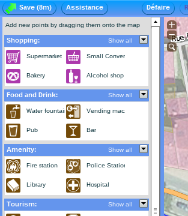
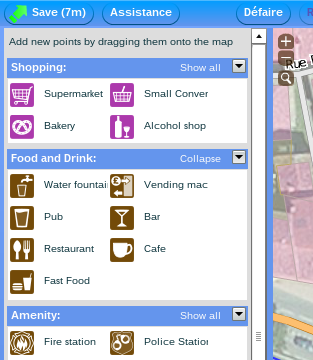
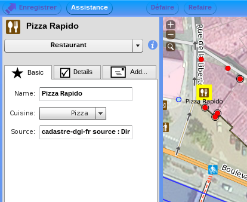

##### []{#anchor-60}Éditer les ways

Pour ajouter un way commencer par une sélection vide. Cliquer sur le
point de départ, puis successivement sur tous les points intermédiaires
désirés ; terminer par un double clic sur le dernier ou par la touche
entrée. Pour former un polygone terminer simplement sur le premier nœud.
La touche d'échappement annule l'édition en cours. Les nœuds
intermédiaires et finaux peuvent être réutilisés depuis d'autres objets.
Seul le premier nœud doit être nouveau, il peut ensuite être supprimé
s'il n'a pas lieu d'être.

Opérations d'édition des ways :

-   Supprimer : sélectionner le way ou nœud et utiliser la « poubelle »
    de la boite-à-outils flottante ou les touches supprimer ou corriger
    (majuscule corriger pour les ways).
-   Couper : sélectionner un way, puis un nœud de celui-ci et utiliser
    l'outil « ciseaux » ou la touche « x ».
-   Ajouter un nœud : sélectionner la way puis faire majuscule clic sur
    son tracé ou même un peu à l'écart.
-   Recopier les propriétés d'un way sur un autre : la touche « r »
    ajoute les tags du dernier way sélectionné à la sélection courante.
    Fonctionnalité également disponible pour les nœuds.

La liste complète des fonctionnalités est disponible dans l'aide.

De façon similaire aux nœuds, la partie gauche permet de décrire les
propriétés des ways. Les propriétés proposées sont fonction du fait que
le way sélectionné soit ou non un polygone.

##### []{#anchor-61}Mode avancé

Une bascule entre les modes « simple » et « avancé » est présente en bas
de la partie gauche des propriétés. La différence réside dans
l'utilisation des icônes et formulaires d'aide à la saisie ou dans la
saisie manuelle des tags. Le mode avancé dispose tout fois d'une
complétion automatique des tags et des valeurs. Rendant le mode de
saisie manuel plus efficace dés lors que les tags à appliquer sont
connu ; plutôt que de rechercher la bonne icône dans le mode « simple ».

##### []{#anchor-62}Critique

induit une mauvaise qualité des données

L'éditeur Potlatch fait l'objet de critiques sur la qualité des
contributions qu'il induit. Il ne permettrait pas au contributeur
d'avoir facilement une idée réelle des données manipulées. Les
opérations complexes sur la géométrie des objets n'y sont pas aisées. De
plus le mode « simple » cherche à cacher les tags qui sont la base de la
description des objets.

Toutes fois il s'agit d'un bon éditeur pour les novices qui les guide au
travers de la forêt de tags et garde un nombre de fonctionnalités
restreintes, le rendant simple à appréhender.

### []{#anchor-63}Éditeurs spécialisés

Il existe d'autres éditeurs en ligne beaucoup plus simples et
thématiques, le but étant de faciliter encore plus la contribution. Ils
sont souvent très limités, mais pratique pour contribuer rapidement.

#### []{#anchor-64}Amenity Editor

« Amenity » vient du tag éponyme, il sert de tag à tout ce qui est
équipement, éducation, transports, santé, culture... L'éditeur est
accessible à l'adresse
[http://ae.osmsurround.org](http://ae.osmsurround.org/). Avant de
pouvoir l'utiliser il est nécessaire de l'autoriser à soumettre des
données au serveur d'OpenStreetMap en notre nom. Il faut pour cela
passer par le button « Oauth/Login ». Ensuite il ne reste plus que à
zoomer suffisant pour voir appaire tous les objets taggés avec amenity.
Il suffit de cliquer et changer les valeurs dans la bulle qui s'ouvre.
Il est également possible de rajouter des nœuds de type amenity.

#### []{#anchor-65}Wheelmap.org

Web ; android

Wheelmap est à la fois un site web et des applications mobiles
spécialisés dans la saisie d'un seul tag :[]{#anchor-66} wheelchair. Ce
tag permet de décrire l'accessibilité d'un lieu en fauteuils roulants.
Ces principales valeurs sont yes, limited et no[^12]. Ce sont les seules
que permet de saisir l'application. Il n'est pas demandé de se
s'authentifier sur le site d'OpenStreetMap pour renseigner
l'accessibilité d'un lieu. Des cartoparties accessibilité sont également
organisées sur ce thème et se focalisent sur la collecte de ce type
d'information.

#### []{#anchor-67}OpenSeaMap

OpenSeaMap est un sous-projet d'OpenStreetMap. Comme son nom l'indique,
il est orienté vers la cartographie nautique et a développé son propre
éditeur d'objet. Encore une fois, le but est la simplicité et la
facilité de contribution. Il est disponible depuis le portail du
projet : [http://www.openseamap.org](http://www.openseamap.org/).

- http://yapis.eu collecte d'adresse
            -   http://www.addresshunter.net/
            -   jeux

[]{#anchor-68}Hors ligne
------------------------

Les logiciels d'édition hors ligne sont des solutions plus complètes et
plus pratiques. Ils permettent à la fois une meilleure ergonomie et une
meilleure appréciation des données. Ils offrent des outils d'édition
plus complexes et plus puissants nécessitant plus de maîtrise que leur
pendant en ligne, mais devenant nécessaire pour contribuer plus
efficacement.

### []{#anchor-69}JOSM

le plus courant ; le plus avancé ; java

JOSM (Java OpenStreeMap) est l'éditeur le plus utilisé toutes catégories
confondues. Il est le plus avancé en termes de fonctionnalités et de
configuration.

beaucoup de plugins ; évolution rapide

Il offre l'avantage d'avoir une riche liste de greffons et d'évoluer
rapidement. Une section entière y est consacré plus loin.

### []{#anchor-70}Merkaartor

Rapide ; avancé

Merkaartor est l'autre grand logiciel de contribution hors ligne. Son
usage est moins rependu. Il offre cependant des fonctionnalités
similaires à JOSM.

logiciel natif

Contrairement à ce dernier Merkaartor est un logiciel natif
multiplateforme utilisant la bibliothèque Qt.

pas de plugin ; mais des fonctionnalités natives

Il ne dispose pas d'un système de greffons mais possède nativement de
beaucoup de fonctionnalités.

### []{#anchor-71}QGIS – Plugin

logiciel libre de SIG

QGIS est un logiciel libre générique de SIG (système d'information
géographique) permettant de traiter de façon professionnel ces dites
informations. Il est également multiplateforme et utilise la
bibliothèque Qt.

plugin

Il dispose d'un plugin OpenStreetMap. Bien que ce soit possible de
l'utiliser comme tel, ce n'est pas un éditeur de choix pour
OpenStreetMap.

pas un éditeur de choix ; utilie pour extraire des données de osm et les
convertir

Il faut plutôt le prendre comme un pont entre les SIG traditionnels et
le monde d'OpenStreetMap. Le plugin permet notamment de faire des
conversions puis d'exploiter les données plus traditionnellement dans
QGIS.

### []{#anchor-72}ArcGis ESRI – Plugin

ArcGis est un logiciel propriétaire de ESRI, il dispose d'un plugin pour
OpenStreetMap. Les logiciels de ESRI sont très rependu dans la
géomatique professionnelle.

[]{#anchor-73}JOSM
------------------

JOSM est un éditeur spécialisé pour OpenStreetMap. Il est écrit en Java
et est donc multiplateforme. L'aide général et détaille peut être trouvé
sur le wiki[^13]. Uniquement une approche synthétique et opérationnelle
est abordé ici.

### []{#anchor-74}Accéder au logiciel

Webstart ; téléchargé ; régulièrement ; pas distribution ; java

Il peut être obtenu depuis son site web[^14]. Il est recommandé de
télécharger la dernière version « josm-tested ». JOSM est un logiciel en
évolution permanente. Il n'y a pas de version de celui-ci à proprement
parlé. Il est donc conseillé de le retélécharger régulièrement. Le
numéro de version (un nombre assez élevé) correspond à la numérotation
des modifications de son code source. Le site de JOSM propose de le
lancer directement en ligne, cette solution est intéressante pour
effectuer rapidement un test, mais il reste préférable de le
télécharger. Une fois JOSM obtenu il n'est pas nécessaire de
l'installer, il suffit de le lancer. Les distributions Linux l'intègrent
souvent dans leur liste de paquets, mais encore une fois, JOSM évoluant
rapidement il est toujours conseillé de le télécharger soit même.

### []{#anchor-75}[]{#anchor-76}Premiers pas

#### []{#anchor-77}Télécharger des données

Une fois JOSM démarré la première chose à faire est d'obtenir des
données. Pour cela il faut utiliser le menu « Fichier &gt; Télécharger »
ou l'icône
.
Une fenêtre s'ouvre permettant de choisir la zone
désirée. Attention à ne sélectionner qu'une zone suffisamment restreinte
pour que le téléchargement soit rapide. Sur l'onglet « Carte glissante »
il est possible de déplacer la carte à l'aide du clic droit, zoomer avec
la molette et faire une sélection avec le clic-déplacé gauche.

#### []{#anchor-78}Interface

écran ; centre ; panneau

Une fois la zone choisie et obtenue elle apparait dans l'éditeur.
L'écran se compose comme il suit.

-   Une zone centrale de travail avec la visualisation des données, les
    objets reconnus par JOSM sont mis en valeur avec des styles
    graphiques, mais tous les objets de la zone sont bien présents.
-   La barre d'icônes du haut donne un accès rapide aux fonctions les
    plus utiles, les autres se trouvent dans les menus.
-   La barre de gauche est composé de deux sections. En haut des outils
    d'édition pour manipuler la géométrie des éléments. En bas des
    commutateurs pour afficher ou masquer les panneaux de droites.
-   À droite un ensemble configurable de panneaux.

#### []{#anchor-79}Se déplacer

Comme pour l'écran de téléchargement le clic droit permet de déplacer la
zone visible de travail et le molette de changer le zoom.

#### []{#anchor-80}Éditer

##### []{#anchor-81}Géométrie

selection

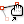
En mode « sélection et déplacement » (touche « S ») il
suffit de cliquer sur un objet. La sélection apparaît alors en rouge sur
le plan de travail et son contenu est listé dans le panneau
« Sélection ».

En conservant la touche « Majuscule » enfoncé il est possible de faire
des sélections multiples. La touche « Ctrl » permet de retirer un
élément de la sélection. Créer une nouvelle sélection est également
possible en faisant un clic-déplacé dessinant un rectangle ne commencent
pas sur un objet.

déplacer

Toujours en mode « sélection et déplacement » tous les éléments
sélectionnés peuvent être déplacé en faisant un clic-déplacé depuis un
élément sélectionné. La même action fonctionne aussi pour un seul
élément même s'il n'est pas sélectionné.

Ajouter

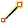
En mode « dessiner » (touche « A ») de nouveaux nœuds
ou ways peuvent être créés ou modifiés.

Un clic sur une zone vierge ou sur un segment de way ajoute un nœud.

Un clic sur un nœud déjà existant le sectionne et permet de tracer un
way depuis ce point. Si ce nœud appartient uniquement à un way, celui-ci
va être poursuivi, sinon un nouveau way est créé. Il est possible de
forcer la continuation d'un way depuis un nœud final commun à plusieurs
way en sélectionnant à la fois le way et le nœud avant de passer en mode
« dessiner ».

Pour terminer de tracer d'un way ou créer uniquement un nœud il faut
double-cliquer. La touche d'« Échappement » permet de tout
désélectionner, il est également possible de rebasculer en mode
« sélection » pour sélectionner l'objet nouvellement créé.

Un nœud intermédiaire à un segment peut être ajouté à un way en mode
« sélection » en déplaçant le milieu de celui-ci symbolisé par un plus.

supprimer

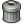
Les objets sélectionnés sont supprimables avec la
touche « Supprimer ». Il existe également un mode « Suppression » avec
des options plus avancés.

##### []{#anchor-82}Tags

Les propriétés des éléments sélectionnés apparaissent dans le panneau
« Attributs et appartenances ». Il contient la liste des tags appliquées
à la selection. La partie basse contient la liste des relations. Il est
possible de modifier des tags en double-cliquant dessus ou en utilisant
les boutons qui apparaissent lorsque le curseur de la sourie survole le
panneau.

La fenêtre d'édition de la clé et de la valeur du tag possède une aide à
la saisie qui complète les tags.

Lorsque plusieurs objets sont sélectionnées simultanément le panneau
affiche les tags et les relations de tous les objets. Si dans la
sélection les objets possèdent tous un même tag avec la même valeur
alors elle sera visible ; si ce n'est pas le cas, la clé est affiché
mais la valeur est « &lt;différent&gt; ». Dans le cas d'une sélection
multiple, la fenêtre d'édition du tag montre la liste des valeurs avec
leur nombre d'apparitions dans la sélection. Une modification de tag sur
une sélection affecte tous les éléments de celle-ci.

preset

Pour ajouter de nouveaux tags il existe une autre approche plus
intuitive que la saisie manuelle. JSOM dispose d'un menu « Attributs »
très fournis. Il permet d'ouvrir des grilles de saisies spécifiques aux
types d'objets. Les principaux sous-menus se retrouvent également dans
la partie droite de la barre d'icône. Ces grilles appliquent des tags à
la sélection, aucuns champs n'est vraiment obligatoire.

##### []{#anchor-83}Pile de commandes

Toutes les modifications sont tracées dans le panneau « Pile de
commandes » et peuvent être annulées directement depuis ce dernier ou à
l'aide des touches ou des icônes « Annuler »
 (Ctrl-Z), ou « Refaire »
 (Ctrl-Y).

#### []{#anchor-84}Imagerie et calques

Des vues aériennes ou des cartes peuvent être ajouté en fond dans
l'espace de travail. Elles sont disponibles depuis le menu « Imagerie ».
Leur utilisation est conforme à la licence d'OpenStreetMap.

L'imagerie aérienne la plus utilisée est celle de « Bing Sat ». L'ajout
d'une imagerie fait apparaître un nouveau calque dans le panneau des
« Calques ».

Les calques peuvent être de plusieurs types : imagerie aérienne, données
OpenStreetMap, etc.

La coche verte désigne le calque actif, il peut par exemple y avoir
plusieurs calques de données OpenStreetMap. L'œil permet d'afficher ou
masquer un calque. Ces petits commutateurs sont manipulables à la souris
ou depuis les boutons.

Il est possible de supprimer des calques. Lors qu'il n'y a plus aucun
calque JOSM revient à l'écran d'accueil. Si un calque OpenStreetMap avec
des modifications non sauvegardées est supprimé JOSM demande une
confirmation.

#### []{#anchor-85}Validation et envoie des []{#anchor-86}modifications

Validator

Avant d'envoyer les modifications au serveur il est fortement recommandé
d'utiliser l'outil de validation de JOSM. Il faut activer panneau
« Validation »
,
puis utiliser le bouton « Valider » de ce dernier. Il
va passer un ensemble de test et livrer des recommandantions. La
validation est appliquée à la sélection si elle existe, sinon à
l'ensemble des données, y compris les données déjà présentes dans
OpenStreetMap avant vos propres contributions. Par sûreté JOSM effectue
également une validation minimaliste avant de renvoyer les
modifications. Il faut toutes fois garder à l'esprit que cet outil n'est
qu'un outil et qu'il n'a pas forcément raison. Il est important de
toujours faire preuve d'esprit critiques.

La validation à pour effet de créer un nouveau calque pour visualiser le
résultat en plus de la liste présente dans le panneau. Certaines erreurs
peuvent être corrigées automatiquement à l'aide du bouton « Fix ». Un
double-clic sur l'erreur ou le bouton « Sélectionner » permet de
sélectionner les objets fautifs. Également utile, le clic-droit sur une
erreur puis « zoomer sur le conflit ».

Une fois les modifications satisfaisantes apportées il ne reste plus que
à les envoyer au serveur d'OpenStreetMap à l'aide du menu « Fichier &gt;
Envoyer les données » ou de l'icône
.
Un écran résumant les éditions apparaît. Il faut alors
saisir un petit commentaire expliquant en quoi a consisté la session de
travail. Une fois validé les informations vont être transmise au serveur
pour créer un nouveau changeset.

mot de passe

Lors du premier envoie JOSM demande l'accès au compte OpenStreetMap. Les
modifications vont être ensuite disponible en ligne[^15] et accessible à
tous. La carte du site se mettre à jour généralement quelques minutes
plus tard, ce délai est variable et peut aller jusqu'à plusieurs jours.

#### []{#anchor-87}Préférences

Les []{#anchor-88}préférences de l'application sont accessibles depuis
le menu « Modifier &gt; Préférences » (« F12 ») ou l'icône
.
Avant d'aller plus loin, il existe un « mode avancé »
activable en bas de l'écran, il change le niveau de détail de la
configuration.

Passage en revue des préférences intéressantes dans une première
approche :

-   Le premier onglet « Paramètres et affichage »
    ,
    puis le sous onglet « Apparence » permet d'activer
    un style graphique d'interface natif au système d'exploitation,
    souvent plus agréable et intégré, par exemple remplacer « Metal »
    par « GTK+ » sous Linux.
-   Le second onglet « Paramètre de connexion »
    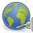
    permet de configurer sons accès à OpenStreetMap et
    si besoin un proxy pour le web.
-   Le quatrième « Greffons »
    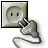
    (plugins) offre la possibilité d'étendre JOSM, nous
    y reviendrons plus tard.
-   Le huitième « Validateur de données »
    
    paramètre le « validateur » : tests effectués sur
    demande et tests effectués automatiques avant envoie de
    modifications.

### []{#anchor-89}Charger, sauvegarder et renvoyer

#### []{#anchor-90}[]{#anchor-91}Télécharger depuis le serveur d'OpenStreetMap

Comme vu plus haut le moyen de prédilection pour obtenir des données
avant de les éditer passe par l'icône

« Télécharger » puis la « carte glissante ». L'autre
onglet intéressant de cette fenêtre est celui de recherche d'un lieu.

zonne raisonable

Attention toutes fois à la quantité de données demandé au serveur. JOSM
signale si la zone est trop grande et pour finir le serveur peut refuser
de servir trop de données d'un seul coup. Même si la surface demandée ne
semble pas grande, elle peut néanmoins contenir beaucoup d'objets.

attention au bati

Particulièrement en zone urbaine lors que les bâtiments sont présent
dans OpenStreetMap.

lenteur de JOSM

Une trop grande quantité de données va être long à obtenir mais va
également alourdir l'éditeur. La manipulation sera alors trop
fastidieuse.

- mémoire requise
            -   augmenter

téléchargement cumulatif possible ; positionnement automatique

Le problème est facilement contourné pour les sessions de contributions
standards qui ne requièrent pas d'édition à de large échelle et en une
seule fois. Il suffit de charger plusieurs petites zones. Chaque
téléchargement s'ajoutant aux précédant tout en conservant les
modifications en cours. Il est à noter qu'une fois le premier
téléchargement effectué, la zone en cours de visualisation dans
l'éditeur sera automatique sélectionnée. Lors que beaucoup de données
sont chargé le plus simple est d'envoyer les modifications, de supprimer
le calque de données OpenStreetMap et de recharger de nouvelles données.

Les zones téléchargées ne sont pas hachurées. Il est fortement conseillé
de ne pas faire de modifications hors de zones non encore obtenues
localement. Les objets n'y sont que partiellement présent et il n'est
pas possible de savoir si l'on édite uniquement ceux chargés dans
l'éditeur et quelles conséquences cela va avoir.

#### []{#anchor-92}[]{#anchor-93}Téléchargement à distance

Un onglet « Contrôle à distance »

est présent dans les préférences. Lorsque cette option
est activée il est possible depuis des sites web ou d'autres outils de
faire charger à JOSM des données. Cette option est particulièrement
utilisée dans des outils effectuant des analyses de qualité des données.
Mais le téléchargement à distance est également disponible sur le site
web d'OpenStreetMap ou il permet tout simplement de charger la vue
courant du navigateur dans l'éditeur.

#### []{#anchor-94}[]{#anchor-95}Téléchargement sélectif

objets

Depuis le menu « Fichier &gt; Télécharger un objet » il est possible de
télécharger plusieurs objets à la fois en connaissant leurs
identifiants.

Avant d'éditer ces objets obtenus unitairement, il est encore une fois
préférable de télécharger leur environnement proche.

- xapi

#### []{#anchor-96}[]{#anchor-97}Fichier de données locales

JOSM permet de sauvegarder les données téléchargées en local, pour faire
des modifications hors ligne, comme sauvegarde ou juste pour les
renvoyer plus tard.

attention au delai

Attention cependant à ne pas conserver des données avec des
modifications trop long temps. Les données risquent d'évoluer
parallèlement dans la base d'OpenStreetMap et de devenir obsolètes.

risque de conflit

Cette divergence peut induire des conflits lors de l'envoie des
modifications. Le serveur refusera vos données.

mise à jour

Pour amoindrir ce problème, JOSM dispose d'un fonction de mise à jour
qui retélécharge et fusionne les données depuis le serveur.

spécificité fichier osm de josm

Les fichiers de sauvegarde de JOSM sont au format « .osm », standard
d'OpenStreetMap, mais avec quelques extensions. Ils contiennent
notamment la liste des zones téléchargées et l'état des objets : créés,
modifiés ou supprimés. Les identifiants des objets créées localement
sont négatifs tant qu'ils n'ont pas été pris en compte par le serveur
qui leur attribuera leur véritable identifiant.

### []{#anchor-98}Source de données

#### []{#anchor-99}Traces GPS

local

Depuis le menu « Fichier &gt; Ouvrir un fichier » une trace GPS au
format « gpx » ou « nmea » peut être chargée. Si votre GPS ne fournir
pas de traces dans un format de fichier adéquat, elles peuvent être
converti, par exemple avec le programme GSPBabel. Les traces sont
chargées dans un nouveau calque.

Serveur

Le serveur OpenStreetMap fait également dépôt de traces GPS. Elles
peuvent être obtenues pour une zone de la même façon que les données
OpenStreetMap. En haut de la fenêtre de téléchargement une case à cocher
permet d'en activer le téléchargement.

L'affichage des traces est personnalisable depuis le panneau des calques
par un clic-droit. Ce menu offre notamment l'accès a un outil de
conversion des traces au format d'OpenStreetMap. Il est important de
comprendre que les traces ne sont qu'une source de données et non
directement une donnée. Des traces simplement convertis et non traitées
manuellement ne doivent pas être ajouté à OpenStreetMap. Il faut les
consolider avec l'existant, nettoyer les écarts...

#### []{#anchor-100}Imagerie

JOSM prose par défaut un jeu restreint de photographies aériennes et de
cartes dans le menu « Imagerie ». Depuis les préférences il est possible
de le configurer la liste. Le dernier onglet « Paramètres d'imagerie »
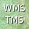 les définit.

La liste propose des sources d'informations utilisables pour la
contribution à OpenStreetMap. Différents lieux de la planète sont
accessibles, classées par pays. Le bouton « Activer » les ajoutera au
menu.

Il est également possible d'ajouter ces propres sources au format
« WMS » ou « TMS », attention toutes fois à avoir le droit de l'utiliser
pour contribuer à OpenStreetMap.

#### []{#anchor-101}Cadastre français

Le cadastre est un plan des parcelles établi et maintenu par
l'administration fiscale. Il peut être consulté en ligne[^16]. Il n'est
pas disponible dans le même format pour toutes les communes de France.
Un travail de révision, de numérisation et de vectorisation est en
cours. L'utilisation du cadastre est autorisé dans OpenStreetMap sous
condition de mentionner la source et que l'utilisation ce face dans le
cadre d'un produit composite. Il n'est donc pas possible de copier le
cadastre tel-quel, en particulier le parcellaire[^17].

##### []{#anchor-102}Installation

L'accès au cadastre par JOSM se présente sous la forme d'un greffon qui
ajoute un calque. Il faut donc dans l'écran des préférences activer le
greffon « cadastre-fr ». Une fois en place un nouveau menu « Cadastre »
est disponible.

##### []{#anchor-103}Configuration

L'imagerie fournit par les services du cadastre est dans des projections
spécifiques à la France. Il convient donc de paramétrer JOSM avant de
pouvoir l'utiliser. Dans l'écran des préférences, dans l'onglet
« Paramètres de la carte »
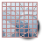,
dans le sous onglet « Projection » il faut chnager la
projection à « Lambert 9 zones (France) » (pour la métropolitaine) puis
sélectionner la zone correspondante au département désiré. À noter que
cette projection spécifique empêchera d'utiliser certaines imageries
comme « Bing », il faudra revenir à la projection par défaut :
« Mercator ».

##### []{#anchor-104}Utilisation

La possibilité d'accès et d'utilisation dépend du format dans le quel le
cadastre est disponible.

-   Sous forme d'image numérisé, l'utilisation est complexe et non
    détaillé ici.
-   Sous forme vectorisée. Des explicitations détaillées sont
    consultables sur le wiki d'OpenStreetMap[^18] ; uniquement une prise
    en main rapide est montré ici.

Commencer par télécharger une zone à éditer. Puis sélectionner le menu
« Cadastre &gt; Télécharger le cadastre » (touche « F10 »). Le greffon
« cadastre-fr » demande alors la commune et le département. Si vous ne
parvenez pas à trouver une commune allez rechercher sa toponymie selon
le cadastre directement sur le site internet de celui-ci. Si la commune
n'est pas disponible en format vecteur un message vous demandera
d'utiliser autre outil.

Une fois la commune sélectionnée, un nouveau calque de type cadastre va
apparaître. Il ne se met pas à jour tout seul lors que l'on zoome ou
déplace la carte. Il est nécessaire de refaire « Télécharger cadastre »
(« F10 »), sans toute fois avoir besoin de ressaisir les paramètres.

Le cadastre contient des noms de rues, de lieux dit, de cours d'eau, des
adresses, etc. Mais le cadastre a avant tout été établie pour des
raisons fiscales et pour porter sur le parcellaire. Il convient donc de
se méfier de sa []{#anchor-105}toponymie qui n'est pas une des raisons
de sons existence. De même que les rues ne sont au final que des trous
entre les parcelles. Il faut donc en faire un usage raisonnable et
raisonné. À note que les bâtiments ne sont pas tracés à la main, mais
obtenu via des outils. À noter également que le greffon cadastre permet
de travailler sur plusieurs communes simultanément via le menu
« Cadastre &gt; Changer de lieu ».

### []{#anchor-106}Édition avancée

-   relations
-   Manipulation avancées
-   plugins
-   Filtrer les données
    -   dans josm
    -   avant josm
        -   xapi
        -   attention
-   Conflict
    -   faux conflit

### []{#anchor-107}Thématique

Deux outils au sein de JOSM permettent de mettre en valeur des données
orientées sur une thématique.

#### []{#anchor-108}[]{#anchor-109}Modèle d'attributs

Les modèles d'attributs sont les grilles de saisie du menu
« Attributs ». Le paramétrage permet d'en ajouter d 'autres. Il faut les
activer dans l'onglet « Paramètres de la carte » puis sous onglet
« Modèle d'attributs ». Il est également possible d'en créer soit même
assez facilement.

#### []{#anchor-110}[]{#anchor-111}Coloriage

Le « coloriage » est l'application de styles pour effectuer le rendu de
la carte. Le coloriage apparaît sous la forme d'un panneau activable
depuis l'icône
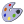.
Ce panneau permet d'utiliser ou non les styles de
coloriage définis dans les préférences de façon similaire aux « Modèles
d'attributs ». Ils se trouvent dans l'onglet « Paramètres de la carte »
puis sous onglet « Coloriage ». Les styles sont définis dans un format
appelé MapCSS et similaire aux feuilles de styles CSS pour page web. Ce
format est compatible avec plusieurs logiciels effectuant du rendu de
carte.

[]{#anchor-112}Mobile
---------------------

Les appareils mobiles sont assez peu adapté à l'édition de données
géographiques. La plupart des applications permettent de collecter de
l'information à retravailler plus tard. Certaines offrent la possibilité
d'éditer les tags, mais quelques-unes sont de véritables éditeurs allant
jusqu'à permettre de modifier la géométrie. Ils sont plutôt destinés à
des appareils récent ou des tablettes avec une connexion internet.

iPhone

iLOE est une application pour iOS permettant de créer, déplacer ou
supprimer des nœuds et d'éditer des tags de ways et de nœuds.

Android

Vespucci

Vespucci est une application Android d'édition des ways, nœuds et des
tags.

OSMapTuner

OSMapTuner est également une application pour Android créer par
[]{#anchor-113}Salzburg Research (centre de recherche non académique de
l'état de Salzburg, Autriche). Il s'agit d'un éditeur assez avancé
offrant même un outil de validation.

-   question classique
    -   pk le trait de cote ne se met pas a jour
        -   http://help.openstreetmap.org/questions/276/why-do-the-changes-i-have-made-to-coastline-not-appear-on-the-map

[]{#anchor-114}Le terrain
=========================

[]{#anchor-115}[]{#anchor-116}Appréhender le terrain
----------------------------------------------------

le terrain fait fois

OpenStreetMap et plus généralement la cartographie à pour but de
représenter le terrain. Il doit donc faire fois. Par exemple lors que le
nom d'une rue du cadastre diverge des plaques apposées dans celle-ci.

il est important de contrôler vis à vis du terrain

Le terrain doit prévaloir et doit être la référence de la cartographie.
Si une donnée cartographique doit être vérifiable c'est bien vis-à-vis
du terrain. La topographie ne ment pas : le terrain est tel qu'il est.
Mais les « méta-informations » qu'il porte doivent être prise avec un
certain recul. Les panneaux de mon de rue, de direction, de nom de
bâtiment peuvent contir des fautes, cette erreur est-elle la réalité du
terrain ? La réponse n'est pas évidente, parfois l'usage a déformé des
mots ou les a fait passer d'une langue à une autre, parfois il s'agit
simplement d'une plaque mal orthographiée.

### []{#anchor-117}Aller sur le terrain pour y faire quoi ?

topologie

La topologie est la forme du terrain, comme les éléments occupent et
structurent l'espace. Le passage in situ permet de mieux comprendre la
structuration des voies, des carrefours, où sont les entrées des
bâtiments... Beaucoup d'informations actuellement difficiles à d'obtenir
librement sans aller sur place.

Attribut ; type de voie ; nom de rue

Il en est de même pour la description des éléments. Voir quels objets
sont présent et quels sont les tags les plus appropriés.

Sur le terrain « tout » peut être relevé et transcrit dans
OpenStreetMap. Il faut s'imposer des limites. Il arrive même qu'au bout
d'un certain temps l'on trouve la nécessite de repasser sur le terrain.
Les connaissances du contributeur évoluent conjointement aux techniques
de cartographie. L'ensemble même des éléments cartographiées dans le
projet grandi. D'où l'émergence d'un besoin de repasser sur le terrain à
la fois parce que ce dernier change mais aussi parce que le processus
cartographie évolue. Pour minimiser ce risque la prise de photographies
est une solution permettant de tirer profit à postériori d'information
laissées de coté lors d'une première exploration.

### []{#anchor-118}Le tag source

Survey ; GPS

Il convient d'annoter correctement les objets recensés depuis le terrain
avec le tag source. La valeur la plus générique pour dire que
l'information est issue d'une visite sur le terrain est source=survey.

« Survey » est le terme anglais pour signifier : inspection ou
arpentage. D'ailleurs l'équivalent de « l'institue National
Géographique » français (l'IGN) en Grande-Bretagne est « l'Ordnance
Survey ». Si l'information provient d'un GPS c'est également une
information complémentaire sur la qualité de la donnée à intégrer dans
le tag source. Les valeurs de ce tag peuvent être combinées :
source=survey;GPS. Il signifiera aux autres contributeurs que
l'information provient du terrain et qu'elle était surement meilleure
que toutes les autres sources de données lors qu'elle a été relevé.

### []{#anchor-119}[]{#anchor-120}Arpenter le terrain

type de déplacement ; spécifique ; autre ; moyen de transport

Le mode déplacement pour cartographier dépend bien sur de la surface à
couvrir. Mais le conflit vitesse-précision va engendrer une perte de
qualité dans le relevé de l'information. Il n'est pas possible de
cartographier une ville en la parcourant à une allure normale en
voiture. Même en vélo il faut faire de nombreux arrêts pour prendre le
temps de noter ou de viser avec un appareil photographique. Il est très
décevant de passer à coté d'une information parce qu'une photographie
est manqué. Se déplacer à pied peut par contre faire perdre du temps et
n'est adéquate que dans une zone très dense en information à relever.

### []{#anchor-121}[]{#anchor-122}Petites astuces

toujours avoir son gps avec soit, ou au moins de quoi noter quelque
chose désintéressant que l'on pourrais trouver en faisant autre chose

saisir rapidement après être aller sur le terrain pour s'en rappeler

Lors d'un déplacement, prévoyant de la cartographie ou non, il est
toujours préférable d'avoir au moins de quoi noter.

Toujours avoir un petit appareil photo ou un smartphone avec soit. Se
dire que l'on va se souvenir de tous les éléments intéressants est
illusoire. Également toujours avoir un GPS, particulièrement lors que
l'on se perd. Non pas pour retrouver son chemin, mais pour savoir par où
l'on est passé et pouvoir contribuer à la carte sur ce parcours !

Après être aller sur le terrain il ne faut pas tarder à contribuer à
OpenStreetMap tant que l'on a une mémoire fraiche des lieux.

[]{#anchor-123}Outils
---------------------

Rien ; papier ; crayon

Comment procéder pour collecter de l'information sur le terrain ? Que
quoi a-t-on besoin ? Rien n'est vraiment nécessaire si ce n'est un
simple papier et un crayon ! Le GPS n'est plus l'équipement
indispensable pour tracer les voies qu'il était au début du projet. Il
est même préférable de les tracer avant d'aller sur place via une
photographie aérienne ou le cadastre en France ; réalisant ainsi une
première reconnaissance virtuelle du terrain.

### []{#anchor-124}Walking Papers

Principe ; imprimer ; mapper

Les « Walking papers »[^19] sont des fonds de carte destinés a être
imprimés. Ils peuvent être annotés sur le terrain. L'idée est simple
mais efficace. Le site permet de générer ces walking papers à la demande
pour un zoom, une localisation et un style désiré.

mapper sans gps

Imprimer un fond de carte avant d'aller cartographier le terrain n'a de
sens que si la zone est déjà partiellement couverte. Il est là très
pertinent de préparer la zone via d'autres sources avant d'aller sur
place. Les walking papers ont aussi le grand avantage de pouvoir être
utilisés tout seul ; c'est-à-dire sans autre matériel : nul besoin de
GPS, d'appareil photo ou d'autre dispositif plus ou moins complexes.

Une fois de retour, à près une session de cartographie sur le terrain,
deux possibilités sont offertes. Les walking papers peuvent simplement
être posé à coté de l'ordinateur et servir de référence pour saisir
l'information. Mais ils peuvent aussi être intégré « dans » l'ordinateur
et servir de fond de carte comme le cadastre ou une imagerie aérienne.

code 2d ; wms ; scanner

Chaque walking paper dispose d'un code barre en deux dimensions, un QR
Code. Il contient l'URL et l'identifiant unique généré par le site et
associé à l'impression. Le walking paper peut donc être numérisé et
retourné au site web. Il va automatique être réassocié à sa zone
d'origine et l'image va être géoréférencé. Elle est ensuite disponible
via le protocole d'échange standard de carte : le WMS.

importer ; plugin josm ; potlach

L'image peut-être affiche dans n'importe quel logiciel supportant ce
format, dont Potlatch. JOSM a un support amélioré grâce au greffon
« walkingpaper » qui ajoute le menu « Walking Papers ».

-   -   voir les stats
    -   étudier l'initiation du projet

### []{#anchor-125}[]{#anchor-126}GPS

Appareil de moins de moins cher ; téléphone, pda

Le GPS est l'appareil emblématique qui a rendu le projet possible.
Aujourd'hui ces récepteurs sont courants et à des tarifs accessibles,
les téléphones et même les appareils photo comment à en être équipé.
S'en servir pour cartographier nécessite un appareil capable
d’enregistrer une trace : c'est-à-dire le parcours effectué. Il doit
ensuite être capable de sauvegarder des points de passage. Attention
tous les GPS n'ont pas ces fonctionnalités, en particulier ceux dédié à
l'assistance à la conduite automobile.

#### []{#anchor-127}[]{#anchor-128}Les systèmes de[]{#anchor-129} positionnement par satellites

Généralisation

Les GPS (Global Positioning System) n'est en fait que l'un des

Parmi les systèmes de positionnement par satellites (GNSS, Global
Navigation Satellite System) le GPS est le plus connu. Il est le plus
courant car le seul accessible aux civils ce deux dernières décennies et
à couverture mondiale.

gps et les autres systèmes ; précurseur ; station au sol

Avant l'ère des satellites de géolocalisation des systèmes par ondes
radio à basse fréquence et longue porté transmissent par des stations au
sol étaient utilisés. Les premiers ont été mis au point durant la
seconde guerre mondiale par les alliées dans le but de permettre aux
navires et aux avions de se géolocaliser. La détermination de la
position était basée sur la mesure de la différence de temps entre la
réception du signal depuis plusieurs émetteurs. Des systèmes plus
évolués utilisant des balises terrestres existent toujours.

Dès le lancement du premier satellite artificiel Sputnik en 1957 par
l'URSS des chercheurs se sont aperçu que grâce à l'effet Doppler il est
possible de localiser un satellite ou inversement se géolocaliser sur
terre. L'effet Doppler est la déformation d'un onde émise par un objet
en mouvement.

Transit

La première constellation de satellite basé sur ce principe est TRASIT,
mis en place par les État-Unis en 1964, et disponible aux civils en
1967. Il permettait de se localiser avec une précision inférieur au
kilomètre environ toutes les heures. TRASIT a été arrêté en 1996.

GPS

Lui a succédé le GPS des État-Unis, mise en service en 1994 et
pleinement disponible au civil en 2000 avec une précision actuelle de 5
à 10m.

GLONASS

Parallèlement est mis en place le système GLONASS de l'URSS. Il est
opérationnel en 1996, mais comme d'autres projets lancés vers la fin de
l'URSS va souffrir de sa chute. Un autre exemple des problèmes de la
Russie de cette époque est le programme de navette spatiale de l'URSS
adonné après le succès de son vol inaugural. Le système est redevenu
complètement opérationnel en 2011, il avait été ouvert aux civils en
2007. GLONASS offre une précision de 5 à 10m. La Russie impose une taxe
à l'importation aux systèmes de positionnement n'utilisant pas
[]{#anchor-130}GLONASS, forçant ainsi sont développement.

BeiDou

Il existe également une constellation de la Chine depuis 2000 qui ne
couvre pas intégralement du globe : []{#anchor-131}BeiDou. Le système
est remplacé par Compass pour attendre une couverture mondiale vers 2020
avec une précision civile inférieure à 10m et une précision militaire
non communiqué.

Galileo

La constellation du système européen Galileo devrait être en place
également vers 2020. Il s'agit d'un projet entièrement civil qui offrira
plus de services que le GPS. Il permettra une précision inférieur à 5m
en service libre et 1m sous licence.

#### []{#anchor-132}[]{#anchor-133}Fonctionnement

principe de localisation

Une constellations est constituées d'une trentaine de satellites en
exploitation. La durée de vie d'un satellite est d'aujourd'hui de plus
de dix ans. Ils embarquent des horloges atomiques permettant de diffuser
un signal horodaté très précisément.

Un récepteur va revoir ces signaux et déterminer sa distance à chaque
satellite par la différence le temps qu'ils ont mis pour en venir. En
plus de l'horodatage, les éphémérides sont transmis (position des
satellites dans le ciel). Avec toutes ces informations il ne reste plus
qu'à déterminer les coordonnées du récepteur par trilatération
(similaire à la triangulation mas avec les distances à la place des
angles). Pour effectuer ce calcul il faut au moins recevoir le signal de
quatre émetteurs qui revient à résoudre un système d'équation à quatre
inconnues, trois pour la position et une pour déterminer l'instant de la
réception (les récepteurs n'étant pas équipé d'une horloge atomique). Le
résultat est obtenu avec une précision de l'ordre de 10m.

amélioration au sol

Les signaux diffusés par les satellites sont déformés de façon variable
par différentes couches de l'atmosphère. On peut donc améliorer la
précision en connaissant cette déformation. Elle peut être mesurée par
un réseau de stations au sol. Ces stations sont fixes et à une position
connue. Elles reçoivent les signaux des satellites et diffusent la
correction à appliquer pour obtenir de meilleure cordonnées. Il s'agit
là du principe de correction différentielle. Il augmente la précision à
moins de 2m. Il est possible de faire encore mieux avec des techniques
et des récepteurs bien plus onéreux. Ces signaux de correction sont
diffusées par différents moyen et leur disponibilité dépend des
opérateurs qui les diffusent et de la zone de couverture.

amélioration statélite

Ce système de correction différentielle est mise en ouvre à plus grande
échelle encore avec des réseaux des stations au sol et des satellites
supplémentaires. []{#anchor-134}WAAS (Wide Area Augmentation System)
pour les État-Unis et EGNOS ([]{#anchor-135}European Geostationary
Navigation Overlay Service) pour l'Europe calculent et diffusent ces
données de correction par satellite aux récepteurs compatibles.

A-GPS

La mise en route d'un récepteur GPS nécessite l'obtention des
éphémérides des satellites avant de pouvoir obtenir une première
position. Cette acquisition directement depuis les satellites prendre de
l'ordre d'une minute. Cette phase d'initialisation est appelé « fix à
froid ». Les éphémérides obtenus sont valables quelques heures et
permettent d'obtenir par la suite un « fix à chaud » plus rapidement. Un
pré-téléchargement des éphémérides depuis une autre source et sur une
période plus longue permet d'obtenir directement un fix à chaud et donc
une initialisation plus rapide. Ce principe est connu sous le nom de
AGPS ([]{#anchor-136}Assisted GPS).

#### []{#anchor-137}[]{#anchor-138}Les GPS du marché

Un récepteur GPS est avant tout un appareil permettant de connaître sa
propre géolocalisation. Tous ce l'on rattache ensuite au terme « GPS »
n'en sont que des applications. Leur démocratisation les ont fait se
décliner en plusieurs catégories d'utilisation. Avec la remise en
activité de GLONASS le GPS n'est plus seul, mais son nom est rentré dans
le langage courant.

##### []{#anchor-139}[]{#anchor-140}Les récepteurs GPS

Les récepteurs sont la forme la plus simple. Ils se composent d'une
antenne et d'une puce de décodage du signal. Il transmette le résultat
de leur réception à un autre appareil suivant différents formats ou
protocoles. Pour le grand public il s'agit de connexions USB ou
Bluetooth.

##### []{#anchor-141}[]{#anchor-142}Les traceurs GPS

Un traceur, aussi nommé « []{#anchor-143}dataloggeur », est un
dispositif autonome qui sauvegarde dans le temps sa position sur une
mémoire interne ou amovible. Ces sauvegardes sont des traces GPS. Ils
disposent souvent d'un petit écran pour connaître les coordonnées de la
position courante et peuvent faire récepteur pour d'autres appareils.
Une fonctionnalité courante, et importante pour OpenStreetMap, est la
possibilité d'enregistrer des points de passage ou points d'intérêts.
Dans ce cas l'appareil enregistre la position et lui attribut un libellé
ou un numéro. Si on enregistre ou on note à quoi cela correspond dans la
réalité, on pourra le cartographier ensuite.

##### []{#anchor-144}[]{#anchor-145}GPS de randonnées

Ils disposent d'un écran pour visualiser une carte et le parcours
réalisé via l'enregistrement d'une trace. Ils ont une autonomie assez
longue et sont fait pour résister aux intempéries.

##### []{#anchor-146}[]{#anchor-147}Assistance aux déplacements

Ces sont les plus connus du grand public qui les nomme simplement
« GPS ». Ils disposent au moins d'une carte et d'un calculateur
d'itinéraire qui assistent les choix en temps réel lors d'un
déplacement. Ils n'offrent pas tous la possibilité d'enregistrer des
traces et de prendre des notes ou de poser des POIs à exploiter plus
tard.

##### []{#anchor-148}Combinés

Des puces GPS se trouvent également dans autres appareils, comme des
smartphones en permettant beaucoup d'usages ou dans des appareils
photographiques pour géopositionner les photos.

##### []{#anchor-149}[]{#anchor-150}GPS professionnels

Il s'agit d'appareil à la fois précis et onéreux utilisant des méthodes
de corrections. Ils sont utilisés dans l'aviation, le repérage, les
secours, l'agriculture, etc.

#### []{#anchor-151}Choix d'un GPS

critères généraux

Pour choisir un GPS il faut d'abord se demander quel va en être l'usage
en dehors d'OpenStreetMap.

critères OSM

Pour contribuer au projet il est nécessaire que le GPS permettent
d'enregistrer une trace et de prendre des points de passage. La plupart
des dispositifs offrent cette possibilité directement ou indirectement,
mais il est bon de le contrôler et de vérifier avec quelle facilité cela
peut être fait et configuré. Il est utile de vérifier qu'une trace peut
être enregistré avec au moins un point toutes les secondes. Dans le cas
contraire, des « détails » de la route comme les giratoires pourraient
ne pas être visible sur la trace.

Format ; gpx

Le format de sauvegarde est aussi un point d'attention. Le standard est
le format ouvert GPX (GPS eXchange Format) base sur l'XML. Le format
natif des puces GPS est la norme NMEA (National Marine Electronics
Association), c'est un format d'échange en clair. En dehors de ces
formats il faudra passer par des outils de conversion avant de pouvoir
utiliser les traces avec des outils gravitant autours d'OpenStreetMap.

Le wiki dispose d'une grande liste comparative de GPS pour aider à la
décision[^20].

[]{#anchor-152}Support d'OSM

Un autre critère de choix peut être la possibilité d'y charger des
cartes issues d'OpenStreetMap. Que ce soit de grè ou de « force », de
plus en plus de marques et d'appareils supporte OpenStreetMap.

#### []{#anchor-153}Traces

Principe

Les traces sont les enregistrements de coordonnées de points successifs
lors d'un déplacement avec un GPS. Suivant les appareils, en plus des
coordonnées, sont conservé la vitesse, la précision, l'altitude... Elles
permettent de créer une information nouvelle.

source de données et pas données elles mêmes ; trop de points, de
bruit ; position

Le traces GPS doivent être prise comme une source d'information à but
cartographique, mais pas comme une donnée finale. La trace est un
cheminement au travers des possibilités du terrain ; alors que la carte
est un réseau de voies structurées et qualifiées.

preuve du survey ; utile pour tout le monde

Les traces sont également utiles pour tout le monde. Il est possible de
faire uniquement des traces sans les exploiter soit même et de
simplement les mettre à disposition dans le dépôt en ligne sur le site
d'OpenStreetMap. Elles sont également une preuve du passage sur le
terrain et par là une justification à la non recopie d'information en
provenance d'autres cartes.

Quelques précautions sont néanmoins à prendre pour obtenir des traces
exploitables par la suite.

fréquence (temps, distance) ; moyen de transport ; capacité de la
mémoire ; mois d'une seconde si possible ; voiture

La fréquence d'enregistrement des points, lors qu'elle est paramétrable,
peut être réglé en seconde ou en mètre. Il est préférable de la
positionner sur 1s ou encore moins. En particulier lors que le
déplacement s'effectue en voiture. Sinon des petits artefacts comme des
virages serrés ou des giratoires vont être oubliés ou déformés. Ce
réglage doit dépendre de la vitesse du moyen de transport mais aussi de
la capacité de la mémoire.

ne pas coller a la route

Attention également à ne pas avoir d'actif une option « coller à la
route » pour des GPS embarquant une carte. Ils peuvent enregistrer une
trace projetée sur une voie de la carte interne la plus proche. Ce n'est
évidement pas souhaitable pour contribuer à OpenStreetMap.

##### []{#anchor-154}Réception

L'enregistrement d'une trace d'aussi bonne qualité que possible dépend
évidement de la qualité de la réception. Plus le nombre de satellites
acquis est grand mieux sera le résulta. Même si un fix peut être obtenu
avec un minimum de 4 satellites reçut simultanément il est possible d'en
capter jusqu'à 12. Un minimum de 4 visibles est garanti en tout point de
la terre.

Environnement ; nuage ; bâtiment ; mappeur qui cache le ciel ; verre
athermique

L'environnement peut influer sur le nombre de satellites visibles. Une
partie du ciel peut être obstrué par une montagne, un bâtiment, des
nuages, des feuilles d'arbres, des vitres athermiques de voiture ou tout
simplement la personne qui tient le GPS dans sa main. Toutes ces choses
ne vont pas forcément empêcher le signal de passer, mais au moins le
déformer ou l'atténuer.

Canyon ; multi trajet ; artefacts ; bruits ; décalage

L'effet canyon, naturel ou urbain, se produit lors qu'un récepteur se
trouve dans un milieu ou les ondes sont réfléchis par de nombreux
obstacles. Les temps de parcours et donc les distances calculées sont
fausses et conduisent à une perte de précision et une mauvaise
localisation.

attendre un bon fix avant de bouger

Avant de commencer à utiliser le GPS en mouvement, il est préférable
d'avoir un bon fix. C'est-à-dire que le GPS ai acquis plusieurs
satellites. Lors du déplacement la partie du ciel visible va être
mouvante et les éphémérides vont aider le récepteur.

##### []{#anchor-155}Qualité

En fonction des conditions et du récepteur les enregistrements de traces
vont être différent. Il existe quelques astuces pour améliorer la prise
d'information.

faire le tour d'un rond-point ; x2 ; passé deux coté de la rue

Pour mieux capturer un rond-point on peut en faire une ou deux fois le
tour complet. Si on passe à pied ou en vélo deux fois dans une même rue
il faut prend les trottoirs opposés pour pouvoir moyenner la position de
la rue. Ne passer que d'un coté induite un décalage de la trace par
rapport au centre de la rue.

POI multiprise

Sur le même principe de moyenne, certain GPS sont dotés d'une fonction
de calcul de la moyenne pour la prise de points d'intérêts. L'appareil
ne doit pas bouger, il va relever plusieurs fois sa position et calculer
une moyenne et donc obtenir un résultat plus précis.

##### []{#anchor-156}L'accumulation de traces

l'accumulation est une nouvelle source de données

L'accumulation de traces du projet OpenStreetMap constitue, elle aussi,
une nouvelle source d'information.

Avg ; arrêt de bus, train... ; vitesse ; pratique tomtom

Il est possible de calculer automatiquement une moyenne de tracé sur les
voies, de détecté les feux de circulation, les sens uniques ou encore
les arrêts d'autobus, de calculer une vitesse de circulation sur une
route... Ces pratiques sont mises en œuvres par les grands groupes du
secteur pour détecter des changements dans la voirie en agrégeant les
traces collectées par les utilisateurs de leurs appareils. Des
tentatives ont été réalisé avec les données d'OpenStreetMap, mais rien
de probant pour l'instant.

### []{#anchor-157}Photo-mapping

Le photo-mapping consiste à prendre en photo les artefacts rencontrés
pour les cartographier par la suite. Ces photographies sont dénuées d'un
quelconque aspect artistique, elles sont purement à but utilitaire.

plus rapide que de noter sur une description

Prendre une photo est plus rapide et plus fidèle à la réalité que de
noter une indication sur un papier ou un appareil.

Appareil ; rapide à prendre un photo ; laisser allumé ; éteindre l'écran
de visu

Un petit appareil photographique ou un smartphone est bien adapté à ce
besoin. Il faut que la prise de vue soit rapide à réaliser. Avec un
pareil photo classique (compact) il est possible d'éteindre l'écran de
visualisation pour économiser énormément la batterie.

Géotagging ; avec ou sans GPS

Le photo-mapping peut être réalisé avec ou sans GPS. Mais le GPS va
permettre de géopositionner les photos et de les exploiter plus
facilement. S'il s'agit du même appareil qui prend les photo et qui fait
office de GPS il va ajouter à la photographie un géo-tag pour la
localiser (smartphone, appareil photo avec GPS intégré ou l'inverse).
Cette possibilité est parfois une option à activer.

Exif ; directionnel

Les photographies numériques disposent de méta-informations (Exif),
telle que la date, les conditions de prise de vues, etc et peuvent
contenir les coordonnées géographiques et l'orientation.

Cependant peut d'appareil disposent à la fois d'un appareil photo, d'un
récepteur GPS et d'un compas électronique pour l'orientation.

Apres

La trace GPS et les photographies peuvent être prises séparément et
corrélé ensuite. Différentes solutions existent pour cela. Il est
possible d'utiliser un logiciel[^21] pour ajouter aux méta-informations
les coordonnées depuis la trace GPS ou n'effectuer cette corrélation à
la volé que lors de l'exploitation des photographies.

prendre en photo le gps avec l'heure si appareil different ; calcul du
déclage

Le GPS et l'appareil photo peuvent ne pas être synchrone. Il faudra
probablement introduire un décalage temporel pour recorréler les deux.
La meilleure solution est de prendre en photo le GPS affichant l'heure.

Orientation ; pencher l'apn

Pour palier l'absence de compas électronique ou de transmission de
l'information dans la photographie, ce qui est quand même très fréquent,
il est possible de coder « manuellement » les prise de vues. Par exemple
en penchant la photographie à droite lors qu'elle est prise sur le coté
droit du parcours et réciproquement à gauche.

Comme il existe un dépôt pour les traces GPS, il existe un dépôt pour
les photographies géopositionnées. Il s'agit par contre d'un projet
annexe à OpenStreetMap : []{#anchor-158}OpenStreetView[^22]. Des
photographies peuvent y être déposées et exploitées par tous.

plugin josm

Pour finir, JOSM dispose d'un outil spécifique pour le photo-mapping. Il
permet à la fois de synchroniser des photographies et des traces ainsi
que de les afficher. Comme il est possible de charger des fichiers GPX
il est possible de charger un jeu d'images dans JOSM. Si elles ne sont
pas géopositionnés il va proposer de les associer à un GPX. Les
photographies sont ensuite disponibles dans un panneau « Images
géolocalisées »
 et dans un calque.

la position de l'objet n'est pas à la position de la photo

À notre que la position de la prise de vue ne correspond pas à la
position de l'objet, il convient de « reprojeter » la photo dans
l'espace.

### []{#anchor-159}[]{#anchor-160}Smartphone

généralité

Les smartphones sont très souvent équipés d'une puce GPS. Mais nécessite
pour l'utiliser d'installer des applications. Ici ce n'est pas d'une
application de calcul d'itinéraire, ni de consultation de cartes dont
nous avons besoin, mais d'une application capable enregistrer la
position du GPS.

m'importe

En fait n'importe quelle application d'enregistrement d'une trace ou de
points d'intérêts peut être suffisante. L'objectif est de pourvoir
géolocaliser des notes, qu'elles soient textuelles, audio ou
photographiques. Les applications d'enregistrement de traces GPS
permettent souvent ajouter des marqueurs avec un commentaire et de les
exporter comme GPXs. Prendre des photographies avec le GPS activé est
aussi une possibilité.

Il existe cependant des applications pour contribuer à OpenStreetMap
plus adaptées que les éditeurs pour plateforme mobile, souvent peu
pratique. Certaines applications sont plus ou moins dédiés à la prise la
prise de géo-note.

IOS ; OpenMaps

Sur iOS « OpenMaps » est une application à la fois pour la consultation
et la contribution à OpenStreetMap. Fonctionnant on-line et off-line
elle permet des petites éditions.

Android ; OSMtracker

Sur Android est disponible une application dédiée à la collecte
d'informations : « OSMtracker ». Elle enregistre une trace GPS et permet
d'ajouter des POIs grâce à un dialler. Il est également possible de
prendre des notes audio ou des photographies géopositionnées.

### []{#anchor-161}Audio-mapping

L'audio-mapping consiste à décrire verbalement les artefacts rencontrés
sur un enregistrement. Il peut être fait avec un dictaphone ou un
smartphone.

pas besoin des mains ; conduire, vélo

L'avantage par rapport aux autres techniques est de pouvoir garder les
mains libres pour conduire ou faire du vélo sans avoir de s'arrêter.

n'importe quel type d'info

La parole permet aussi d'enregistrer n'importe quel type d'information.

Problème ; orthographe exacte des lieux ; []{#anchor-162}épeler

Par contre cette approche ne positionne pas exactement les objets et ne
capte pas bien l'orthographe sauf à condition d'épeler les mots.

Cette technique peut être utilisée sans GPS, mais l'exploitation de
l'enregistrement risque d'être très compliqué, il faut décrire le
contexte avant de décrire un objet.

[]{#anchor-163}plusieurs techniques ; []{#anchor-164}fonction du
matériel ; synchro GPS ; OSMtracker

Les façons de procéder sont surtout dépendante du matériel disponible.
Dictaphone autonome à enregistrement continue, smartphone à
enregistrement court et géopositonnée avec un GPS... Comme pour les
photographies, l'application « OSMtracker » dispose d'un mode pour faire
de l'audio-mapping.

mode JOSM

JOSM dispose également d'un mode « Audio », similaire dans le principe
au photo-mapping. La façon de l'utiliser dépend des conditions
d'enregistrement.

[]{#anchor-165}Mapping partie
-----------------------------

### []{#anchor-166}Objectif

Une mapping partie est un événement organisé autour du projet
OpenStreetMap dont le but affiché est d'améliorer la carte. Mais c'est
notamment l'occasion de rencontrer les acteurs locaux ou d'autres
personnes venues de plus loin, d'échanger et d'initier de nouveaux
contributeurs à la cartographie collaborative. Le terme actuellement
utilisé en français pour les désigner est « mapping partie » ou
« cartopartie ».

#### []{#anchor-167}Objectif social

OpenStreetMap est un projet où les contributeurs se rencontre assez peu
sur le terrain. Ils échangent et collaborent via internet, chacun à leur
niveau. Mais ils ne se rencontrent que très occasionnellement en même
lieu pour contribuer de façon coordonnée.

rencontre

Participer à une mapping partie offre la possibilité de rencontrer de
visu des personnes avec qui on échange ou dont on observe les
contributions aux fils de ces pérégrinations cartographiques.

Découverte ; création de lien

Elles sont aussi l'occasion de découvrir de nouveaux contributeurs sur
les environs, de discuter avec eux, de communiquer la connaissance du
terrain et de créer des liens au-delà de la contribution au projet.

initiation

Ce type d'événement peut s'adresser à un public avertis, mais aussi être
l'occasion d'initier de futurs participants, l'un n'empêchant pas
l'autre. C'est l'occasion de faire découvrir ce qui ces cache derière le
mot communauté et de leur faire créer un compte sur le site.
Accompagnant ainsi leurs premiers pas.

territoire ; découverte ; appropriation

Mais c'est également l’occasion de leur faire redécouvrir et
s'approprier leur propre territoire.

présentation

Suivant l'objectif de la mapping partie, il est envisageable de faire
une présentation d'introduction aux concepts à destination des
néophytes.

Une cartopartie rassemble en un même lieu des participants d'origine
souvent éparses, mais aussi habituer à contribuer suivant un rythme et
des méthodes qui leurs sont propres.

convivialité

Une mapping partie, comme son nom l'indique, est aussi une « partie ».
C'est donc l'occasion de réunir du monde avec un intérêt commun et de
faire plus que de la cartographie : passer un bon moment, partager un
pique-nique (tourism=picnic\_site), faire un barbecue (amenity=bbq),
boire un verre (amenity=pub) et discuter.

10p est déjà pas mal

Rassembler une dizaine de personnes, passer une bonne journée et faire
un avancer la carte est déjà un objectif raisonnable.

#### []{#anchor-168}Objectif cartographique

les MP n'apportent pas tant de données que ça

Cartographier le monde est un travail de fourmi, pas celui d'un commando
sur une journée. Les cartoparties n'apportent en fait que relativement
peu de nouvelles données comparé à la taille du monde. Suivant le profil
des participants il faut nuancer l'importance de l'objectif
cartographique au profit de l'aspect social et communautaire.

cartographie réelle ; cartographie exhaustive

Toutes fois si les participants présents forment un public aguerrit, il
n'est pas déraisonnable de se fixer une cible et de cartographier
« exhaustivement » une ville ou un quartier.

thématique

La mapping partie peut aussi être thématique, avec l'objectif
d'améliorer une zone déjà couverture dans OpenstreetMap suivant un
critère. Les sujets les plus courants sont l'accessibilité[^23] et la
cyclablilité.

Accessibilité ; cycle

Une cartopartie se focalisant sur l'accessibilité va notamment collecter
des informations sur le déplacement des personnes en fauteuil roulant ou
d'aveugles. Permettant en suite de faire du calcul d'itinéraire
adapté[^24]. Dans ce cadre vont être relevé les hauteurs et largeurs de
trottoirs, l'inclinaison des pentes, la présence de marches, les
surfaces podotactiles[^25] (tactile\_paving=yes), les signaux sonores
(traffic\_signals:sound), la possibilité d'accès ou non à des toilettes
publiques (wheelchair=yes), à des bâtiments publics...

essayer d'avoir des locaux pour continuer le travail

Une fois la cartographie amorcée il faut continuer à la faire vivre.
C'est pourquoi il est important d'impliquer des personnes locales à
l'événement. Ces contributeurs sont aussi ceux qui connaissent le mieux
le terrain : ils y habitent et y portent un intérêt particulier.

MP virtuelle

De temps en temps émergent de façon spontané ou organisé des mapping
parties virtuelles. C'est-à-dire que les participants contribuent à
distance, principalement à l'aide de photographies aériennes et personne
ne va sur le terrain. Ce genre d'actions coordonnées émergent souvent en
cas de crises, comme après un tremblement de terre ou encore en réaction
à des critiques localisées.

### []{#anchor-169}[]{#anchor-170}Première mapping partie : l'île de Wight

île de Wight ; Sud de l'Angleterre ; 20km de coté

L'île de Wight est situé au sud de l'Angleterre, dans la Manche. Elle
fait 20km de large. C'est là que c'est déroulé la première mapping
partie.

OSM workshop

L'événement avait alors était nommé « OSM workshop » et organisé par
Steve Coast, le fondateur d'OpenStreetMap[^26].

démontrer que l'on peut cartographier une zone avec des volontaires sur
un weekend

L'objectif fut de démontrer que l'on pouvait cartographier une zone de
taille raisonnable uniquement avec des volontaires sur un weekend.

plus 30p de toute l'Europe ; 90% des routes

Cette première mapping partie a réuni plus de 30 participants venus du
Royaume-Uni et du continent du 5 au 7 mai 2006. Elle a permis de
cartographier 90% des routes de l'île. La seule source de données alors
disponible était les enregistrements de traces GPS.

époque épique ; GPS

À cette époque reculée, les hommes étaient encore des hommes et allaient
eux-mêmes collecter la localisation des voies sur le terrain avec leurs
GPS.

### []{#anchor-171}[]{#anchor-172}Mapping parties de l'île de Man[^27]

L'île de Man se situe entre les îles Britanniques et l'Irlande. Elle
possède un statu particulier. L'île est une dépendance de la Couronne
britannique sans pour autant appartenir au Royaume-Uni et encore moins à
l’Union européenne. Elle dépend directement du souverain britannique.
Elle fait 53 km de long sur 21 km de large : un petit paradis au charme
celtique.

2007 ; 2009 ; 2010

En 2007 a eu lieu la première mapping partie sur l'île de Man. En 2008
un groupe a parcouru toutes les routes d'un bout à l'autre de l'île pour
les ajouter à la carte. Les deux mapping parties suivantes de 2009 et
2010 se sont alors concentrées sur l'ajout de détails, en particulier
dans la capitale Douglas.

Dan Karran

Le principal contributeur et organisateur est Dan Karran, un natif
aujourd'hui exilé à Londres.

Le gouvernement mannois lui a donné accès en 2009 à une carte de l'île
et aux photographies aériennes détaillés pour l'aider dans sa tâche.

http://themap.im/

Il a aussi lancé un site de cartographie[^28] pour présenter ces travaux
(et ceux de tous les autres contributeurs). Aujourd'hui la cartographie
OpenStreetMap de l'île de Man peut être considéré comme l'un des
meilleurs de ce territoire.

Trouver une MP marquante en France (ou francophonie)

Plouarzel ?

Via Alpina

-   http://www.via-alpina.org/fr/page/797/mapping-party-sulla-via-alpina
-   mapping partie de 80j

### []{#anchor-173}Organisation d'un mapping partie[^29]

#### []{#anchor-174}Organiser

##### []{#anchor-175}Choisir un site

Intérêt

Le choix du site et des objectifs de la cartopartie sont indissociables.
Il est préférable que le site, le quartier, la ville ou le village soit
agréable et ai un coté attrayant.

Glamour ; []{#anchor-176}Pompéi ; pas une zone industrielle

Un lieu « glamour ».comme un charmant village médiéval, une station
balnéaire, ou un site atypique comme Pompéi attirera plus aisément les
participants qu'une zone industrielle ou une banlieue pavillonnaire.

accessibilité

Un autre point à prendre en compte dans la localisation de la mapping
partie est son accessibilité.

transport en commun

Il doit être facile de s'y rendre en transport en commun, et si
l'événement est de portée plus importante en train ou en avion.

Le dernier critère est géographique. Quel est l'avancement actuel de la
cartographie da la zone ? L'objectif peut être de compléter un quartier
moins bien couvert que les autres, de cartographier exhaustivement un
village à la campagne...

fonction des sources de données dispo

Mais aussi quelles sources annexes en plus du terrain sont disponibles :
vue aérienne, cadastre... Il faut alors choisir de profiter de
l'événement pour améliorer OpenStreetMap là ou les contributeurs font
défauts ou choisir là où d'autres sources ne permettent pas d'avancer
sans aller sur le terrain. Ces deux options se conjuguent assez
facilement, mais sont souvent en contradiction avec les lieux
« glamour » ou facilement accessible...

préparation fond de carte

L’avantage de disposer d'une autre source d'information que le terrain
est de ne pas obliger à utiliser un GPS. Il faut dans ce cas créer ou
compléter un fond de carte dans OpenStreetMap avant la cartopartie
elle-même. Ensuite il sera possible du profiter du fond de carte avec
notamment des walking-papers.

##### []{#anchor-177}Choisir une date

un weekend

Il est évidant que sauf cas particulier il faut organiser une
cartopartie le weekend. Si elle ne doit se faire que sur un jour, il est
préférable de choisir le samedi. Les participants sont plus à même
d'être disponible, plus de transports en commun circulent et les
commerces sont ouverts.

0.5j, j, 1we

Il n'y a pas de durée type pour ce genre d'événement, le format le plus
courant est la journée. Il est tout à fait possible de faire une mini
mapping partie d'une demi-journée avec saisie des données une fois
rentré chez soi, comme il est possible d'organiser un weekend complet du
vendredi soir au dimanche.

faire attention au calendrier ; pont ; vacances

Il convient également de faire attention au calendrier ; les périodes de
vacances et les weekends prolongés sont à éviter pour de petits
événements.

si prendre un ou deux mois à l'avance

À fin de pouvoir communiquer suffisant tôt et permettre aux éventuels
participants de réserver leur journée il convient de s'y prendre un à
deux mois à l'avance.

##### []{#anchor-178}[]{#anchor-179}Trouver un quartier général

Fixer un point de rendez-vous aux participants qui va idéalement servir
de point fixe sur la journée.

à manger ; à boire ; breuvage à base de céréale fermenté

De préférence un lieu ou il est possible de manger et de boire (le
cartographe collaboratif aime particulièrement s'abreuver de boissons à
base de céréales fermentées).

trouver un endroit cool, c'est une partie !

On peut aussi opter pour un endroit sympathique où faire un pique-nique.

[]{#anchor-180}

vérifier l’accès à internet en wifi ; accès au net ; si possible gratuit

Vérifier à l’avance la disponibilité d'un accès internet sur place. Il
permettra de consulter des sites web, de la documentation, le wiki
d'OpenStreetMap... mais surtout de saisir directement des données en
ligne.

pas acces au net ; precharger data

L'autre alternative, sans connexion, est de précharger la zone de
travail avant la cartopartie. De la modifier sur place avec tout le
monde et de la renvoyer une fois de retour chez soi. Ou tout simplement
de ne faire les modifications que plus tard. Le travail collaboratif sur
place est préférable car il permet de voir comment les autres abordent
les problèmes et d'échanger sur les techniques et façons de faire.

organisé par un établissement ; cyberbase ; médiathèque ; école ; centre
social ou culturel

Si la cartopartie est à l'initiative d'un établissement (médiathèque,
école, cyberbase, centre social ou culturel...) la zone à cartographier
et le point de rendez-vous est naturellement tout trouvé. Il n'y a
normalement pas de problème d’accès à internet.

production

L'organisation de ce type d'événement dans un lieu public et par
l'établissement lui-même peut se justifier par la production d'un bien
immatériel local qui peut servir à tous les citoyens.

retour sur investissement de la collectivité

On peut le considérer comme un retour sur investissement de la
collectivité dans ces centres culturels ou autres. L’organisation de
mapping parties à destination de publics divers est aussi une façon de
faire redécouvrir le territoire à ces habitants, d'animer un quartier et
de permettre d'appréhender l'informatique d'une façon original et
pratique. Les données ainsi collectées et saisies peuvent être ensuite
réutilisées pour illustrer des sites web ou éditer des cartes papier de
grands formats.

cf Brice M

 Nièvre

s'assurer de la présence d'un noyau dur

#### []{#anchor-181}Communiquer

##### []{#anchor-182}[]{#anchor-183}À qui s'adresser

La cible des cartoparties est aussi vaste que celle des profils pouvant
s’intéresser à OpenStreetMap.

Locaux

Les locaux sont naturellement les personnes les plus susceptibles de
participer. Elles ont l'avantage de connaître le terrain et de pouvoir
pérenniser la démarche.

Mapeur ; comment les retrouver ?

Trouver les contributeurs locaux et les contacter n'est pas une
entreprise aussi évidente que cela peut sembler.

Lug

Les associations au tour de l'informatique et plus spécialement celles
des logiciels libres (LUG, GUL : Linux User Group) sont fortement enclin
à fournir des participants.

calendrier de libre

Il est également intéressant de les en informer car ces structures
disposent souvent des canaux de rediffusion de l'information vers de
personnes susceptibles d'être intéressées par l'événement : agenda,
liste de diffusion, site web...

espace multimedia

On retrouve comme autres potentiels participant les autres organisateurs
possibles : les espaces multimédia, les médiathèques...

association mobilité

OpenStreetMap n'est pas que du libre et de l'informatique mais c'est
aussi de la cartographie et de la mobilité.

Cycliste ; accessibilité

Les associations locales de cyclistes, de randonneurs, de pédibus,
défendant l'accessibilité des lieux, les moyens de transports
alternatifs sont aussi de potentiels partenaires. En cherchant plus loin
on va trouver des associations de botanistes, de patrimoine local,
d'histoire...

Il est également important de communiquer vers d'autres acteurs ne
contribuant pas directement mais offrant la possibilité d’accroître la
visibilité du projet.

administration locale

Tenir informer les administrations et collectivités locales montrant
ainsi l'activité et la vivacité du projet, peut être même de le faire
découvrir. Cela permettra de nouer des liens, pouvant conduite à des
échangés bénéfiques.

Presse

Le grand public peut être touché par l'intermédiaire de la presse. Il ne
faut pas hésiter à la convier dès que la cartopartie est bien organisé
et avec un nombre correct de participants.

préparer une communication à leur donner

Prévoir un support à leur remettre. Il permettra d'éviter les oublies et
de communiquer quelques liens et ressources profitables. Ce type de
document est parfois grandement repris pour être publié.

acteur OSM

Communiquer aussi au sein même de la communauté OpenStreetMap.

autres mapeurs ; ML

Les moyens de communication classiques de la communauté sont bien sûr à
utiliser : les listes de diffusions et le wiki du projet.

Wiki

Plusieurs éléments peuvent être portés par l'intermédiaire du wiki.

mettre dans les event

Tout d’abord ajouter la cartopartie à l'agenda du wiki. Il apparaît sur
la première page et donne tous les événements programmés. On constate
vite qu'une très grande partie sont en Allemagne et en Angleterre. Il
est préférable de faire pointer l'entrée du calendrier vers un page avec
plus de détails.

créer une page pour l'événement

On en vient donc au second élément : créer un page pour la cartopartie,
ou à défaut l'ajouter à la page de la ville.

créer la ville dans le wiki

Si elle n'existe pas encore il faut profiter de l’occasion pour la
créer.

laisser une trace

Tout cela va permettre à la fois de donner des informations sur
l’organisation mais aussi de laisser une trace et un retour
d'expérience.

prendre des images de la zone pour faire un avant/après

Une bonne façon de montré le travail réalisé est de prendre des images
de la zone pour faire un avant/après.

communiquer comme point de repère si pas mieux

Cette page peut être communiqué aux futurs participants et à la presse.

catégorie:MP

Ne pas oublier d'ajouter cette nouvelle page du wiki à la catégorie
« \[\[Category:Mapping Party\]\] ». Cette dernière contient déjà
beaucoup d’exemple de cartoparties, mais pas toutes, loin sans faut.

##### []{#anchor-184}Quoi communiquer

matériel à prévoir

Il faut naturellement communiquer toutes les informations relatives à
l'organisation, mais aussi informer sur le matériel à prévoir.

mode de locomotion

Ne pas non plus oublier les moyens de locomotion sur place. Le plus
approprié étant le vélo.

donner les coordonnées lat et long ; utiliser une carte OSM, même
incomplète

Pour rester dans l'esprit géographique et de carte en construction,
communiquer les coordonnées GPS du point de rendez-vous et utiliser une
carte OpenStreetMap comme support, bien qu'elle puisse ne pas être très
utile à cause de son incomplétude.

ex de message

#### []{#anchor-185}Éventuel problème

Cartographie soumise à autorisation

Il n'est pas partout possible de cartographier librement. Cette activité
est encadrée dans certains pays. Il convient de faire attention, même
dans des zones ou on ne s'y attendrait pas.

la Suède demande aussi une autorisation officielle préalable avant toute
cartographie ; y compris pour OSM

Par exemple la Suède dispose d'une loi[^30] limitant la cartographie de
certain élément du paysage sans autorisation préalable, cette contrainte
s'applique également à OpenStreetMap.[]{#anchor-186}[]{#anchor-187}

Problème rencontré sur le terrain

La collecté d’information sur le terrain engendre très rarement des
problèmes. Le relevé systématique entraîne la suspicion, qui plus est
avec des moyens technologiques comme des GPS ou des appareils photo. Des
mésaventures sont déjà arrivées à des contributeurs.

UK

En 2011 où Eriks Zelenka a été arrêté par la police en Angleterre suite
à la dénonciation d'un personne du voisinage fortement suspicieuse[^31]
alors qu'il cartographiait à vélo.

Mais tout ne se passe pas forcément mal. Même si des fois on vous
regarde bizarrement, une petite explication est suffisante.

donné un cd

Une fois lors d'une mapping parti j'ai aidé quelqu'un à trouver son
chemin avec une carte manuscrite du secteur que je venais de réaliser.
Pour me remercier il m'a donné un CD qu'il venait d'enregistrer dont il
avait une caisse pleine (CD que je n'ai toujours pas écouté).

### []{#anchor-188}Matériel

tout est optionnel

Chacun des éléments décrit ici est en lui-même optionnel. Il faut tout
de même disposer d'un minimum d'équipement pour relever de l'information
sur le terrain.

#### []{#anchor-189}Support papier

Osmecum

Plusieurs aides mémoires thématiques ont été réalisées : les
« Osmecum[^32] » (les vade-mecum d'OpenStreetMap). Préparez en quelques
exemplaires suivant la thématique de la cartopartie. À distribuer aux
participants avant d'aller sur le terrain.

préparer fond de carte

Un autre élément à préparer est un fond de carte, surtout pour ceux
n'ayant pas de GPS.

Décalque ; photographie aérienne ; cadastre

À l'aide de photographies aériennes ou du cadastre en France on peut
préparer un premier passage sur la zone par un décalquage grossier.
Cette tâche d'éclaireur va initialiser la carte et permettre d'éditer
des plans succincts, sans nom de rues ni points d'intérêts. Cette
manière itérative de procéder à plusieurs avantages. On pourra tout
d'abord s'orienter et préparer son parcours surplace sans nécessiter
d'une carte complète (et forcement non libre). Deuxièmement, avec ou
sans un GPS ce plan va permettre de savoir ce quelles informations sont
déjà présente dans OpenStreetMap et relever sur le terrain ce qui est
nécessaire, voies manquantes, noms de rues, POI...

Walking papers

Pour générer ces plans penser à utiliser le service de Walking papers.

ne pas les préparer trop tôt

Le fond de carte préparé à l'avance dans OpenStreetMap ne doit être
édité que au dernier moment.

la carte risque d'évoluer avant la MP

Des contributions sur la zone peuvent survenir, principalement de la
part des futurs participants à la cartopartie.

flyer

D'autre part, des dépliants sont disponibles sur le wiki[^33]. Préparez
en quelques un pour pouvoir en donner à la presse, aux néophytes ou
juste aux curieux que vous rencontrerez.

#### []{#anchor-190}Sur le terrain

Rien n'est vraiment obligatoire. Le matériel conseille est quand même un
GPS et un appareil photographiqie.

des GSP à prêter

Si possible envisager de prêter des GPS notamment aux néophytes pendant
la cartopartie. Leur permettant ainsi de découvrir les concepts et les
manipuler.

#### []{#anchor-191}Saisie des données

Ordinateur portable

Dans la dernière phase de la cartopartie, celle où l'on enrichi la base
OpenStreetMap, il faut quelques ordinateurs, ordinateurs portables ou
même des tablettes.

Installer ; a l'avance

À fin de simplifier le déroulement des opérations, de ne pas perdre de
temps et d'aller directement à l'objectif : c'est-à-dire ajouter de
l'information ; il est préférable d'installer à l'avance les logiciels
utiles.

gps babel

De plus préparer le nécessaire pour transférer les traces de son GPS
vers son ordinateur, vérifier que c'est bien fonctionnel.

josm

D'autre part installer un éditeur OpenStreetMap, par exemple JOSM avec
les greffons utiles.

#### []{#anchor-192}Préparer le matériel

pc ; avec les batteries chargées ; logiciel pour utiliser le matériel ;
avec les câbles

Il va sans dire qu'il faut préparer le matériel avant la cartopartie.
Arriver avec les batteries chargées des ordinateurs portables, des GPS
et autres appareils photographiques ainsi que tous les câbles idoines.
Vérifier l'état de votre vélo...

### []{#anchor-193}Le jour J

mapper sur le trajet de l'aller et du retour

Tout d'abord les trajets et de l'aller et du retour à la mapping partie
elle-même sont déjà une bonne occasion de cartographier. Du monde qui
vient d'endroit différent par des moyens de transports différents et par
des chemins différents : un bon moyen de produire encore plus
d'informations cartographiques !

mini présentation du projet suivant à qui s'adresse la MP ; utile s'il y
a des personnes ne connaissant pas le projet

En fonction du profil des participants il faut prévoir une courte
présentation du projet.

présentation générale ; présentation pratique ; initiation

Ne pas perdre trop de temps sur des concepts abstraits. Faire plutôt une
présentation des principes généraux et passer à la pretique. La suite de
la cartopartie sera de toute façon une très bonne initiation, qui plus
est encadré par des personnes expérimentées.

#### []{#anchor-194}Inception

L'inception est l'étape initiale de mise en place.

réparation des zones

Avant d'aller sur le terrain les néo-cartographes doivent se répartir le
territoire à couvrir. Dessiner et affecter des zones aux participants ou
à des groupes de participants.

toutes les zones ne demandent pas le même travail

Le découpage des zones doit prendre en compte plusieurs critères. Tous
les terrains ne demandent pas le même travail. Le temps à passer sur une
zone est à la fois fonction de son avancement dans OpenStreetMap et de
son urbanisme.

[]{#anchor-195}repérer les rues manquantes ; sans noms

D'une part il faut estimer les rues manquantes et celles sans nom à
couvrir obligatoirement induisant du temps de déplacement
supplémentaire. D'autre part les zones où il va y avoir une forte
densité de points d'intérêts et de voies.

Urbaine ; à pied ; forte densité

Les zones urbaines denses prennent du temps à cartographier. Il est
préférable de si déplacer à pied.

Résidentielle ; beaucoup de rues à couvrir, peu de POI ; à vélo

Les quartiers résidentiels sont moins fourni en POI et les parcours y
sont plus long. Une part importante du temps va être occupé par les
déplacements : à faire en vélo.

Rurale ; large zone, très peu de poi

Les zones rurales sont plus difficiles à couvrir lors de cartoparties,
les distances sont grande relativement vis-à-vis à la densité
d'information à relever.

Donner des consignes avant de se lancer sur le terrain.

[]{#anchor-196}cadrer les relevés

Préciser quels types d'information on va relever, essentiellement au
niveau des POI.

surtout avec les débutants ; quel types de poi

Ces consignes rassurent et cadrent les participants, surtout les
néophytes ; mais ils vont dans la pratique trouver eux-mêmes la réponse
à leurs questions.

laisser les gens libre tout de même

Quoi qu'il en soit, les participants sont libres de collecteur les
informations que bon leur semble, même si l'homogénéité du résultat doit
en souffrir : c'est de la cartographie libre après tout !

Coté pratique.

fixer un horaire de retour ; donner son num de téléphone

Fixer un point et un horaire de retour ainsi que donner le numéro de
téléphone portable de l'organisateur.

mappeur ou pas il y a toujours quelqu'un pour se perdre

Ce n'est pas parce que les contributeurs se prennent pour des
cartographes qu'ils ne vont pas se perdre ou avoir des problèmes.

#### []{#anchor-197}[]{#anchor-198}Les relevés de terrain

Déplacement ; pied ; Vélo

Pour les déplacements sur le terrain préférer les faire à pied ou à vélo
(avec un panier pour poser le matériel).

pas motorisé : déconseillé dans les MP

Les moyens de déplacement motorisés sont à éviter en cartopartie.

pas le temps d'observer ; concentré sur la conduite

Il sont trop rapide pour avoir le temps d'observer le terrain et il faut
se concentrer sur la conduite, pas possible de noter, de prendre des
photos. À moins d'être un passager aux aguets.

utile que pour aller sur site

Toutes fois ne pas les proscrire pour aller d'un site à un autre.

comment noter ; walking papers

L'information va être collecté par des méthodes différents suivant le
matériel dont on dispose. Un crayon et un papier, ou un walking paper,
représente un support très facile à manipuler et à annoter, même lors
que l'on dispose d'un GPS. À chacun de trouver ça propre façon de noter
l'information relevé. Un numéro sur le plan plus une description sur une
autre feuille est la pratique la plus courante. Choisir de tout noter
sur le plan ou de mettre juste des symboles directement sur le walking
paper. Numéroter ses relevés assure de tout retranscrire plus tard. Se
trouver une méthode pour indiquer un sens unique (oneway=yes), une boite
postale (amenity=post\_box)...

gps

Suivant le type de GPS un numéro s'affiche juste lors de la création
d'un point d'intérêt. Il est alors nécessaire de le reporter quelque
part et d'en écrire ça désignation. Même dans le cas ou l'on peut saisir
la description du point dans le GPS ou le smartphone il faut souvent
ajouter de l'information sur le contexte. Par exemple le point est du
coté droit de la route, il est au sol ou sur un pont... Plus long temps
on va attendre avant de faire la retranscription moins on va être
capable de se remémorer les détails de son parcours.

photo

De manière à être plus fidèle à la réalité, le contexte peut être
capturé par une photographie.

débutant ; se poser beaucoup de questions

Les débutants vont se poser beaucoup de questions en allant sur le
terrain. Comment reporter dans OpenSteerMap une rue à sens unique les
jours de marché () ? Comment reporter une piste cyclable à contre sens
(cycleway=opposite) ? Comment reporter une rue limitrophe avec un nom
différent de chaque coté (name:right=, name:left=) ?

autre approche du territoire

Cartographier fait appréhender la réalité avec un angle de vue
différent.

essayer de synthétiser la réalité

Il faut synthétiser ce que l'on perçoit pour le modéliser de manière
communicable aux autres et utile aux logiciels.

faire 1 ou 2 "raids" suivant le temps dispo

En fonction du temps disponible faire une ou plusieurs sorties sur le
terrain. Mais en garder une partie non négligeable à passer tous
ensemble.

échanger

Lors que vous serez prêt à aller faire une cartopartie sous la pluie ou
par -10 C[^34] c'est que vous serrez devenu accroc, peut être même sans
vous en rendre compte !

#### []{#anchor-199}Saisie

gardes autant de temps que sur le terrain à rentrer les données

La dernière étape de la cartopartie, avant d'aller boire un verre de
lait[^35], consiste à saisir dans la base OpenStreetMap les données
collectées pendant la journée. Il est important d'y consacrer du temps
tous ensemble. Cela permet les échanges autant sur les concepts que sur
les pratiques autours d'un éditeur ou d'un page wiki. Ils sont tous
aussi profitables, voire plus, que la sortie sur le terrain. Garder aux
moins un tiers du temps pour ces activités.

/!\\ au conflit

Travailler à plusieurs simultanément sur une même zone crée un risque de
conflit. Cela arrive lors que deux contributeurs modifient en même
temps[^36] le même objet, il faut alors résoudre le problème
manuellement.

envoyer souvent les données

Il est donc conseillé d'envoyer et de mettre à jour ces données de
travail fréquemment lors que le risque de modifications concurrentes est
grand.

L'édition hors ligne va induire le même problème. Les copies des données
hors ligne et en ligne vont diverger. Il y a également le risque de
créer des objets en double. Les participants doivent correctement se
coordonner pour limiter les problèmes. Le travail hors ligne nécessitera
une phase d'ajustement itératif lors de l'envoie sur le serveur par les
différentes parties : raccords de rues, doublons, manques...

saisir les données plus tard

L'autre possibilité qui réduit les risques de conflits en
désynchronisant les contributions est de faire la saisie des données
après la cartopartie. Mais on se prive alors de tous les échanges
enrichissants entres les contributeurs. Les néophytes ne pourront plus
aussi facilement poser des questions aux plus aguerris.

Plusieurs outils en ligne sont disponibles pour aider lors de
cartopartie, même s'ils ne sont pas spécifique à cette activité :

-   QualityStreetMap[^37] (osmqa) : coordonner l'avancement et
    l'exhaustivité de tags suivant une grille,
-   MapCraft[^38] : suivre sous forme de projet l'avancement sur des
    zones qu'il faut soit même créer, les discussions en ligne entres
    participants y sont également possibles.

uploader les traces gpx

Pour finir, ne pas oublier de déposer les traces GPX collectées sur le
site d'OpenStreetMap. Même si elles ne sont plus la source de données
principale, il est toujours intéressant de les mettre à disposition pour
en profiter dans les éditeurs en ligne, mais aussi comme « preuve » du
passage sur le terrain et de façon plus générale comme source de données
parmi d'autres et pour tout le monde.

### []{#anchor-200}Et après

Le charmant petit village existent maintenant sur la carte grâce à
vous ! Vous n'allez quand même pas l'abandonner à son sort...

zone la continue d'être active par les participants

La zone de la cartopartie va être active encore pendant un petit moment,
les participants vont la suivre et l'améliorer.

nouveaux contributeurs locaux

De nouveaux contributeurs était sûrement venu participer, probablement
des locaux.

Assistance ; communiquer

Il faut essayer de les soutenir et de leur donner des conseils.
L'historique des modifications sur le site peut servir à ça. Il est
aussi possible d'examiner la carte finale, d'y voir des erreurs, de la
valider avec des outils et de guider les contributeurs pour qu'ils
s'améliorent.

données utilisables

Les données produites durant la cartopartie sont maintenant des données
cartographiques utilisables. Il est possible d'éditer des cartes
complètes, d'illustrer un site web... en un mot de les utiliser.

laisser une trace sur le wiki ; petit compte rendu ; wiki ; ML ;
couverture presse ; faire avant/après

Enfin, penser à laisser une trace sur le wiki ou sur les listes de
diffusion : un bref compte rendu, la couverture presse, une image
avant/après... Et pourquoi pas remettre ça l'an prochain !

[^1]: <http://wiki.openstreetmap.org/wiki/FR:Elements>

[^2]: L'encodage des clés et des valeurs se fait en l'UTF-8.

[^3]: <http://wiki.osm.org/FR:Map_Features>

[^4]: <http://wiki.osm.org/WikiProject_France/Osmecum>

[^5]: [http://taginfo.osm.org](http://taginfo.osm.org/) mais également
    disponible spécifiquement pour plusieurs pays dont pour la France
    [http://taginfo.openstreetmap.fr](http://taginfo.openstreetmap.fr/)

[^6]: [http://wiki.](http://wiki.osm.org/Any_tags_you_like)[osm](http://wiki.osm.org/Any_tags_you_like)[.org/Any\_tags\_you\_like](http://wiki.osm.org/Any_tags_you_like)

[^7]: tagging@openstreetmap.org

[^8]: http://wiki.osm.org/FR:Proposed features

[^9]: http://www.osm.org/user/frodrigo/edits

[^10]: <http://wiki.osm.org/API_v0.7>

[^11]: http://wiki.osm.org/FR:Good\_practice

[^12]: Voir le wiki pour la signification de ces valeurs
    <http://wiki.osm.org/FR:Key:wheelchair>.

[^13]: <http://wiki.osm.org/FR:JOSM>

[^14]: <http://josm.openstreetmap.de/>

[^15]: http://osm.org/user/\[nom d'utilisateur osm\]/edits

[^16]: [http://cadastre.gouv.fr](http://www.cadastre.gouv.fr/)

[^17]: <http://wiki.osm.org/WikiProject_France/Cadastre>

[^18]: <http://wiki.osm.org/FR:JOSM/Fr:Plugin/Cadastre-fr>

[^19]: [http://walking-papers.org](http://walking-papers.org/)

[^20]: <http://wiki.osm.org/GPS_Reviews>

[^21]: <http://wiki.osm.org/Geotagging_Source_Photos>

[^22]: [http://openstreetview.org](http://openstreetview.org/)

[^23]: http://wiki.april.org/w/Cartopartie\_Accessibilité

[^24]: http://wiki.openstreetmap.org/wiki/FR:Wheelchair\_routing

[^25]: Surface incrusté dans le sol destiné aux déficients visuel
    implanté en bord de quais ou voiries.

[^26]: http://old.opengeodata.org/2006/02/20/isle-of-wight-workshop/index.html

[^27]: http://wiki.openstreetmap.org/wiki/WikiProject\_Isle\_of\_Man

[^28]: <http://themap.im/>

[^29]: http://wiki.openstreetmap.org/wiki/FR:Mapping\_Weekend\_Howto

[^30]: http://www.riksdagen.se/webbnav/index.aspx?nid=3911&bet=1993:1742

[^31]: http://www.openstreetmap.org/user/Eriks Zelenka/diary/14468

[^32]: http://wiki.openstreetmap.org/wiki/WikiProject\_France/Osmecum

[^33]: http://wiki.openstreetmap.org/wiki/WikiProject\_France/Support\_Communication

[^34]: Conditions réelles de cartoparties

[^35]: <http://wiki.osm.org/File:Osm_tags_mug.jpg>

[^36]: En même temps : dans deux sessions de travail (changeset)
    simultanées.

[^37]: <http://osmqa2.qualitystreetmap.org/osmqa>

[^38]: [http://mapcraft.nanodesu.ru](http://mapcraft.nanodesu.ru/)
